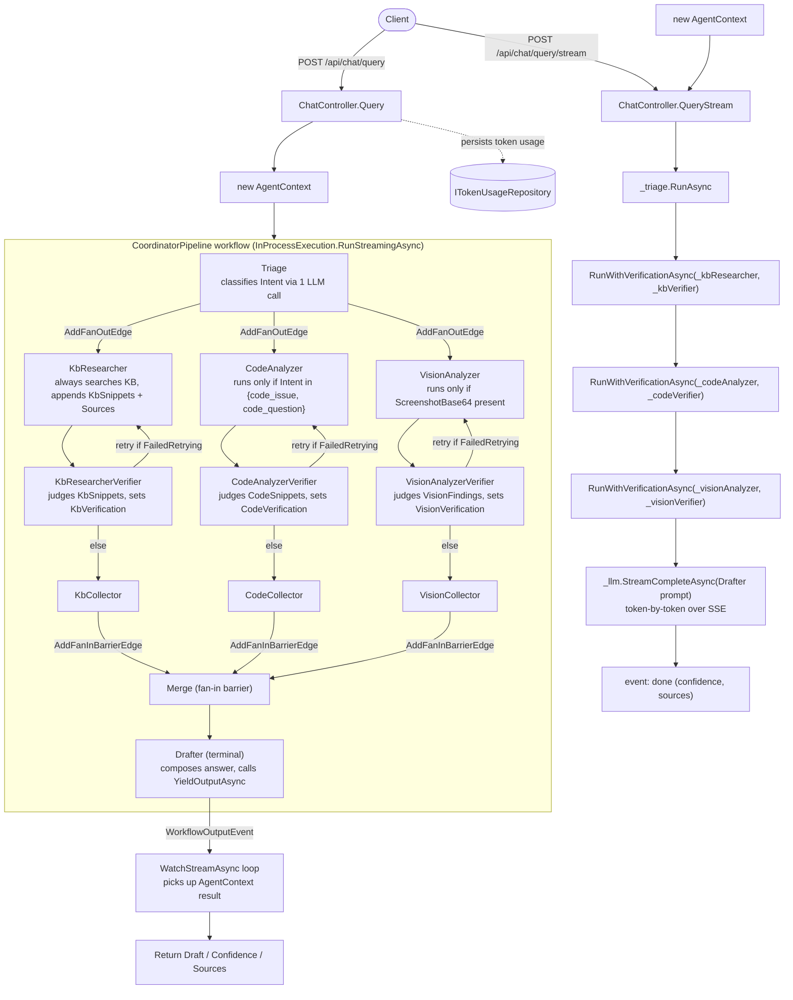

# Agentic Support Pipeline

How a support query flows through SupportForge's backend, and how that flow
is implemented on top of the [Microsoft Agent Framework](https://github.com/microsoft/agent-framework)
`Workflow` API.

## 1. Overview

A support query goes through eight components: five specialist agents plus
three verifiers, wired together by `CoordinatorPipeline`. Triage runs first;
KbResearcher, CodeAnalyzer, and VisionAnalyzer then fan out in parallel, each
paired with its own verifier (`KbResearcherVerifier`, `CodeAnalyzerVerifier`,
`VisionAnalyzerVerifier`) that judges the specialist's output and can send it
back for one retry. The three verified branches merge, and Drafter runs last:

```
                 +-> KbResearcher     -> KbResearcherVerifier     -+
Triage -> (fan out)-> CodeAnalyzer    -> CodeAnalyzerVerifier    -+-> Merge -> Drafter
                 +-> VisionAnalyzer   -> VisionAnalyzerVerifier  -+
```

Each agent (specialist or verifier) reads/writes a single shared
`AgentContext` object and decides for itself whether it has anything to do —
the branching in that diagram is real (a fan-out/fan-in graph plus
conditional retry edges), but *which* specialists do real work is still an
`if` inside each agent, keyed off `context.Intent` / `context.ScreenshotBase64`.
`CoordinatorPipeline` wires all eight agents into a Microsoft Agent Framework
`Workflow` and runs it in-process for one request.

## 2. Glossary

| Term | Where | Meaning here |
|---|---|---|
| `IAgent` | `SupportForge.Agents/IAgent.cs` | This app's own contract: `Name` + `RunAsync(AgentContext, ct) -> Task<AgentContext>`. Every pipeline step implements it. |
| `AgentContext` | `SupportForge.Agents/AgentContext.cs` | The one object passed through the whole pipeline. Holds input (`Query`, `ScreenshotBase64`) and accumulated output (`Intent`, `KbSnippets`, `CodeSnippets`, `VisionFindings`, `Draft`, `Sources`, `Confidence`, `TotalTokensUsed`). |
| `Executor<TIn, TOut>` | Agent Framework | Base class for a workflow node. `AgentExecutor : Executor<AgentContext, AgentContext>` adapts an `IAgent` into one. |
| `WorkflowBuilder` | Agent Framework | Fluent builder that assembles executors into a graph. |
| `AddEdge(from, to)` / `AddEdge<T>(from, to, predicate)` | Agent Framework | Declares a directed edge between two executors, optionally guarded by a predicate on the message. Used here for the specialist → verifier edges and the verifier's conditional retry-vs-forward edges. |
| `AddFanOutEdge` / `AddFanInBarrierEdge` | Agent Framework | Fan-out sends one message to several executors in parallel (Triage → the three specialists); a fan-in barrier waits for one message per source before forwarding (the three branch collectors → `Merge`). |
| `WithOutputFrom(executor)` / `Build()` | Agent Framework | Marks which executor(s) can yield workflow output, then compiles the graph into a `Workflow`. |
| `InProcessExecution.RunStreamingAsync` | Agent Framework | Runs the compiled `Workflow` for one input, in-process, returning a `StreamingRun`. |
| `StreamingRun` / `WatchStreamAsync` | Agent Framework | Async event stream of everything that happens during the run. |
| `WorkflowOutputEvent` | Agent Framework | The event type raised when a node calls `YieldOutputAsync` — carries the final result. |
| `context.YieldOutputAsync(result, ct)` | Agent Framework (`IWorkflowContext`) | Called by a node to publish a value as the workflow's output. Only the terminal `AgentExecutor` calls this. |
| Verifier (`KbResearcherVerifier`, `CodeAnalyzerVerifier`, `VisionAnalyzerVerifier`) | `SupportForge.Agents/*Verifier.cs` | An `IAgent` paired one-to-one with a specialist. Runs immediately after it, checks whether the specialist's output is usable (empty results, or an LLM-judge call for a single low-confidence snippet/finding), and writes the outcome to that branch's `VerificationResult` on `AgentContext`. A `FailedRetrying` status routes back to the specialist for one retry (`CoordinatorPipeline`'s conditional edges); anything else forwards to that branch's collector. |
| `VerificationResult` | `SupportForge.Agents/VerificationResult.cs` | Per-branch verification outcome — `AgentContext.KbVerification` / `CodeVerification` / `VisionVerification`. Holds `Status` (`NotRun`, `Passed`, `FailedRetrying`, `FailedFinal`), `Attempts`, and `Reason`. |

## 3. Flow diagram



Three things worth reading twice in that diagram:

- The `/query` path goes through the Agent Framework `Workflow`; the
  `/query/stream` path **does not** — it calls the same specialist/verifier
  pairs directly (via `RunWithVerificationAsync`), then streams the
  `Drafter`'s completion itself so tokens can reach the client as they're
  generated (a `Workflow` only yields one final output, not a token stream).
- `CodeAnalyzer` and `VisionAnalyzer` are drawn inside the fan-out but may
  no-op — the graph structure (fan-out, verify, retry-or-collect, fan-in) is
  the same for every request; whether a specialist does real work is still
  an `if` inside that specialist keyed off `context.Intent` /
  `context.ScreenshotBase64`.
- The `KbV`/`CodeV`/`VisionV` retry edges are conditional
  (`AddEdge<AgentContext>` with a predicate on that branch's
  `VerificationStatus`); the collector nodes exist only so the fan-in
  barrier into `Merge` has one unconditional edge per branch to wait on,
  regardless of how many retry rounds that branch took.

## 4. Step-by-step walkthrough

### `POST /api/chat/query` (`ChatController.cs:126`)

1. Controller builds a fresh `AgentContext { ProjectId, Query, ScreenshotBase64 }`.
2. `CoordinatorPipeline.RunAsync` (`CoordinatorPipeline.cs:133`) calls
   `InProcessExecution.RunStreamingAsync(_workflow, context)` and iterates
   `run.WatchStreamAsync(ct)`.
3. **TriageAgent** (`TriageAgent.cs`) sends the query to the LLM with a
   classification prompt, sets `context.Intent` to one of `kb_question`,
   `code_issue`, `code_question`, `screenshot_error`.
4. Triage's fan-out (`AddFanOutEdge`) then runs three branches in parallel,
   each specialist immediately followed by its verifier:
   - **KbResearcherAgent** (`KbResearcherAgent.cs`) always runs a KB vector
     search and appends any hits to `KbSnippets` / `Sources`.
     **KbResearcherVerifier** (`KbResearcherVerifier.cs`) then checks the
     result — no snippets or a single low-confidence snippet (judged by an
     LLM call) sets `KbVerification.Status` to `FailedRetrying` (routing
     back to `KbResearcherAgent` for one retry) or `FailedFinal`; otherwise
     `Passed`.
   - **CodeAnalyzerAgent** (`CodeAnalyzerAgent.cs:14`) checks
     `context.Intent is not ("code_issue" or "code_question")` and returns
     immediately if so; otherwise searches code and appends to
     `CodeSnippets` / `Sources`. **CodeAnalyzerVerifier**
     (`CodeAnalyzerVerifier.cs`) verifies it the same way, writing
     `CodeVerification`.
   - **VisionAnalyzerAgent** (`VisionAnalyzerAgent.cs:14`) returns
     immediately if `ScreenshotBase64` is empty; otherwise calls the vision
     tool and sets `VisionFindings`. **VisionAnalyzerVerifier**
     (`VisionAnalyzerVerifier.cs`) verifies it, writing `VisionVerification`.
5. Each branch's verifier forwards to that branch's collector
   (`KbCollector`/`CodeCollector`/`VisionCollector`) once its status is no
   longer `FailedRetrying`. The fan-in barrier (`AddFanInBarrierEdge`) waits
   for exactly one message per collector, then `MergeExecutor` forwards the
   (shared, mutated-in-place) `AgentContext` on to Drafter.
6. **DrafterAgent** (`DrafterAgent.cs`, terminal node) builds a prompt from
   everything accumulated so far, calls the LLM for the final `Draft`,
   computes `Confidence` from the branch verification results, and —
   because it's the terminal `AgentExecutor` — calls
   `context.YieldOutputAsync(result, ct)`.
7. Back in `CoordinatorPipeline.RunAsync`, the `WatchStreamAsync` loop sees
   the `WorkflowOutputEvent` and returns that `AgentContext`.
8. Controller persists `TotalTokensUsed` via `ITokenUsageRepository` and
   returns `Draft` / `Confidence` / `Sources` as `ChatQueryResponse`.

### `POST /api/chat/query/stream` (`ChatController.cs:155`)

Same specialist/verifier steps, called directly (not via the workflow) and
sequentially rather than fanned out in parallel: `_triage.RunAsync`, then
`RunWithVerificationAsync` for each of
`(_kbResearcher, _kbVerifier)` → `(_codeAnalyzer, _codeVerifier)` →
`(_visionAnalyzer, _visionVerifier)` — a controller-local helper
(`ChatController.cs:58`) that mirrors `CoordinatorPipeline`'s
retry-once-then-flag semantics: run the specialist, run the verifier, and if
`FailedRetrying`, run both once more. Then, instead of running
`DrafterAgent`, the controller itself streams
`_llm.StreamCompleteAsync(DrafterAgent.SystemPrompt, DrafterAgent.BuildUserPrompt(context), ct)`
and writes each token as an SSE `data:` event, finishing with an
`event: done` payload containing confidence and the conversation id.

## 5. Design notes

- **Whether a specialist does real work lives in the agent, not the graph;
  whether its output is *good enough* lives in its verifier.** The workflow
  graph (fan-out from Triage, specialist → verifier → retry-or-collect,
  fan-in at Merge) is the same shape for every request. Whether
  `CodeAnalyzer` or `VisionAnalyzer` do real work depends on
  `context.Intent` / `context.ScreenshotBase64`, checked inside each
  specialist's own `RunAsync`; whether that work was good enough (non-empty,
  relevant) is a separate decision made by the paired verifier
  (`KbResearcherVerifier`, `CodeAnalyzerVerifier`, `VisionAnalyzerVerifier`),
  which can send the specialist back for exactly one retry
  (`VerificationStatus.FailedRetrying`, capped by `VerificationResult.Attempts`)
  before giving up (`FailedFinal`). Adding a new conditional specialist means
  adding an `if` inside it (and, if it needs verification, a paired
  verifier); it doesn't require reshaping the fan-out/fan-in graph itself.
- **Two endpoints duplicate the agent sequence.** `/api/chat/query` goes
  through `CoordinatorPipeline`, which runs the three specialist/verifier
  branches in parallel via the workflow's fan-out/fan-in;
  `/api/chat/query/stream` re-implements the same specialist-then-verifier
  logic sequentially (`RunWithVerificationAsync` in
  `ChatController.cs:58`) so it can stream the Drafter's output. Any change
  to agent composition or retry semantics (adding/removing agents in
  `Program.cs`, or changing `CoordinatorPipeline`'s retry predicate) has to
  be mirrored by hand in `ChatController.QueryStream`.
- **`AgentContext` is shared mutable state, not an immutable message.**
  Every agent mutates the same instance and returns it; there's no copying
  between workflow nodes. This works because `InProcessExecution` runs the
  whole workflow synchronously within one request — there's no
  cross-process or persisted state to reconcile.
