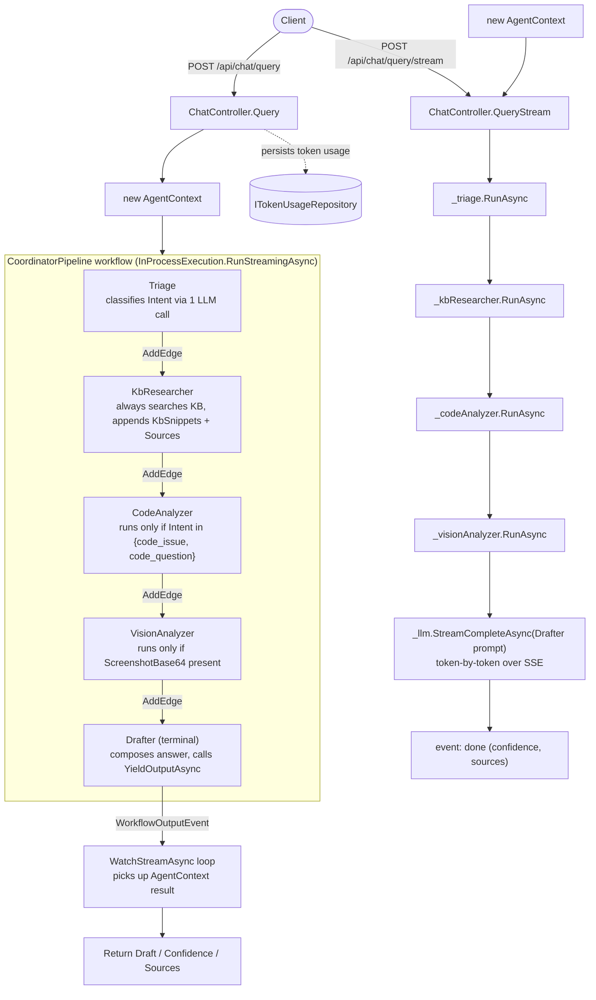

# Agentic Support Pipeline

How a support query flows through SupportForge's backend, and how that flow
is implemented on top of the [Microsoft Agent Framework](https://github.com/microsoft/agent-framework)
`Workflow` API.

## 1. Overview

A support query goes through five agents in a fixed order:

```
Triage -> KbResearcher -> CodeAnalyzer -> VisionAnalyzer -> Drafter
```

Each agent reads/writes a single shared `AgentContext` object and decides
for itself whether it has anything to do — the pipeline doesn't branch,
the *agents* branch. `CoordinatorPipeline` wires those five agents into a
Microsoft Agent Framework `Workflow` and runs it in-process for one request.

## 2. Glossary

| Term | Where | Meaning here |
|---|---|---|
| `IAgent` | `SupportForge.Agents/IAgent.cs` | This app's own contract: `Name` + `RunAsync(AgentContext, ct) -> Task<AgentContext>`. Every pipeline step implements it. |
| `AgentContext` | `SupportForge.Agents/AgentContext.cs` | The one object passed through the whole pipeline. Holds input (`Query`, `ScreenshotBase64`) and accumulated output (`Intent`, `KbSnippets`, `CodeSnippets`, `VisionFindings`, `Draft`, `Sources`, `Confidence`, `TotalTokensUsed`). |
| `Executor<TIn, TOut>` | Agent Framework | Base class for a workflow node. `AgentExecutor : Executor<AgentContext, AgentContext>` adapts an `IAgent` into one. |
| `WorkflowBuilder` | Agent Framework | Fluent builder that assembles executors into a graph. |
| `AddEdge(from, to)` | Agent Framework | Declares a directed edge between two executors — here, a straight chain, executor `i-1` to executor `i`. |
| `WithOutputFrom(executor)` / `Build()` | Agent Framework | Marks which executor(s) can yield workflow output, then compiles the graph into a `Workflow`. |
| `InProcessExecution.RunStreamingAsync` | Agent Framework | Runs the compiled `Workflow` for one input, in-process, returning a `StreamingRun`. |
| `StreamingRun` / `WatchStreamAsync` | Agent Framework | Async event stream of everything that happens during the run. |
| `WorkflowOutputEvent` | Agent Framework | The event type raised when a node calls `YieldOutputAsync` — carries the final result. |
| `context.YieldOutputAsync(result, ct)` | Agent Framework (`IWorkflowContext`) | Called by a node to publish a value as the workflow's output. Only the terminal `AgentExecutor` calls this. |

## 3. Flow diagram



Two things worth reading twice in that diagram:

- The `/query` path goes through the Agent Framework `Workflow`; the
  `/query/stream` path **does not** — it calls the same four agents
  directly, then streams the `Drafter`'s completion itself so tokens can
  reach the client as they're generated (a `Workflow` only yields one final
  output, not a token stream).
- `CodeAnalyzer` and `VisionAnalyzer` are drawn inside the workflow chain
  but may no-op — the graph itself has no branches; the branching is an
  `if` inside each agent.

## 4. Step-by-step walkthrough

### `POST /api/chat/query` (`ChatController.cs:41`)

1. Controller builds a fresh `AgentContext { ProjectId, Query, ScreenshotBase64 }`.
2. `CoordinatorPipeline.RunAsync` (`CoordinatorPipeline.cs:49`) calls
   `InProcessExecution.RunStreamingAsync(_workflow, context)` and iterates
   `run.WatchStreamAsync(ct)`.
3. **TriageAgent** (`TriageAgent.cs`) sends the query to the LLM with a
   classification prompt, sets `context.Intent` to one of `kb_question`,
   `code_issue`, `code_question`, `screenshot_error`.
4. **KbResearcherAgent** (`KbResearcherAgent.cs`) always runs a KB vector
   search and appends any hits to `KbSnippets` / `Sources`.
5. **CodeAnalyzerAgent** (`CodeAnalyzerAgent.cs:14`) checks
   `context.Intent is not ("code_issue" or "code_question")` and returns
   immediately if so; otherwise searches code and appends to
   `CodeSnippets` / `Sources`.
6. **VisionAnalyzerAgent** (`VisionAnalyzerAgent.cs:14`) returns immediately
   if `ScreenshotBase64` is empty; otherwise calls the vision tool and sets
   `VisionFindings`.
7. **DrafterAgent** (`DrafterAgent.cs`, terminal node) builds a prompt from
   everything accumulated so far, calls the LLM for the final `Draft`,
   computes `Confidence` (`0.8` if any KB/code snippets were found, else
   `0.4`), and — because it's the terminal `AgentExecutor` — calls
   `context.YieldOutputAsync(result, ct)`.
8. Back in `CoordinatorPipeline.RunAsync`, the `WatchStreamAsync` loop sees
   the `WorkflowOutputEvent` and returns that `AgentContext`.
9. Controller persists `TotalTokensUsed` via `ITokenUsageRepository` and
   returns `Draft` / `Confidence` / `Sources` as `ChatQueryResponse`.

### `POST /api/chat/query/stream` (`ChatController.cs:63`)

Same first four agent steps, called directly (not via the workflow):
`_triage` → `_kbResearcher` → `_codeAnalyzer` → `_visionAnalyzer`. Then,
instead of running `DrafterAgent`, the controller itself streams
`_llm.StreamCompleteAsync(DrafterAgent.SystemPrompt, DrafterAgent.BuildUserPrompt(context), ct)`
and writes each token as an SSE `data:` event, finishing with an
`event: done` payload containing confidence and sources.

## 5. Design notes

- **Branching lives in the agents, not the graph.** The workflow itself is
  always the same five-node straight line (`AddEdge` chain in
  `CoordinatorPipeline.cs:42-44`). Whether `CodeAnalyzer` or
  `VisionAnalyzer` do real work depends entirely on `context.Intent` /
  `context.ScreenshotBase64`, checked inside each agent's own `RunAsync`.
  Adding a new conditional agent means adding an `if` inside it, not
  reshaping the workflow graph.
- **Two endpoints duplicate the agent sequence.** `/api/chat/query` goes
  through `CoordinatorPipeline`; `/api/chat/query/stream` re-implements the
  same ordering by calling agents directly so it can stream the Drafter's
  output. Any change to agent order or composition (adding/removing/
  reordering agents in `Program.cs:55-62`) has to be mirrored by hand in
  `ChatController.QueryStream`.
- **`AgentContext` is shared mutable state, not an immutable message.**
  Every agent mutates the same instance and returns it; there's no copying
  between workflow nodes. This works because `InProcessExecution` runs the
  whole workflow synchronously within one request — there's no
  cross-process or persisted state to reconcile.
