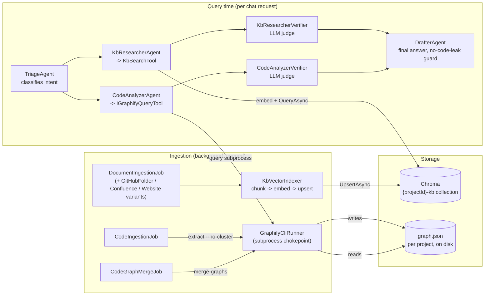
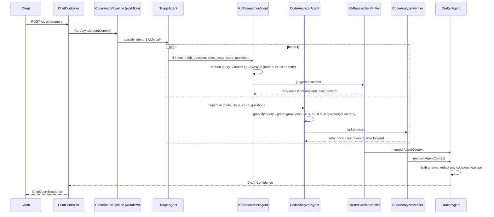

# HLD: KB and Code Retrieval Architecture

> **STALE as of 2026-08-06.** The `graphify extract`/`graphify query` external CLI subprocess described
> throughout this doc (§1–§2, both diagrams) has been removed from the codebase. Code-graph extraction is
> now an in-process regex-based extractor (`CodeGraphExtractor.cs`) writing directly into **Neo4j**
> (`GraphImportJob.cs`) — there is no `graph.json` file and no `graphify` CLI dependency anymore. KB
> retrieval via Chroma (§1's left column) is still accurate. See
> [`docs/architecture/2026-08-06-001-hld-system-design.md`](./2026-08-06-001-hld-system-design.md) §2 and §4
> for the corrected architecture and full explanation.

Status: reflects code on branch `worktree-fix-verifier-relevance` as of 2026-08-03.
Companion doc: [`2026-08-03-002-lld-kb-code-retrieval.md`](./2026-08-03-002-lld-kb-code-retrieval.md).
Existing doc: [`docs/agentic-pipeline.md`](../agentic-pipeline.md) covers the `CoordinatorPipeline` workflow wiring in
depth; this pair of docs focuses on *how content gets retrieved* (KB vs. code) rather than *how agents are wired*.

## 1. The two retrieval strategies, as implemented today

KB and code are **not** retrieved the same way. This was a discussion point ("is vector-DB-for-KB /
graphify-for-code the right split?") — the answer, confirmed by reading the current code rather than the older
plan doc, is: **yes, and it's already built that way.**

| | Knowledge Base (docs) | Codebase |
|---|---|---|
| Ingestion | Chunk → embed → upsert into Chroma | `graphify extract . --no-cluster` → AST graph on disk |
| Storage | Chroma vector collection `{projectId}-kb` | `graph.json` file per repo, merged per project |
| Query-time retrieval | Embed query → nearest-neighbor search (`KbSearchTool`) | `graphify query <question> --graph <path>` subprocess call (`GraphifyQueryTool`) |
| What comes back | Top-K prose chunks with cosine-distance ranking | A budgeted graph traversal result (BFS/DFS over nodes reachable from question-matched entry points) |
| Relevance judged by | LLM yes/no verifier on the top snippet | LLM yes/no verifier on the top (only) output |

This is a deliberate divergence, not an accident: documentation is unstructured prose where semantic similarity
is the right primitive, while source code has *structural* relationships (who calls what, what depends on what)
that an embedding blurs but a graph traversal preserves exactly.

## 2. Component map

## 3. Why two different engines instead of one

- **Code needs structure, not similarity.** `graphify extract` builds an AST-derived graph with no LLM call
  (`CodeIngestionJob.cs:37-41`) — cheap enough to run on every ingestion. `graphify query` then does a
  budgeted BFS (first attempt) or DFS (retry) traversal (`GraphifyQueryTool.cs:23-30`), which answers
  "what calls X" / "what does Y depend on" questions that nearest-neighbor embedding search cannot.
- **Docs need similarity, not structure.** Documentation doesn't have a call graph; chunking + embedding +
  cosine similarity (`KbVectorIndexer.cs`, `ChromaVectorStoreService.cs`) is the right tool for "which
  paragraph talks about X."
- **Both paths converge at the same guard rail.** Regardless of retrieval mechanism, both `KbResearcherVerifier`
  and `CodeAnalyzerVerifier` run the same shape of check: an LLM judges whether the single top result is
  actually relevant, and fails the branch (triggering one retry, then a final failure) if not. This was
  recently hardened (commit `a085e8c`) so the judge always runs on the top-ranked result, not just when
  exactly one snippet came back — see LLD §4.

## 4. Request-time sequence (per chat query)

## 5. Ingestion trigger and background processing

`IngestionController.Trigger` (`POST /api/ingestion/trigger`) loads the project, asks every registered
`IIngestionJobFactory` to build jobs from `project.KbSources` / `project.Repos`, and enqueues them on
`IngestionQueue` — an in-memory unbounded channel. `IngestionBackgroundService` dequeues and runs jobs with a
3-attempt exponential-backoff retry (Polly), one job at a time per the channel's FIFO order, but with up to
2 concurrent `graphify` subprocesses gated by `GraphifyCliRunner.ConcurrencyGate`.

## 6. What's still a gap (open questions for follow-up, not covered by "already built")

- No single Architecture Decision Record captures *why* the split is KB→vector / code→graph — this doc pair now
  serves as the closest thing to one. Consider promoting §3 above into a formal ADR if this needs to survive as
  policy.
- `docs/plans/2026-08-01-001-brainstorm-kb-rag-infrastructure-plan.md` proposed demoting Chroma to a "secondary"
  index for code too; that proposal is now moot for code (code no longer touches Chroma at all) but the doc
  itself hasn't been updated/retired and could mislead a future reader — see LLD §7.
- There is no code-graph freshness signal surfaced to the query path: if `graphify query` runs against a stale
  `graph.json` (e.g., ingestion queued but not yet processed), the agent has no way to know and will return
  results from the last successful ingest silently.
