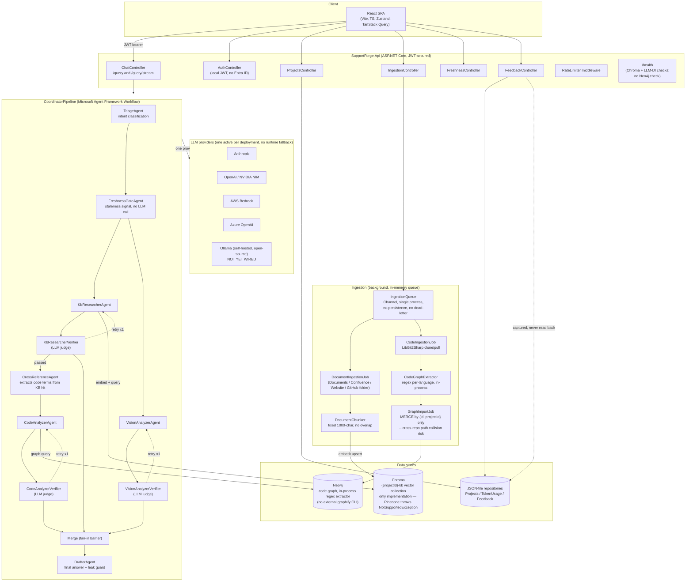

# HLD: SupportForge AI — System Design & AI-System-Design Coverage

Status: reflects code on branch `master` as of 2026-08-06, verified by reading source directly (not by
trusting prior docs — see §4 "Corrections to existing docs").
Audience: client-facing high-level design + an internal checklist of which AI-system-design disciplines
this project has actually implemented vs. still owes.

## 1. What this system does

SupportForge AI answers a support engineer's question about a specific customer project by retrieving
relevant knowledge-base content and source-code context, optionally reading an attached error screenshot,
and drafting a grounded answer — never inventing facts and never leaking raw code/doc text verbatim to the
customer-facing draft.

## 2. High-level architecture

## 3. AI system design coverage table

Legend: ✅ implemented and reasonably solid · ⚠️ partially implemented / real gap · ❌ not implemented.

| # | Discipline | Status | Evidence |
|---|---|---|---|
| 1 | Retrieval architecture (RAG for docs) | ✅ | Chunk → embed → Chroma upsert/query, purpose-aware embeddings (`Query` vs `Passage`) so ingest/query don't mismatch (`KbSearchTool.cs`, `KbVectorIndexer.cs`, `ILlmClient.cs`) |
| 2 | Structured retrieval for code | ✅ (redesigned) | In-process regex extractor → Neo4j graph, queried per request (`CodeGraphExtractor.cs`, `GraphImportJob.cs`) — replaces the external `graphify` CLI the old HLD doc describes |
| 3 | Multi-agent orchestration | ✅ | Real fan-out/fan-in workflow graph via Microsoft Agent Framework, verified topology in §2 (`CoordinatorPipeline.cs`) |
| 4 | Vector store abstraction | ⚠️ | `IVectorStoreService` interface exists but only one implementation; Pinecone (PRD's stated prod target) is a stub that throws `NotSupportedException` (`VectorStoreServiceCollectionExtensions.cs:20`) |
| 5 | Chunking strategy | ⚠️ | Fixed 1000-char word-wrap, **zero overlap**, minimal metadata (`DocumentChunker.cs`) — retrieval-quality risk at chunk boundaries |
| 6 | LLM provider abstraction | ⚠️ | 5 providers switchable via config, but exactly one registered per process with **no runtime fallback**; resilience posture differs per provider (Bedrock has no Polly); **no open-source/self-hosted option** — all 5 (OpenAI, NVIDIA NIM, Azure OpenAI, Anthropic, Bedrock) are paid hosted APIs (`LlmServiceCollectionExtensions.cs:22`) |
| 7 | Groundedness / hallucination control | ⚠️ | A narrow "no verbatim code/doc leak" guard exists (`DrafterAgent.cs`); **no check that drafted claims are actually supported by retrieved snippets** — paraphrased hallucination is undetected |
| 8 | Prompt injection defenses | ⚠️ | Untrusted KB/code content is interpolated into prompts with no structural delimiters — defense is instructional wording only |
| 9 | Eval / judge calibration | ❌ | Verifiers are LLM judges (KB/Code/Vision) with **no offline golden dataset, no precision/recall measurement** — their accuracy is unverified |
| 10 | Human feedback loop | ❌ | `FeedbackController` writes feedback to a JSON repo; **nothing in the codebase reads it back** — no analytics, no prompt/model improvement loop |
| 11 | Cost control / model tiering | ❌ | Every agent (cheap classifier and expensive drafter alike) shares one model; token usage is recorded, never budgeted or gated |
| 12 | Observability (tracing/logging) | ✅ | Real OpenTelemetry spans per agent + structured decision logging (intent, verifier reason, confidence) (`CoordinatorPipeline.cs`, `Program.cs`) |
| 13 | Observability (metrics/APM export) | ⚠️ | OTLP tracing exporter wired; **no metrics pipeline, no Application Insights/Azure Monitor exporter** despite PRD requiring it |
| 14 | AuthN | ⚠️ | Real JWT auth, but **custom-issued, not Entra ID** as PRD/TSD specify; open self-registration endpoint |
| 15 | AuthZ / RBAC | ❌ | No role claims, no `[Authorize(Roles=...)]` anywhere — Support vs Admin distinction from the PRD doesn't exist |
| 16 | Multi-tenant data isolation | ❌ | `ProjectId` is client-supplied on every request with **no server-side check the caller belongs to that project** — any authenticated user can query any project |
| 17 | Freshness management | ⚠️ | On-demand staleness read (`FreshnessGateAgent`, `FreshnessController`) exists; **no GitHub webhooks, no scheduled re-ingestion, no push alert** as PRD requires |
| 18 | Ingestion durability | ⚠️ | In-memory `Channel`, no persistence, no dead-letter queue — a crash mid-run silently drops jobs |
| 19 | Data lifecycle / de-dup | ⚠️ | Idempotent upsert on unchanged content; **no deletion of orphaned chunks** when a source shrinks — permanent retrieval drift |
| 20 | Horizontal scalability | ❌ | Single-instance by design: in-process queue, in-process state, no distributed cache/queue |
| 21 | CI/CD | ⚠️ | Backend build+test+Docker-image CI exists; **no frontend test/lint in CI, no deploy job** |
| 22 | Deployment automation | ❌ | Deployment is prose-only manual IIS runbooks; no IaC, no deploy script — two unreconciled deployment models (Docker for dev, bare IIS for prod) |
| 23 | Test coverage — backend | ✅ | Broad, largely real integration tests (`WebApplicationFactory`-based E2E, per-component suites) |
| 24 | Test coverage — frontend | ⚠️ | Component-level tests exist but the riskiest piece (SSE streaming hook) and auth store are untested, and not run in CI |
| 25 | Architecture documentation | ⚠️ | Docs exist but two were stale relative to code prior to this review — see §4 |
| 26 | Error handling consistency | ⚠️ | No global exception middleware / consistent `ProblemDetails` shape across controllers |

**Rollup**: 6 fully ✅, 13 ⚠️ partial, 7 ❌ missing, out of 26 disciplines assessed. The system's *retrieval and
orchestration core* (rows 1–3, 12) is genuinely solid engineering. The weakest clusters are **evaluation/trust**
(rows 7–10: nothing measures whether the AI is actually right) and **multi-tenant security** (rows 14–16: the
PRD's stated security model isn't built), followed by **production operability** (rows 17–22).

## 4. Corrections to existing docs

Verified against current code, not assumed from prior docs, per explicit review instruction:

- **`docs/agentic-pipeline.md`** — diagram and flow description (its §3 diagram, lines ~9–20) describe Triage
  fanning out to KB/Code/Vision in parallel. **This is no longer true.** Code now runs `Triage → FreshnessGate →
  fan-out(Kb, Vision)`, with **Code gated behind `KbResearcherVerifier` → `CrossReferenceAgent`**, not in the
  initial fan-out (confirmed directly in `CoordinatorPipeline.cs:150-168`). `FreshnessGateAgent` and
  `CrossReferenceAgent` are both present in code and absent from that doc entirely. `ChatController.QueryStream`
  mirrors this same KB→CrossReference→Code order, not three independent branches. This doc needs a rewrite of
  §3–§4, not a patch.
- **`docs/architecture/2026-08-03-001-hld-kb-code-retrieval.md`** — describes code retrieval as a `graphify
  extract`/`graphify query` **external CLI subprocess** writing/reading a `graph.json` file
  (`GraphifyCliRunner`, `IGraphifyQueryTool`). **This mechanism has been removed.** Code graph extraction is
  now an in-process regex-based extractor (`CodeGraphExtractor.cs`) writing directly into **Neo4j**
  (`GraphImportJob.cs`), queried live per request — no subprocess, no `graph.json` file, no `graphify` CLI
  dependency at all. This doc's entire premise (§1–§2, the two-engine comparison table, both Mermaid diagrams)
  describes an architecture that no longer exists in this codebase.
- **`doc/PRD.md` / `doc/TSD.md`** — these are treated here as target/requirements documents (not
  as-built descriptions), so they aren't "wrong," but several stated MVP commitments are unmet as of this
  review: Entra ID auth, Pinecone in production, Application Insights, model tiering, and GitHub webhook-driven
  freshness are all specified but not implemented (see coverage table rows 4, 6, 11, 13, 14, 17).

Recommendation: retire or rewrite the two architecture docs above once the gap-closing work in the companion
Gap Analysis is scoped, rather than leaving them as misleading historical artifacts.
