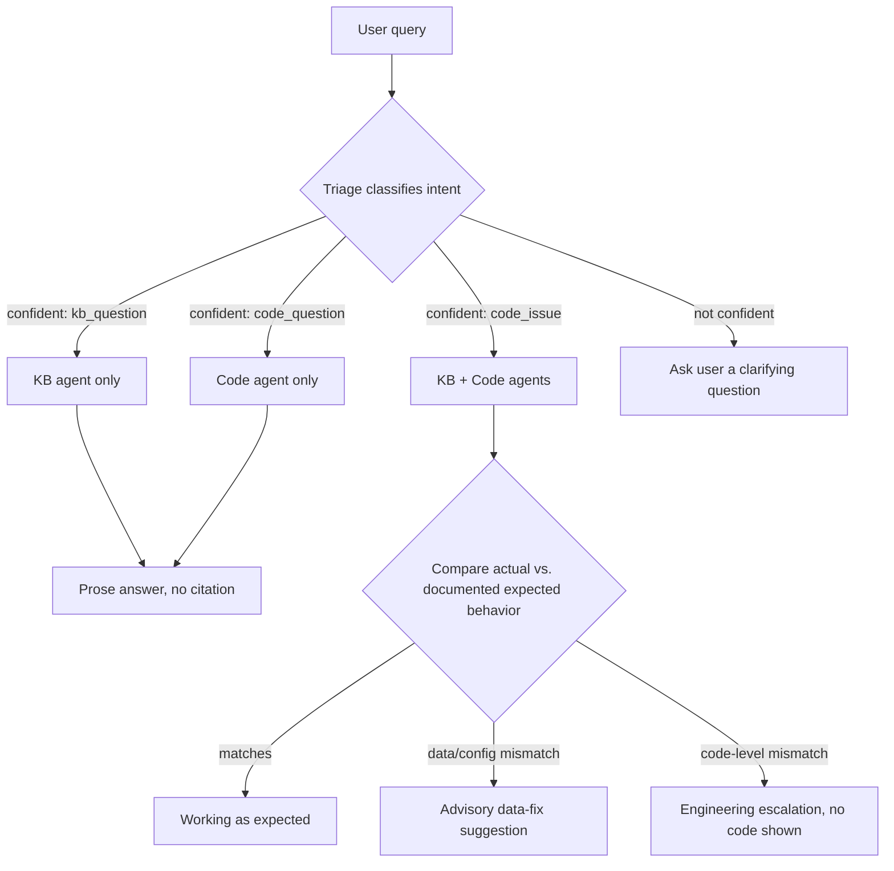

# RCA Answers Without Code Exposure - Plan

## Goal Capsule

- **Objective:** Change how the agent pipeline answers bug-report ("RCA")
  support questions so it classifies each finding as working-as-expected,
  an advisory data/config fix, or a code fix requiring engineering — always
  in plain prose, never exposing source code, KB document text, or
  file/line citations — and only invokes the KB and Code specialist agents
  when their domain is actually relevant to the query.
- **Product authority:** This `ce-brainstorm` dialogue (user: Ritesh Tak).
- **Open blockers:** An unmerged branch, `drafter-recap-rca-guardrails`
  (2 commits ahead of `master`, not yet merged), currently changes
  `DrafterAgent`'s system prompt in the opposite direction — requiring
  verbatim code quoting to prevent hallucination. See Outstanding
  Questions.

## Product Contract

**Product Contract preservation:** unchanged. Planning added routing, prompt,
filter, and UI implementation detail below without altering requirements,
key decisions, actors, flows, acceptance examples, or their IDs.

### Summary

For bug reports, compare actual behavior (from source code) against
documented expected behavior (from the KB) and tell the user one of three
things — works as expected, an advisory data/config fix to try, or that
engineering needs to make a code change — always in plain prose, never
showing code, KB text, or citations. Pure documentation or pure
code-explanation questions invoke only the one relevant specialist agent;
when intent is ambiguous, the system asks a clarifying question instead of
guessing or running everything.

### Problem Frame

Today, `DrafterAgent` (`backend/SupportForge.Agents/DrafterAgent.cs`) is
instructed only to "use the provided KB/code context" — nothing stops it
from quoting retrieved code or KB text verbatim into the answer, and
`CoordinatorPipeline.cs` fans out to KB, Code, and Vision agents
unconditionally on every request regardless of what `TriageAgent` classified
the query as. There is no structured way for a bug-report answer to
distinguish "this is expected behavior," "this is a data-level problem," and
"this needs a code change" — the Drafter blends whatever context it received
into one free-form response. Separately, an unmerged branch is actively
pushing the opposite direction on code exposure (forcing verbatim quoting to
prevent fabrication), which this work must reconcile with before or during
implementation.

### Requirements

**Routing**

- R1. Triage classifies query intent into exactly one of `kb_question`,
  `code_question`, `code_issue`, or `screenshot_error` (existing behavior,
  unchanged).
- R2. For `kb_question`, only the KB agent runs; for `code_question`, only
  the Code agent runs; for `screenshot_error`, only the Vision agent runs —
  the other specialists are not invoked.
- R3. For `code_issue` (bug reports), both the KB and Code agents always
  run, since classifying the report requires comparing documented expected
  behavior against actual behavior.
- R4. When Triage cannot confidently classify intent, the system asks the
  user one clarifying question before routing to any specialist, instead of
  guessing or running every specialist defensively.

**Bug-report classification**

- R5. For `code_issue` queries, the Drafter classifies the finding into
  exactly one of: (a) actual behavior matches KB's documented expectation —
  no fix needed, (b) an advisory data/configuration fix may resolve it, or
  (c) actual behavior diverges from KB's documented expectation and
  requires a code change.
- R6. Outcome (b) answers state an advisory suggestion inferred from KB and
  code context — never a live diagnosis, since the pipeline has no access
  to the user's actual runtime/customer data.
- R7. Outcome (c) answers tell the user to engage the engineering team and
  include no code, file path, or line reference.

**No-exposure guarantee**

- R8. The Drafter's answer never quotes or closely paraphrases source code,
  in any outcome.
- R9. The Drafter's answer never quotes or closely paraphrases KB document
  text; findings are always stated in the Drafter's own prose.
- R10. The answer includes no file, line, or other citation/evidence
  pointer for the user to independently check.

**Trust signal**

- R11. The existing confidence score continues to reflect how well the
  retrieved KB/code context grounds the drafted answer.

### Key Decisions

- **No code or KB text is ever exposed verbatim, under any outcome**
  (session-settled: user-directed — chosen over showing file+line
  citations: the user explicitly said code areas must not be exposed to the
  end user). Governs R8, R9, R10.
- **Verification shifts from user-facing citations to the three-way
  classification plus the confidence score** (session-settled:
  user-directed — chosen over file+line citations as the trust mechanism).
  Governs R5, R6, R7, R11.
- **`code_issue` is the one exception to strict either/or agent routing** —
  it always runs both KB and Code, because the three-way classification
  requires comparing them (session-settled: user-directed — chosen over
  running both agents for every intent). Governs R2, R3.
- **Ambiguous intent triggers a clarifying question rather than running
  every specialist speculatively** (session-settled: user-directed —
  chosen over defensively running both KB and Code when intent is
  unclear). Governs R4.
- **"Data fix" is advisory guidance inferred from KB + code, not a real
  diagnosis** — there is no live-data access anywhere in the pipeline
  (session-settled: user-approved — agent proposed after confirming no
  data-access tool exists, user confirmed). Governs R6.
- **No-code enforcement is a prompt instruction plus a lightweight
  post-filter safety net, not a structural response redesign** — the
  Drafter's system prompt is changed to forbid verbatim code/KB quoting,
  and the assembled answer is checked for accidental leaks before being
  returned (session-settled: user-approved — agent recommended over a
  citation-matching enforcement mechanism and over a structural
  Explanation/Evidence field split, user accepted). Governs R8, R9.

### Actors

- A1. **User** — asks a support question or reports a bug; may be asked a
  clarifying follow-up when intent is ambiguous.
- A2. **Triage** — classifies query intent; must be able to signal when
  intent is not confidently classifiable (new capability, see Outstanding
  Questions).
- A3. **KbResearcher** — retrieves documented/expected-behavior context;
  runs per R2/R3.
- A4. **CodeAnalyzer** — retrieves actual-behavior context from source
  code; runs per R2/R3.
- A5. **Drafter** — compares KB vs. code context for bug reports,
  classifies the finding per R5, and writes the prose-only answer.
- A6. **Engineering team** — the escalation target named to the user for
  code-fix-required outcomes (R7); no direct system integration implied.

### Key Flows

- F1. **Bug report investigation**
  - **Trigger:** Triage classifies intent as `code_issue`.
  - **Actors:** A1, A2, A3, A4, A5.
  - **Steps:** KB and Code agents run in parallel; Drafter compares actual
    behavior (code) against documented expected behavior (KB) and
    classifies the finding.
  - **Outcome:** One of three prose answers (see AE1-AE3), never exposing
    code, KB text, or citations.
  - **Covers:** R3, R5, R8, R9, R10.

- F2. **Single-domain question**
  - **Trigger:** Triage classifies intent confidently as `kb_question` or
    `code_question`.
  - **Actors:** A1, A2, and one of {A3, A4}, A5.
  - **Steps:** Only the matching specialist runs; the other is skipped
    entirely.
  - **Outcome:** Prose answer drawn from that one domain, no citations.
  - **Covers:** R2, R8, R9, R10.

- F3. **Ambiguous intent clarification**
  - **Trigger:** Triage cannot confidently classify intent.
  - **Actors:** A1, A2.
  - **Steps:** The system asks the user one clarifying question instead of
    routing to any specialist.
  - **Outcome:** No specialist runs until the user's follow-up resolves
    intent.
  - **Covers:** R4.

### Acceptance Examples

- AE1. **Covers R5, R6.**
  - **Given** a `code_issue` query where the finding traces to a
    configuration or data-level cause.
  - **When** the Drafter classifies the finding.
  - **Then** the answer states the likely data/config issue as an advisory
    suggestion, with no code or citation shown.

- AE2. **Covers R5.**
  - **Given** a `code_issue` query where actual behavior matches KB's
    documented expected behavior.
  - **When** the Drafter classifies the finding.
  - **Then** the answer states the behavior is working as expected and no
    fix is needed.

- AE3. **Covers R5, R7.**
  - **Given** a `code_issue` query where actual behavior diverges from
    KB's documented expectation and the divergence traces to code logic.
  - **When** the Drafter classifies the finding.
  - **Then** the answer tells the user to engage engineering, with no
    code, file, or line reference shown.

### Scope Boundaries

- Live-data access or diagnosis — out of scope; "data fix" stays advisory
  guidance inferred from KB + code (R6).
- File/line (or any) citation display — dropped in favor of the three-way
  classification plus confidence score as the trust mechanism.
- Defensively running both KB and Code agents for non-bug (`kb_question` /
  `code_question`) queries — explicitly rejected as unnecessary cost.
- Citation-matching enforcement and a structural Explanation/Evidence DTO
  split — both considered and deferred; not needed once citations are
  dropped entirely.
- Removing the backend `Sources` collection, API contract field
  (`ChatQueryResponse.Sources`, `SourceDto`), or `ChatMessage.Sources`
  persistence — out of scope (`ce-plan` scoping decision, user-confirmed).
  R10 governs what the end user is shown; only the frontend citation
  display (`MessageBubble.tsx`) is removed (see U5). The backend
  collection has no other consumer today, but ripping it out is a
  separate, unrequested change.

### Dependencies / Assumptions

- Assumes KB documentation is accurate and complete enough to serve as the
  "expected behavior" source of truth for classification (R5). If KB
  coverage is thin for a given feature area, the confidence score (R11)
  should reflect that rather than the Drafter guessing.

### Outstanding Questions

- **Resolved:** The `drafter-recap-rca-guardrails` branch has been merged
  into `master` (commit `a909ed2`), landing its recap-threading and
  verbatim-quoting prompt text as-is. R8/R9 ("never quote code/KB text
  verbatim") are unchanged by this — implementing this plan will need to
  reverse that prompt text, not merge around it. This was a known,
  pre-existing state at merge time, not a new discovery.
- **Deferred to Planning:** How Triage signals "not confident" — today
  `TriageAgent.cs` always returns exactly one label with no confidence or
  ambiguity signal (R4 requires detecting this case) — and the exact UX
  mechanics of the clarifying-question turn, i.e. how it fits into the
  existing chat/conversation turn structure.

### Sources / Research

- `backend/SupportForge.Agents/TriageAgent.cs` — intent classification,
  always returns exactly one of four labels, no confidence signal.
- `backend/SupportForge.Agents/CoordinatorPipeline.cs` — KB/Code/Vision
  fan-out is unconditional today; Triage's intent is not used for routing.
- `backend/SupportForge.Agents/DrafterAgent.cs` — current system prompt
  only says "use the provided KB/code context," no exposure restriction.
- `backend/SupportForge.Ingestion/Documents/DocumentChunker.cs` — chunks by
  character count only, no line-position tracking (relevant to why
  citations were dropped rather than extended to file+line).
- Commit `cd04953` on branch `drafter-recap-rca-guardrails`
  (`.claude/worktrees/drafter-recap-rca-guardrails`) — unmerged, forces
  verbatim code quoting in the Drafter prompt; conflicts with R8.
- `backend/SupportForge.Agents/CodeAnalyzerAgent.cs:14` and
  `backend/SupportForge.Agents/CodeAnalyzerVerifier.cs:17` — existing
  per-agent intent-gate pattern (no-op unless `Intent` is `code_issue` or
  `code_question`); reused for `KbResearcherAgent`/`Verifier` in U2 instead
  of restructuring `CoordinatorPipeline`'s workflow graph.
- `frontend/src/components/MessageBubble.tsx` — renders a "Sources" list
  (KB filename / code file path labels) on every assistant message; this
  is the citation display R10 and the Scope Boundaries drop.
- `backend/SupportForge.Api/Controllers/ChatController.cs` — confirms
  `Sources` flows through both `Query` and `QueryStream` into the API
  response and `ChatMessage` persistence; out of scope per Scope
  Boundaries (only the frontend display is removed).

---

## Planning Contract

### Technical Approach Summary

Routing (R2-R4) is implemented by extending the existing per-agent
intent-gate pattern already used by `CodeAnalyzerAgent`/`Verifier` to
`KbResearcherAgent`/`Verifier`, rather than restructuring
`CoordinatorPipeline`'s conditional fan-out/fan-in workflow graph. Ambiguous
intent is a fifth Triage label (`"unclear"`) that causes every specialist to
no-op under the existing/extended gates and causes the Drafter to ask one
clarifying question instead of drafting. No-exposure (R8-R10) is enforced in
two layers on `DrafterAgent`: a rewritten system prompt (reversing the
verbatim-quoting instruction merged in `a909ed2`) plus a lightweight
post-filter safety net that catches accidental leaks the prompt alone
misses. Citation display is removed from the frontend only; the backend
`Sources` plumbing is untouched.

### Key Technical Decisions

- **KTD1: Routing reuses existing per-agent intent gates instead of a
  `CoordinatorPipeline` graph rewrite** (session-settled: user-approved —
  chosen over restructuring the fan-out/fan-in workflow edges; user
  confirmed during plan scoping). `CodeAnalyzerAgent`/`Verifier` already
  no-op for non-matching intents; `KbResearcherAgent`/`Verifier` gain the
  same guard (U2). Governs R2, R3.
- **KTD2: Ambiguous intent is a fifth Triage label, not a separate
  confidence score** (session-settled: user-approved). `TriageAgent`
  reuses its existing single-token `CompleteAsync` response format; no new
  response schema or confidence-parsing logic. Governs R4.
- **KTD3: The clarifying question is produced by `DrafterAgent` recognizing
  `Intent == "unclear"`, not a new pipeline stage or API contract field**
  (session-settled: user-approved). KB/Code/Vision no-op naturally under
  KTD1's gates when intent is `"unclear"`, so no specialist work actually
  runs even though the workflow graph still traverses those nodes.
  Governs R4.
- **KTD4: Citation removal is frontend-display-only** (session-settled:
  user-approved — chosen over also removing the backend `Sources`
  collection, API field, and persistence; user confirmed during plan
  scoping). Only `MessageBubble.tsx` changes (U5); `ChatQueryResponse`,
  `SourceDto`, and `ChatMessage.Sources` are untouched. Governs R10.

---

## Implementation Units

### U1. Signal ambiguous intent from Triage

- **Goal:** `TriageAgent` gains a fifth classification, `"unclear"`, for
  queries it cannot confidently place into the other four labels, using
  the same single-token LLM response format it already uses.
- **Requirements:** R4.
- **Dependencies:** None.
- **Files:**
  - `backend/SupportForge.Agents/TriageAgent.cs`
  - `backend/SupportForge.Api.Tests/Agents/TriageAgentTests.cs`
- **Approach:**
  1. Extend the system prompt's label list with `"unclear"`, described as
     the response to use when the query cannot be confidently placed into
     the other four labels.
  2. Keep the existing `CompleteAsync` + `Trim()` response handling
     unchanged — `"unclear"` flows through `context.Intent` exactly like
     the other four labels.
- **Patterns to follow:** the existing single-label prompt and
  `context.Intent = intent.Trim();` handling in `TriageAgent.RunAsync`.
- **Test scenarios:**
  - LLM returns `"unclear"` -> `Intent` is set to `"unclear"`.
  - LLM returns each of the four existing labels -> unchanged (regression).
  - LLM response has surrounding whitespace -> trimmed correctly
    (regression of existing behavior).
- **Verification:** `TriageAgentTests` passes, including a new test for the
  `"unclear"` label.

### U2. Gate KbResearcher to relevant intents (parity with CodeAnalyzer)

- **Goal:** `KbResearcherAgent` and `KbResearcherVerifier` only do real
  work when `Intent` is `"kb_question"` or `"code_issue"`; for any other
  intent (including `"unclear"`) they return the context unchanged, per
  KTD1.
- **Requirements:** R2, R3, R4 (per KTD1).
- **Dependencies:** U1 (for the `"unclear"` case to be meaningful; the
  `kb_question`/`code_issue`/`code_question`/`screenshot_error` gating is
  independently testable without U1).
- **Files:**
  - `backend/SupportForge.Agents/KbResearcherAgent.cs`
  - `backend/SupportForge.Agents/KbResearcherVerifier.cs`
  - `backend/SupportForge.Api.Tests/Agents/KbResearcherAgentTests.cs`
  - `backend/SupportForge.Api.Tests/Agents/KbResearcherVerifierTests.cs`
- **Approach:**
  1. Add an early-return guard to `KbResearcherAgent.RunAsync` mirroring
     `CodeAnalyzerAgent.cs:14`: skip the search tool call, snippet
     population, and `Sources` addition when `Intent` is not
     `"kb_question"` or `"code_issue"`.
  2. Add the matching guard to `KbResearcherVerifier.RunAsync` mirroring
     `CodeAnalyzerVerifier.cs:17`: return the context unchanged (verifier
     status stays `NotRun`) for the same non-matching intents.
- **Patterns to follow:** `CodeAnalyzerAgent.cs`, `CodeAnalyzerVerifier.cs`.
- **Test scenarios:**
  - `Intent == "code_question"` -> `KbResearcherAgent` does not call the
    search tool; `KbSnippets`/`Sources` stay unchanged.
  - `Intent == "screenshot_error"` -> same no-op.
  - `Intent == "unclear"` -> same no-op.
  - `Intent == "kb_question"` -> existing search behavior unchanged
    (regression).
  - `Intent == "code_issue"` -> existing search behavior unchanged
    (regression) — KB still runs per R3.
  - `KbResearcherVerifier`: `KbVerification.Status` stays `NotRun` for
    non-matching intents; unchanged behavior for `kb_question`/
    `code_issue` (regression).
- **Verification:** existing `KbResearcherAgentTests`/
  `KbResearcherVerifierTests` pass unchanged plus new no-op tests;
  `CoordinatorPipelineTests` continues passing without modification
  (confirms the workflow graph itself needs no change).

### U3. Drafter: clarifying question + no-exposure three-way classification

- **Goal:** For `code_issue` queries, `DrafterAgent` classifies the finding
  into exactly one of the three outcomes (R5) and writes a prose-only
  answer that never quotes code or KB text and never cites a file or line
  (R8-R10). For `"unclear"` intent, it asks exactly one clarifying
  question instead of drafting (R4, per KTD3).
- **Requirements:** R4, R5, R6, R7, R8, R9, R10.
- **Dependencies:** U1.
- **Files:**
  - `backend/SupportForge.Agents/DrafterAgent.cs`
  - `backend/SupportForge.Api.Tests/Agents/DrafterAgentTests.cs`
- **Approach:**
  1. When `context.Intent == "unclear"`, skip the normal answer/
     classification prompt and have the LLM produce exactly one
     clarifying question about the query instead.
  2. Rewrite `SystemPrompt`: remove the verbatim-quoting requirement
     merged in `a909ed2` entirely; explicitly forbid quoting or closely
     paraphrasing source code or KB document text in any outcome (R8, R9);
     forbid file, line, or citation references (R10); for `code_issue`,
     require classifying into exactly one of (a) matches documented
     expected behavior — no fix needed, (b) an advisory data/config
     suggestion inferred from context, explicitly not a live diagnosis
     (R6), or (c) tell the user to engage engineering, with no code, file,
     or line reference (R7).
  3. Preserve existing conversation-recap threading (`BuildUserPrompt`)
     and `ComputeConfidence` unchanged.
- **Patterns to follow:** existing `BuildUserPrompt`/`ComputeConfidence`
  structure; origin Key Decision "No-code enforcement is a prompt
  instruction plus a lightweight post-filter safety net" (see Key
  Decisions above).
- **Technical design (directional, not literal prompt text):**
  - Never quote or closely paraphrase code or KB text, in any outcome.
  - Never mention a file name, line number, or path.
  - If `Intent == "unclear"`: ask exactly one clarifying question, nothing
    else.
  - If `Intent == "code_issue"`: classify as (a) working as expected, (b)
    advisory data/config fix, or (c) needs engineering — state the
    classification in prose only.
- **Test scenarios:**
  - Covers AE2. `Intent == "code_issue"`, KB/Code context agree -> Draft
    states the behavior is working as expected, no fix needed, no code or
    citation present.
  - Covers AE1, R6. `Intent == "code_issue"`, context suggests a
    config/data mismatch -> Draft states an advisory suggestion, framed
    explicitly as advisory (not a diagnosis), no code or citation present.
  - Covers AE3, R7. `Intent == "code_issue"`, context shows a code-level
    divergence -> Draft tells the user to engage engineering, no code,
    file, or line reference present.
  - `Intent == "unclear"` -> Draft contains exactly one question; KB/Code/
    Vision context is not referenced.
  - `Intent == "kb_question"` or `"code_question"` -> Draft is prose-only
    with no citations (regression of single-domain behavior).
  - Regression: existing `BuildUserPrompt` snippet-capping and
    history-recap tests continue to pass unchanged.
- **Verification:** existing `DrafterAgentTests` pass; new tests for each
  classification outcome and the `"unclear"` path pass; the rewritten
  `SystemPrompt` is read back to confirm no residual verbatim-quoting
  instruction remains.

### U4. Post-filter leak-detection safety net

- **Goal:** After the LLM produces a draft, catch accidental code/KB/
  citation leakage the prompt alone misses, and replace a leaking draft
  with a safe fallback before it is returned.
- **Requirements:** R8, R9, R10 (per origin Key Decision: prompt
  instruction plus a lightweight post-filter safety net, not a
  citation-matching enforcement mechanism).
- **Dependencies:** U3.
- **Files:**
  - `backend/SupportForge.Agents/DrafterAgent.cs`
  - `backend/SupportForge.Api.Tests/Agents/DrafterAgentTests.cs`
- **Approach:**
  1. Add a small, independently testable filter step run on the drafted
     text before it is returned, checking for: code fences; common source
     file extensions (e.g. `.cs`, `.ts`, `.tsx`, `.py`, `.js`) appearing as
     a file-like token; and a substantial verbatim substring overlap
     between the draft and any `KbSnippets`/`CodeSnippets` entry.
  2. When a leak is detected, replace the draft with a safe, generic
     message rather than returning the leaking text.
- **Execution note:** This is an additive safety net around existing LLM
  output — prefer testing the filter as a pure function against synthetic
  draft strings over re-driving the full LLM flow.
- **Patterns to follow:** keep the filter as a small static method on
  `DrafterAgent`, consistent with the existing `ComputeConfidence`
  static-method style.
- **Test scenarios:**
  - Draft containing a code fence -> filter flags it; the returned answer
    no longer contains the fenced text.
  - Draft containing a bare file path with a recognized source extension
    -> filter flags it.
  - Draft containing a long verbatim substring from `CodeSnippets` ->
    filter flags it.
  - Draft with clean prose and no leak signals -> passes through
    unchanged.
- **Verification:** unit tests over the filter covering each signal plus
  the clean-pass case.

### U5. Stop rendering citations in the chat UI

- **Goal:** The assistant message bubble no longer shows a "Sources" list
  of KB/code file citations to the end user.
- **Requirements:** R10.
- **Dependencies:** None (parallel-safe with U1-U4 — touches only the
  frontend).
- **Files:**
  - `frontend/src/components/MessageBubble.tsx`
  - `frontend/src/components/MessageBubble.test.tsx`
- **Approach:** Remove the "Sources" list block from the assistant
  message render path. Leave the `sources` prop and its threading through
  `MessageThread`/the chat hooks untouched — the backend/API/DB `Sources`
  plumbing is out of scope (see Scope Boundaries, KTD4).
- **Patterns to follow:** the existing conditional-render style already
  used for `confidence` in the same component.
- **Test scenarios:**
  - Assistant message with a non-empty `sources` prop -> rendered output
    contains no "Sources" label or source list items.
  - Assistant message with an empty/undefined `sources` prop -> unchanged
    (regression).
- **Verification:** `MessageBubble.test.tsx` passes; no "Sources" section
  renders regardless of the `sources` prop's contents.

---

## Verification Contract

- Backend: `dotnet test` over `backend/SupportForge.Api.Tests` — all
  existing tests continue to pass, plus the new tests enumerated in each
  unit's Test scenarios (U1-U4).
- Frontend: the frontend test runner over
  `frontend/src/components/MessageBubble.test.tsx` (U5).
- Manual: read `DrafterAgent.SystemPrompt` after U3 to confirm no
  verbatim-quoting or citation instruction remains.
- The confidence score (R11, `DrafterAgent.ComputeConfidence`) is
  unchanged by this plan and continues to reflect only the verification
  status of the branches that actually ran — U2's gating means
  non-triggered branches stay `NotRun` and are excluded, exactly as today.

## Definition of Done

- R1-R4: Triage classifies into one of five labels (four original plus
  `"unclear"`); KB/Code specialists no-op outside their relevant intents;
  ambiguous intent produces exactly one clarifying question with no
  specialist work performed.
- R5-R7: `code_issue` queries are classified into exactly one of the three
  outcomes, each answered per its rule (working as expected / advisory
  data-fix / engineering escalation).
- R8-R10: no code, KB text, or file/line citation appears in any Drafter
  answer, in any outcome, under both the rewritten prompt and the
  post-filter safety net; the frontend no longer displays a Sources list.
- R11: confidence score behavior is unchanged and verified by regression
  tests.
- All five implementation units' test scenarios pass; no existing test in
  `TriageAgentTests`, `KbResearcherAgentTests`, `KbResearcherVerifierTests`,
  `DrafterAgentTests`, `CoordinatorPipelineTests`, or
  `MessageBubble.test.tsx` regresses.
