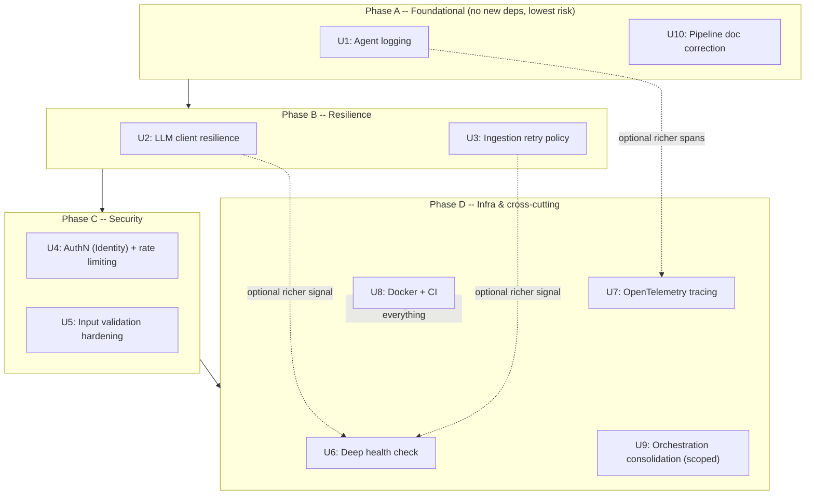

# Analysis-Workflow Gaps Mitigation - Plan

## Goal Capsule

**Objective:** `docs/analysis-workflow.md` (an AI-generated architecture audit, dated 2026-08-01) is stale — it describes an earlier snapshot of SupportForge. Its claims were verified against the current `master` codebase, corrected, and turned into 10 independently deliverable mitigation workstreams (`U1`-`U10`), sequenced into 4 phases.

**Product authority:** engineering-internal (reliability/observability/security hardening), no external product-shape decision.

**Open blockers:** none.

**Product Contract preservation:** unchanged from the requirements-only version — Problem, In Scope, Out of Scope, and Key Decisions carried forward verbatim; this pass adds the Planning Contract, Implementation Units, Verification Contract, and Definition of Done below.

---

## Verification Summary

The source document (`docs/analysis-workflow.md`) is **substantially stale**. Corrections, by section:

| Claim in doc | Verdict | Actual state |
|---|---|---|
| React 18 | REFUTED | `frontend/package.json` pins React 19.2.7 |
| 4 routes incl. "Statistics" | REFUTED | 3 routes exist: `/`, `/query`, `/admin` — no Statistics page |
| "Lack of component-level unit tests" | REFUTED | 7 Vitest/Testing-Library test files exist under `frontend/src` |
| "No end-to-end tests" | CONFIRMED | No Cypress/Playwright |
| API "only 2 endpoints" | PARTIALLY TRUE | `ChatController` has both, but `FeedbackController`, `FreshnessController`, `IngestionController`, `ProjectsController`, `ConversationsController` also exist |
| No auth / no rate limiting | CONFIRMED | `Program.cs` has no `AddAuthentication`/`AddJwtBearer`/`RateLimiter` |
| No request validation | PARTIALLY TRUE | Ownership checks exist (`backend/SupportForge.Api/Controllers/ChatController.cs:74-91`); no size/format limits on `Query`/screenshot |
| Agent order hard-coded, QueryStream duplicates chain | PARTIALLY TRUE | `CoordinatorPipeline` exists and is used by `Query`; `QueryStream` re-runs agents via a shared `RunWithVerificationAsync` helper because it needs token-by-token SSE output the `Workflow` API doesn't expose — a real technical constraint, not blind duplication |
| Ingestion "no health check, no retry" | CONFIRMED | Catch-and-continue loop (`backend/SupportForge.Ingestion/IngestionBackgroundService.cs:31-42`), no backoff/retry policy |
| **GraphifyCliRunner "not present currently"** | **REFUTED — materially wrong** | Fully built at `backend/SupportForge.Ingestion/Graphify/GraphifyCliRunner.cs` (170 lines, `ILogger`, concurrency gate) |
| Testing "no integration tests" | REFUTED | `backend/SupportForge.Api.Tests/Integration/EndToEndQueryTests.cs` exists, but is `[SkippableFact]`-gated on live `OpenAI__ApiKey` + a running Chroma instance, so it never runs without CI |
| No Docker, no CI/CD | CONFIRMED | No `Dockerfile`, no `.github/workflows/` |
| "Only TriageAgent logs" | PARTIALLY TRUE | All 5 specialist agents + 3 verifiers (`backend/SupportForge.Agents/*`) have zero `ILogger` usage |
| No tracing/OpenTelemetry | CONFIRMED | Zero `OpenTelemetry*` package references in any `.csproj` |
| `/health` returns bare 200 | CONFIRMED | `backend/SupportForge.Api/Program.cs:86`, no dependency checks |
| No Polly/circuit-breaker anywhere | CONFIRMED | Zero `Polly`/`Resilience` package references in any `.csproj` |
| Secrets "hard-coded in config" | REFUTED | `appsettings.json` has blank `ApiKey` placeholders (field names only), read via `IConfiguration`/env; repo-wide key-pattern scan found no real secrets |
| `docs/agentic-pipeline.md` staleness | CONFIRMED | Documents only the 5-agent flow, no mention of the Verifier layer; its `ChatController.cs` line citations are also stale (off by ~85 and ~92 lines) |

**Missed by the source document entirely:**
- A **Verifier/retry layer** (`KbResearcherVerifier`, `CodeAnalyzerVerifier`, `VisionAnalyzerVerifier`) sits alongside the 5 specialist agents — the real pipeline is 8 components (5 specialists + 3 verifiers + `CoordinatorPipeline`), not 5.
- **Three LLM provider clients** (`OpenAiLlmClient`, `AnthropicLlmClient`, `BedrockLlmClient`) share no resilience wrapper, and — per Phase 1 research — don't share a uniform integration shape either: only `AnthropicLlmClient` goes through `IHttpClientFactory` (`backend/SupportForge.Agents/LlmServiceCollectionExtensions.cs:74`); OpenAI/Azure build a raw SDK client inline; Bedrock uses the AWS SDK's own client.
- **No persistence layer today** — all repositories (`JsonFileProjectRepository`, `JsonFileTokenUsageRepository`, `JsonFileFeedbackRepository`, `JsonFileConversationRepository`, `JsonFileChatMessageRepository`, all in `backend/SupportForge.Core/`) are JSON-file-backed. No EF Core, no SQL database anywhere in the repo. This materially shapes how auth (`U4`) should be implemented — see KTD1.

---

## Product Contract

### Problem
The architecture audit that's supposed to seed a hardening effort is wrong often enough (Graphify status, test coverage, React version, route count) that acting on it as-written would waste effort and miss the two gaps it never saw (agent logging, LLM-client resilience, the undocumented Verifier layer). Confirmed real gaps still stand: no auth/rate-limiting, no tracing, no Docker/CI, no retry/circuit-breaker anywhere, agents don't log, ingestion has no retry policy, health check is a bare 200.

### In Scope
10 independently deliverable mitigation workstreams, derived only from CONFIRMED or PARTIALLY TRUE gaps:

1. Agent observability/logging
2. LLM client resilience
3. Ingestion retry policy
4. AuthN (JWT via self-hosted ASP.NET Core Identity) + rate limiting
5. Input validation hardening
6. Deep health check
7. OpenTelemetry tracing
8. Containerization + CI
9. Orchestration consolidation (scoped — see KTD3)
10. `docs/agentic-pipeline.md` correction

### Out of Scope
- Rebuilding Graphify integration (already exists), adding component/integration tests (already exist), fixing "hardcoded secrets" (not hardcoded) — all refuted by verification.
- E2E/load testing (Cypress/Playwright, load tests) and documentation-automation tooling (docfx/Sailfish) — real gaps, deliberately deferred to a follow-up plan.
- Multi-tenant auth design and key rotation policy beyond what `U4` implements.
- Migrating existing JSON-file repositories to a database — `U4` adds a JSON-file-backed user store consistent with the existing pattern; it does not touch `JsonFileProjectRepository` or its siblings.

### Key Decisions
- Correct the architectural model before planning against it: **8-component pipeline** (5 specialist agents + 3 verifiers + `CoordinatorPipeline`), not the 5-agent model the source document used.
- Treat "wrap LLM calls in Polly" as three concrete, non-uniform targets rather than one shared abstraction — see KTD2.
- Each of the 10 in-scope items is an independently deliverable unit; none require bundling into one PR.

### Assumptions
- E2E/load testing and documentation-automation tooling remain real gaps but are deliberately out of scope — a scoping choice, not an unverified claim.
- `docs/agentic-pipeline.md`'s stale line-number citations are folded into `U10`'s scope rather than treated as a separate finding.

---

## Planning Contract

### Key Technical Decisions

**KTD1 — Auth via self-hosted ASP.NET Core Identity with a JSON-file-backed user store** *(session-settled: user-directed — chosen over minimal-JWT-only and external OIDC via explicit choice during planning)*. The repo has no database and no EF Core anywhere — every existing repository (`JsonFileProjectRepository` and siblings in `backend/SupportForge.Core/`) is JSON-file-backed. Standard ASP.NET Core Identity defaults to EF Core against a SQL store, which would introduce a persistence paradigm the codebase doesn't otherwise have. `U4` implements Identity's storage abstractions (`IUserStore<T>`, `IUserPasswordStore<T>`) against a new `JsonFileUserRepository` that mirrors the existing repository pattern, rather than adding EF Core + a database. This keeps the new surface consistent with the rest of the codebase and avoids a second, orphaned persistence mechanism for a single feature.

**KTD2 — LLM resilience implemented per-provider, not as one shared wrapper.** Research confirmed the three LLM clients don't share an integration shape: `AnthropicLlmClient` is registered via `AddHttpClient<AnthropicLlmClient>` (`backend/SupportForge.Agents/LlmServiceCollectionExtensions.cs:74`) and is directly Polly-attachable via `.AddPolicyHandler(...)`; `OpenAiLlmClient`/Azure build a raw `OpenAI.Chat.ChatClient` inline with no `HttpClient` seam, so resilience there wraps the call site inside `OpenAiLlmClient` itself; `BedrockLlmClient` uses `IAmazonBedrockRuntime`, whose retry behavior is configured through the AWS SDK's own `RetryMode`/`ClientConfig`, not Polly. `U2` implements equivalent retry/circuit-breaker behavior for all three using each one's idiomatic mechanism rather than forcing a shared abstraction that wouldn't fit two of the three.

**KTD3 — Orchestration consolidation (U9) scoped down, not eliminated.** `QueryStream` doesn't duplicate `CoordinatorPipeline` by oversight: it needs per-token SSE output, and the `Microsoft Agent Framework` `Workflow` API `CoordinatorPipeline` runs on doesn't expose that. `U9` extracts the shared step-construction/DI-wiring logic both paths already funnel through (`RunWithVerificationAsync`, `backend/SupportForge.Api/Controllers/ChatController.cs:58-69`) into one reviewable helper, but keeps the non-streaming (`CoordinatorPipeline`) and streaming (`QueryStream`) execution paths separate. Full consolidation is not in scope.

**KTD4 — Rate limiting via the built-in `Microsoft.AspNetCore.RateLimiter` middleware** (part of the ASP.NET Core shared framework, no new package). Partitioned by authenticated user ID once `U4` lands; falls back to client IP for any endpoint reached before authentication is enforced.

**KTD5 — Deep health check via ASP.NET Core's built-in health-checks framework** (`Microsoft.Extensions.Diagnostics.HealthChecks`, `AddHealthChecks()`/`MapHealthChecks()`), with custom `IHealthCheck` implementations per dependency (VectorStore, LLM connectivity, `GraphifyCliRunner`), replacing the current one-line `/health` endpoint.

**KTD6 — Docker/CI scoped to build, test, and package only**, per the source document's own recommendation. No deploy automation. Single multi-stage `Dockerfile` targeting `SupportForge.Api` (which pulls in `Core`/`Agents`/`VectorStore`/`Common`/`Ingestion` via `ProjectReference`); `SupportForge.Api.Tests` excluded from the runtime image. CI provides `OpenAI__ApiKey`-shaped test credentials so `EndToEndQueryTests.cs` (currently `[SkippableFact]`-gated) can actually run.

**KTD7 — Phasing by risk and dependency, not by workstream number.** See High-Level Technical Design below.

### Product Contract preservation
Unchanged — no requirement, key decision, or scope boundary from the requirements-only version was altered. This section only adds planning-time decisions.

---

## High-Level Technical Design

Four phases, ordered so lower-risk, dependency-free work lands first and the heaviest unit (`U4`, new persistence surface) doesn't block anything else:



Phases are a sequencing recommendation, not hard gates — units within a phase have no dependency on each other and can land in any order or in parallel. Cross-phase arrows marked "optional" are quality improvements, not blockers (e.g., `U6`'s health check works without `U2`/`U3`, but is more informative once retry/circuit-breaker state exists to report).

---

## Implementation Units

### U1. Agent observability/logging

**Goal:** Every specialist agent and verifier logs entry, outcome, and key context per step.

**Requirements:** Advances the "agents don't log" confirmed gap.

**Dependencies:** none.

**Files:**
- `backend/SupportForge.Agents/TriageAgent.cs`
- `backend/SupportForge.Agents/KbResearcherAgent.cs`
- `backend/SupportForge.Agents/CodeAnalyzerAgent.cs`
- `backend/SupportForge.Agents/VisionAnalyzerAgent.cs`
- `backend/SupportForge.Agents/DrafterAgent.cs`
- `backend/SupportForge.Agents/KbResearcherVerifier.cs`
- `backend/SupportForge.Agents/CodeAnalyzerVerifier.cs`
- `backend/SupportForge.Agents/VisionAnalyzerVerifier.cs`
- Test files: `backend/SupportForge.Api.Tests/Agents/*Tests.cs` (existing per-agent test files — extend, do not create new ones)

**Approach:**
1. Add `ILogger<T>` constructor dependency to each of the 8 components above (built-in DI auto-injects it; no `Program.cs` registration change needed).
2. Log one entry at the start of `RunAsync` (agent name, relevant input summary) and one at completion (outcome, elapsed time) — mirror the shape already used in `backend/SupportForge.Ingestion/IngestionBackgroundService.cs:9-15` and `backend/SupportForge.Ingestion/Graphify/GraphifyCliRunner.cs:18`.
3. On verifier retry, log the retry attempt number and reason.

**Patterns to follow:** `IngestionBackgroundService`'s `ILogger<T>` constructor-injection pattern; `GraphifyCliRunner`'s structured log-message shape.

**Test scenarios:**
- Happy path: running `TriageAgent.RunAsync` with a valid `AgentContext` produces a start log and a completion log with `Intent` in the outcome.
- Happy path: same shape verified for each of the other 7 components (one scenario per component, reusing the existing per-agent test file).
- Edge case: a verifier retry logs each attempt, not just the final outcome.
- Error path: an agent that throws still logs a failure entry before the exception propagates (does not swallow the exception).

**Verification:** All 8 components have `ILogger<T>` injected and log both entry and outcome; existing agent test suites extended to assert on logged output (via a test `ILogger` capture, e.g., `Microsoft.Extensions.Logging.Testing` fakes or a simple in-memory sink) pass.

---

### U2. LLM client resilience

**Goal:** `OpenAiLlmClient`, `AnthropicLlmClient`, and `BedrockLlmClient` each have retry-with-backoff and circuit-breaker behavior appropriate to their integration shape (KTD2).

**Requirements:** Advances "no Polly/circuit-breaker anywhere."

**Dependencies:** none.

**Files:**
- `backend/SupportForge.Agents/LlmServiceCollectionExtensions.cs`
- `backend/SupportForge.Agents/AnthropicLlmClient.cs`
- `backend/SupportForge.Agents/OpenAiLlmClient.cs`
- `backend/SupportForge.Agents/BedrockLlmClient.cs`
- `backend/SupportForge.Agents/SupportForge.Agents.csproj` (new package reference)
- Test files: new `backend/SupportForge.Api.Tests/Agents/LlmClientResilienceTests.cs`

**Approach:**
1. Add a Polly-family package reference (`Microsoft.Extensions.Http.Resilience` or `Polly.Extensions.Http`) to `SupportForge.Agents.csproj`.
2. `AnthropicLlmClient`: attach a Polly retry + circuit-breaker policy via `.AddResilienceHandler(...)` on the existing `AddHttpClient<AnthropicLlmClient>` registration (`LlmServiceCollectionExtensions.cs:74`).
3. `OpenAiLlmClient` (and its Azure/NVIDIA-NIM variants built via `BuildOpenAiCompatibleClient`/`BuildAzureClient`): wrap the outbound chat-completion call inside the client with an in-process Polly retry policy (no `HttpClient` seam available), since the underlying `OpenAI.Chat.ChatClient` is constructed directly.
4. `BedrockLlmClient`: configure the AWS SDK's own retry behavior (`AmazonBedrockRuntimeConfig.RetryMode`/`MaxErrorRetry`) rather than adding Polly — the SDK already owns retry semantics for its client.
5. All three: exponential backoff, bounded retry count (e.g., 3 attempts), and a circuit-breaker that opens on sustained failure to avoid hammering a down provider.

**Technical design:** *(directional, not implementation-specification)*
```
Anthropic: AddHttpClient<AnthropicLlmClient>(...).AddResilienceHandler("llm-retry", policy)
OpenAI/Azure: try { call } catch (transient) via Polly.Retry.RetryStrategyOptions, invoked at the call site
Bedrock: new AmazonBedrockRuntimeClient(new AmazonBedrockRuntimeConfig { RetryMode = RequestRetryMode.Standard, MaxErrorRetry = 3 })
```

**Patterns to follow:** existing `AddHttpClient<AnthropicLlmClient>` registration in `LlmServiceCollectionExtensions.cs:74` for the HttpClient-based case.

**Test scenarios:**
- Happy path: a successful call to each client completes without retry overhead being visible to the caller.
- Edge case: a transient failure (simulated 429/503 or timeout) on the first attempt succeeds on retry for each of the three clients.
- Error path: sustained failures beyond the retry budget surface a clear exception rather than hanging or retrying indefinitely.
- Error path: the circuit breaker opens after repeated failures and fails fast on subsequent calls until it resets.

**Verification:** Unit tests simulate transient vs. sustained failure per client (via a fake `HttpMessageHandler` for Anthropic, a fake/mocked SDK client for OpenAI and Bedrock) and assert retry/circuit-breaker behavior matches KTD2's per-provider approach.

---

### U3. Ingestion retry policy

**Goal:** Transient ingestion job failures retry with backoff instead of being logged once and dropped.

**Requirements:** Advances "ingestion: no health check, no retry."

**Dependencies:** none.

**Files:**
- `backend/SupportForge.Ingestion/IngestionBackgroundService.cs`
- `backend/SupportForge.Ingestion/SupportForge.Ingestion.csproj` (new package reference)
- Test files: `backend/SupportForge.Api.Tests/Ingestion/IngestionBackgroundServiceTests.cs` (create if no existing ingestion test directory)

**Approach:**
1. Add the same resilience package used in `U2` to `SupportForge.Ingestion.csproj`.
2. Wrap the `job.RunAsync(...)` call at `IngestionBackgroundService.cs:31-42` in a bounded retry-with-backoff policy; keep the existing `_logger.LogError` on final failure after the retry budget is exhausted.
3. Distinguish transient failures (worth retrying — e.g., network/timeout) from permanent ones (bad KB source config — fail fast, don't retry) if the job surface makes that distinguishable; otherwise retry uniformly with a bounded attempt count.

**Patterns to follow:** the retry policy shape introduced in `U2` — reuse the same policy-building approach for consistency rather than inventing a second one.

**Test scenarios:**
- Happy path: a job that succeeds on the first attempt completes normally, no retry overhead.
- Edge case: a job that fails once then succeeds on retry completes successfully and logs the retry.
- Error path: a job that fails through the entire retry budget logs the final failure (existing behavior) and does not crash the background service loop.
- Integration: the queue's `MarkComplete` is still called exactly once per job regardless of how many retry attempts occurred.

**Verification:** Test simulates a job that fails N times then succeeds, and a job that always fails, asserting retry count and final logged outcome match the configured policy.

---

### U4. AuthN (JWT via self-hosted ASP.NET Core Identity) + rate limiting

**Goal:** API requests require a valid bearer token; per-user (or per-IP pre-auth) rate limiting is enforced.

**Requirements:** Advances "no authentication, rate limiting" confirmed gap. Implements KTD1, KTD4.

**Dependencies:** none (independent of all other units).

**Files:**
- `backend/SupportForge.Api/Program.cs`
- `backend/SupportForge.Api/appsettings.json` (new `Jwt` config section)
- `backend/SupportForge.Api/SupportForge.Api.csproj` (new package: `Microsoft.AspNetCore.Authentication.JwtBearer`)
- `backend/SupportForge.Core/JsonFileUserRepository.cs` (new, mirrors `JsonFileProjectRepository.cs`)
- `backend/SupportForge.Core/IUserRepository.cs` (new)
- New: `backend/SupportForge.Api/Identity/` (custom `IUserStore<T>`/`IUserPasswordStore<T>` implementations backed by `JsonFileUserRepository`)
- New: `backend/SupportForge.Api/Controllers/AuthController.cs` (token-issuance endpoint)
- Controllers requiring `[Authorize]`: `ChatController.cs` and others per scope decision
- Test files: new `backend/SupportForge.Api.Tests/Identity/JsonFileUserStoreTests.cs`, `backend/SupportForge.Api.Tests/Integration/AuthenticationTests.cs`

**Approach:**
1. Add `IUserRepository`/`JsonFileUserRepository` following the exact pattern of `JsonFileProjectRepository.cs` (KTD1).
2. Implement a custom Identity store (`IUserStore<T>`, `IUserPasswordStore<T>`) backed by `JsonFileUserRepository` — register via `AddIdentityCore<TUser>().AddUserStore<CustomUserStore>()`. Identity's default `PasswordHasher<TUser>` handles password hashing; no custom hashing code needed.
3. Add `AuthController` with a `POST /api/auth/token` endpoint: verify username/password against the user store via `UserManager<TUser>`/`SignInManager`, then issue a signed JWT on success. Without this, nothing in the system can ever obtain a token to authenticate with.
4. Configure JWT bearer authentication (`AddAuthentication().AddJwtBearer(...)`) reading issuer/audience/signing-key from the new `Jwt` config section in `appsettings.json`. Follow the existing secret-handling convention already used for every LLM `ApiKey` in `appsettings.json` (blank placeholder committed, real value supplied via `IConfiguration`/environment variable) — the JWT signing key must not be a literal value in the committed file.
5. Insert `app.UseAuthentication()` / `app.UseAuthorization()` between `app.UseCors("Frontend")` (`Program.cs:84`) and `app.MapControllers()` (`Program.cs:85`).
6. Add `[Authorize]` to `ChatController` and other user-facing controllers; leave `/health` and `AuthController`'s token endpoint anonymous.
7. Add `builder.Services.AddRateLimiter(...)` (KTD4) partitioned by authenticated user ID, falling back to IP.

**Technical design:** *(directional)*
```
Program.cs:
  builder.Services.AddIdentityCore<AppUser>().AddUserStore<JsonFileUserStore>();
  builder.Services.AddAuthentication(JwtBearerDefaults...).AddJwtBearer(o => { o.TokenValidationParameters = ... from Jwt config });
  builder.Services.AddRateLimiter(o => o.AddPolicy("perUser", ctx => RateLimitPartition.GetFixedWindowLimiter(...)));
  ...
  app.UseCors("Frontend");
  app.UseAuthentication();
  app.UseAuthorization();
  app.UseRateLimiter();
  app.MapControllers();
```

**Patterns to follow:** `JsonFileProjectRepository.cs` for the new `JsonFileUserRepository`'s file-locking/serialization approach.

**Test scenarios:**
- Happy path: `POST /api/auth/token` with valid credentials returns a signed JWT.
- Happy path: a request with a valid JWT reaches `ChatController` and succeeds.
- Happy path: `JsonFileUserStore` creates, finds-by-id, and finds-by-username correctly, matching `IUserStore<T>`'s contract.
- Edge case: an expired token is rejected with 401.
- Edge case: a token with a valid signature but wrong audience/issuer is rejected.
- Error path: `POST /api/auth/token` with wrong credentials returns 401, not a token.
- Error path: a request with no `Authorization` header returns 401, not 500.
- Error path: a malformed bearer token returns 401.
- Integration: exceeding the configured rate limit returns 429, and the limit resets after the configured window.
- Integration: `/health` and `POST /api/auth/token` remain reachable without a token.

**Verification:** `AuthenticationTests.cs` (via `WebApplicationFactory<Program>`, following `EndToEndQueryTests.cs`'s pattern) covers the auth and rate-limit scenarios above.

---

### U5. Input validation hardening

**Goal:** `Query` length and screenshot payload size are validated before reaching the agent pipeline.

**Requirements:** Advances "no request validation" (partial gap — ownership checks already exist).

**Dependencies:** none.

**Files:**
- `backend/SupportForge.Api/Controllers/ChatController.cs`
- `backend/SupportForge.Api/Contracts/ChatQueryRequest.cs`
- Test files: `backend/SupportForge.Api.Tests/Controllers/ChatControllerTests.cs` (extend if exists, else create)

**Approach:**
1. Add a length check on `request.Query` (source doc suggests < 4000 chars) and a decoded-size check on `request.ScreenshotBase64` (< 5 MB), alongside the existing ownership check at `ChatController.cs:74-91`.
2. Return `400 Bad Request` with a clear message on violation, before any agent runs.

**Patterns to follow:** the existing `ResolveConversationAsync` validate-then-400 shape at `ChatController.cs:74-91`.

**Test scenarios:**
- Happy path: a query within limits and a screenshot within size proceed normally.
- Edge case: a query exactly at the length boundary is accepted; one character over is rejected.
- Edge case: a screenshot exactly at the size boundary is accepted; one byte over is rejected.
- Error path: an oversized query returns 400 with a descriptive message, not a 500 or silent truncation.
- Error path: a malformed (non-base64) screenshot payload returns 400, not an unhandled decode exception.

**Verification:** Controller tests assert 400 responses for over-limit inputs and normal processing for in-limit inputs.

---

### U6. Deep health check

**Goal:** `/health` reports actual dependency status (VectorStore, LLM connectivity, Graphify) instead of a bare 200.

**Requirements:** Advances "`/health` returns bare 200."

**Dependencies:** none (richer with U2/U3 resilience state available, not required).

**Files:**
- `backend/SupportForge.Api/Program.cs`
- New: `backend/SupportForge.Api/HealthChecks/VectorStoreHealthCheck.cs`, `LlmConnectivityHealthCheck.cs`, `GraphifyHealthCheck.cs`
- Test files: new `backend/SupportForge.Api.Tests/HealthChecks/HealthCheckTests.cs`

**Approach:**
1. Replace `Program.cs:86`'s literal `MapGet("/health", ...)` with `AddHealthChecks()` + `MapHealthChecks("/health")`.
2. Implement `IHealthCheck` for each dependency: VectorStore (lightweight ping/query), LLM connectivity (per configured provider), Graphify (check `GraphifyCliRunner`'s availability without invoking a full CLI run).
3. Aggregate into the standard `Healthy`/`Degraded`/`Unhealthy` response shape.

**Patterns to follow:** ASP.NET Core's standard `IHealthCheck` interface — no existing local pattern to mirror since this is new.

**Test scenarios:**
- Happy path: all dependencies healthy → `/health` returns 200 with `Healthy` status for each check.
- Edge case: one dependency (e.g., VectorStore) unreachable → `/health` returns a degraded/unhealthy status reflecting just that component, others still report correctly.
- Error path: a health check that throws internally is caught and reported as `Unhealthy`, not an unhandled 500.

**Verification:** Tests fake each dependency healthy/unhealthy and assert the aggregate `/health` response reflects it correctly.

---

### U7. OpenTelemetry tracing

**Goal:** Each agent step is a span; spans propagate across the pipeline for one request.

**Requirements:** Advances "no tracing/OpenTelemetry."

**Dependencies:** none (pairs naturally with U1's logging, not required).

**Files:**
- `backend/SupportForge.Api/Program.cs`
- `backend/SupportForge.Api/SupportForge.Api.csproj` (new OpenTelemetry packages)
- `backend/SupportForge.Agents/CoordinatorPipeline.cs`
- Test files: new `backend/SupportForge.Api.Tests/Telemetry/TracingTests.cs`

**Approach:**
1. Add `OpenTelemetry.Extensions.Hosting` + ASP.NET Core/HttpClient instrumentation packages to `SupportForge.Api.csproj`.
2. Register OpenTelemetry tracing in `Program.cs` with an exporter (OTLP or console, per deployment target — leave exporter choice to implementation-time environment config).
3. Wrap each agent's `RunAsync` in `CoordinatorPipeline` with an `Activity`/span named after the agent, so a single request's trace shows the full pipeline.

**Test scenarios:**
- Happy path: a full pipeline run for one request produces a trace with one span per agent that ran, correctly nested/ordered.
- Edge case: an agent that's skipped (e.g., `VisionAnalyzer` with no screenshot) produces no span for that step, not an empty/erroring one.
- Error path: an agent that throws still closes its span with an error status rather than leaving it open.

**Verification:** An in-memory OTel exporter in tests captures spans for a full pipeline run and asserts span names/count/ordering match the agents that actually ran.

---

### U8. Containerization + CI

**Goal:** A `Dockerfile` builds and runs `SupportForge.Api`; a CI workflow builds, tests, and packages on every change.

**Requirements:** Advances "no Docker, no CI/CD."

**Dependencies:** none (recommended to land after other units so CI validates the fullest surface — not a hard blocker).

**Files:**
- New: `Dockerfile` (repo root or `backend/`)
- New: `.github/workflows/ci.yml`
- `backend/SupportForge.Api.Tests/Integration/EndToEndQueryTests.cs` (no code change; CI supplies the env vars/services this test is gated on)

**Approach:**
1. Multi-stage `Dockerfile`: SDK image builds `SupportForge.Backend.sln`, publishes `SupportForge.Api`; runtime image (`mcr.microsoft.com/dotnet/aspnet:9.0`) runs it. `SupportForge.Api.Tests` excluded from the runtime stage (KTD6).
2. GitHub Actions workflow: checkout, `dotnet build`, `dotnet test` (with `OpenAI__ApiKey`-shaped test credentials and a Chroma service container so `EndToEndQueryTests.cs` actually executes), `docker build` to validate the image.

**Test scenarios:**
- Test expectation: none — this unit is infrastructure/config, not application behavior. Verification is that `docker build` succeeds and the CI workflow runs `dotnet test` green, including `EndToEndQueryTests.cs` no longer skipping.

**Verification:** `docker build .` succeeds locally; pushing a branch triggers the CI workflow and it passes, with `EndToEndQueryTests.cs` executing (not skipped) in the CI run.

---

### U9. Orchestration consolidation (scoped)

**Goal:** Extract the shared step-construction/DI-wiring logic between `CoordinatorPipeline` (non-streaming) and `QueryStream`'s manual sequencing into one reviewable helper, without forcing both onto the same execution path (KTD3).

**Requirements:** Advances "agent order hard-coded, QueryStream duplicates chain" (partial gap).

**Dependencies:** none.

**Files:**
- `backend/SupportForge.Api/Controllers/ChatController.cs`
- `backend/SupportForge.Agents/CoordinatorPipeline.cs`
- Test files: `backend/SupportForge.Api.Tests/Controllers/ChatControllerTests.cs` (extend)

**Approach:**
1. Identify the setup/wiring both `Query` (via `_pipeline.RunAsync`) and `QueryStream` (via manual `_triage.RunAsync` + `RunWithVerificationAsync` calls) duplicate — primarily agent/verifier instantiation and `AgentContext` seeding.
2. Extract that shared piece into a helper both paths call, leaving the actual execution strategy (Workflow-based vs. manual-for-SSE) separate per KTD3.
3. Do not attempt to route `QueryStream`'s per-token output through `CoordinatorPipeline` — that would require a Workflow API capability that doesn't exist today; out of scope.

**Test scenarios:**
- Happy path: `Query` and `QueryStream` both produce equivalent `AgentContext` seeding for the same input (verifying the extraction didn't change behavior).
- Regression: existing `EndToEndQueryTests.cs` and any `ChatController` tests still pass unchanged after the extraction.

**Verification:** Both endpoints produce identical results for the same input pre- and post-refactor; no behavior change, only reduced duplication.

---

### U10. `docs/agentic-pipeline.md` correction

**Goal:** The canonical pipeline doc reflects the actual 8-component architecture and current line references.

**Requirements:** Advances the source document's §8 (documentation staleness) finding.

**Dependencies:** none. Test expectation: none — documentation-only change.

**Files:**
- `docs/agentic-pipeline.md`

**Approach:**
1. `## 1. Overview` and `## 3. Flow diagram`: add the 3 verifier nodes (`KbResearcherVerifier`, `CodeAnalyzerVerifier`, `VisionAnalyzerVerifier`) to the flow description and mermaid diagram.
2. `## 2. Glossary`: add entries for `Verifier`/`VerificationResult`.
3. `## 4. Step-by-step walkthrough`: refresh the `ChatController.cs` line citations (`Query` is now at `:126`, not `:41`; `QueryStream` is now at `:155`, not `:63`).
4. `## 5. Design notes`: no change needed unless it references the stale 5-agent model.

**Verification:** Doc no longer references only 5 components; line citations match current `ChatController.cs`.

---

## Verification Contract

- All 10 units' test scenarios pass (`dotnet test` across `SupportForge.Api.Tests` and any new test projects).
- `docker build .` succeeds (`U8`).
- CI workflow runs green on a pushed branch, including `EndToEndQueryTests.cs` executing rather than skipping (`U8`).
- `/health` reflects real dependency status, verified manually against a running instance with one dependency intentionally down (`U6`).
- A request without a valid JWT is rejected; a request with one succeeds (`U4`).

## Definition of Done

- [ ] U1-U10 implemented per their Approach and passing their Test scenarios.
- [ ] No existing test regresses (`EndToEndQueryTests.cs`, existing agent tests, existing controller tests).
- [ ] `docs/agentic-pipeline.md` matches the actual current architecture (U10).
- [ ] CI is green on the branch, with the previously-`[SkippableFact]`-gated integration test actually executing.
- [ ] `docker build .` succeeds and the resulting image runs `SupportForge.Api` correctly.

---

## Sources & Research

- `docs/analysis-workflow.md` — source audit document, verified and corrected in this plan.
- Verification pass: read-only inspection of `backend/`, `frontend/`, `docs/agentic-pipeline.md`, and every `.csproj` under `backend/` for package references (Polly, OpenTelemetry, EF Core, JwtBearer).
- Repo pattern research: `backend/SupportForge.Api/Program.cs` (full read), `backend/SupportForge.Agents/*` (IAgent, all 5 specialists, 3 verifiers, CoordinatorPipeline, LlmServiceCollectionExtensions), `backend/SupportForge.Ingestion/IngestionBackgroundService.cs`, `backend/SupportForge.Api/Controllers/ChatController.cs` (full read), `backend/SupportForge.Core/*Repository.cs` (persistence pattern), `backend/SupportForge.Backend.sln` (project structure).
- No external research was warranted — all patterns needed (logging, DI, HTTP client resilience, ASP.NET Core Identity, health checks, OpenTelemetry, rate limiting) are standard .NET/ASP.NET Core framework capabilities with strong local precedent to follow (existing `ILogger` usage in Ingestion, existing repository pattern for the new user store).

## Outstanding Questions

None blocking — auth approach (KTD1), plan scope (all 10 workstreams, phased), and CI platform (GitHub Actions, confirmed despite this worktree currently having no configured git remote) were resolved during planning. Two advisory items from doc review, left for the implementer's judgment rather than settled here:
- **U4 weight:** `AddIdentityCore` + a custom store brings Identity machinery (lockout, email confirmation, roles) that nothing in this plan uses. A minimal hand-rolled user+password-hash+token-issuance service would be lighter, at the cost of losing Identity's built-in extension points if auth needs grow later. KTD1 (self-hosted Identity) is user-settled; this is a preference about *how much* of Identity to lean on, not a challenge to the decision itself.
- **U8 CI credentials:** running `EndToEndQueryTests.cs` in CI requires a live `OpenAI__ApiKey`-shaped credential on every push, which has real cost and secret-rotation implications the plan doesn't size. Worth a cost check before wiring it into every-push CI rather than a scheduled/manual trigger.
