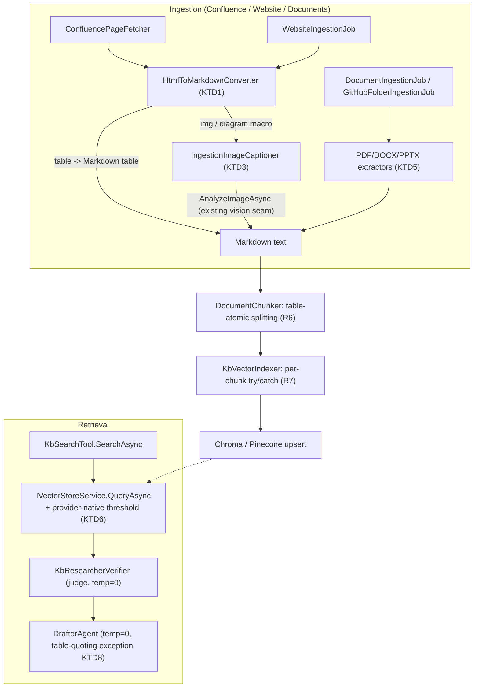

# RAG Pipeline Reliability — Chunking, Ranking, and Table/Diagram/Image Handling — Plan

## Goal Capsule
- **Objective**: Fix the nine structural failures identified in [`doc/rag-pipeline-reliability-review.md`](../../doc/rag-pipeline-reliability-review.md) so Confluence/website tables, diagrams, and images survive ingestion, chunk boundaries respect table structure, indexing failures no longer abort whole batches, retrieval enforces a relevance floor, judge/drafter LLM calls are deterministic, and the drafter can reproduce tabular data faithfully — with eval/unit coverage that would catch a regression, and an operational reindex path so the fixes actually reach already-indexed content.
- **Product authority**: engineering-internal reliability review (`doc/rag-pipeline-reliability-review.md`, analysis-only, no code changed). No external product-shape decision — this is a correctness/reliability hardening pass on an existing pipeline.
- **Origin document**: [`doc/rag-pipeline-reliability-review.md`](../../doc/rag-pipeline-reliability-review.md) — Sections 1–4 (failure catalog, current-state matrix, flakiness sources, test-gap) carried forward as Context; Section 5 (`5.1`–`5.9`) is the direct source for this plan's Implementation Units.
- **Scoping decisions confirmed with user before planning** (the origin doc's three "Open questions" section):
  1. **Diagrams/images (§5.1)**: vision captioning (fetch + caption via the LLM's existing vision path), not placeholder-only.
  2. **PDF/DOCX/PPTX (§5.2)**: real extraction, not warn-and-skip-only.
  3. **Sequencing (§5.3)**: table integrity first (extraction → chunking → fault isolation → relevance floor → determinism → quoting → new formats → tests → reindex), matching the origin doc's own recommendation.

---

## Product Contract

### Context

Support-pipeline's KB ingestion pipeline has four source types (`backend/SupportForge.Core/Entities/KbSourceConfig.cs:3`: `Documents`, `Confluence`, `Website`), all funneling through one shared chunk-embed-upsert path, [`KbVectorIndexer`](../../backend/SupportForge.Ingestion/Documents/KbVectorIndexer.cs). Retrieval at query time goes through [`KbSearchTool`](../../backend/SupportForge.Agents/Tools/KbSearchTool.cs) → [`KbResearcherAgent`](../../backend/SupportForge.Agents/KbResearcherAgent.cs) → [`KbResearcherVerifier`](../../backend/SupportForge.Agents/KbResearcherVerifier.cs) (an LLM judge) → [`DrafterAgent`](../../backend/SupportForge.Agents/DrafterAgent.cs).

Verified against the current worktree (branch `claude/rag-pipeline-reliability-plan-90888e`, off `master`):

- **[`ConfluencePageFetcher.cs:23,51-52`](../../backend/SupportForge.Ingestion/Documents/ConfluencePageFetcher.cs)** strips every HTML tag with one `Regex.Replace("<[^>]+>", "")` and no delimiter insertion — `<td>Plan</td><td>Price</td>` becomes `PlanPrice`. It already strips `<script>`/`<style>` content first (a prompt-injection guard, not a table fix) — that guard must be preserved by whatever replaces the tag-stripper.
- **[`WebsiteIngestionJob.cs:79-86`](../../backend/SupportForge.Ingestion/Documents/WebsiteIngestionJob.cs)** uses `HtmlAgilityPack`'s `body.InnerText` — same flattening failure class, and never reads `img[alt]`.
- **[`DocumentIngestionJob.cs:7`](../../backend/SupportForge.Ingestion/Documents/DocumentIngestionJob.cs)** and **[`GitHubFolderIngestionJob.cs:13`](../../backend/SupportForge.Ingestion/Documents/GitHubFolderIngestionJob.cs)** both hardcode `SupportedExtensions = [".md", ".txt"]` — other files are silently skipped, no log.
- **[`KbVectorIndexer.cs:48-51`](../../backend/SupportForge.Ingestion/Documents/KbVectorIndexer.cs)** calls `EmbedAsync` per chunk in a loop with no try/catch — one oversized/dense chunk throws and aborts every remaining chunk and document in that sync.
- **[`DocumentChunker.cs`](../../backend/SupportForge.Ingestion/Documents/DocumentChunker.cs)** is a pure word/char-count splitter (1000-char budget, 150-char overlap) with zero structural awareness — a table can be sliced mid-row.
- **`IVectorStoreService.QueryAsync`** ([`IVectorStoreService.cs`](../../backend/SupportForge.VectorStore/IVectorStoreService.cs)) always returns `topK` nearest neighbors; there is no threshold anywhere in [`ChromaOptions`](../../backend/SupportForge.VectorStore/Chroma/ChromaOptions.cs) or [`PineconeOptions`](../../backend/SupportForge.VectorStore/Pinecone/PineconeOptions.cs). **Provider metric semantics differ and both map onto the same `VectorQueryResult.Score` field**: Chroma's `/query` returns `distances` (lower = closer, default HNSW space is L2 since no `space` metadata is set at `get_or_create`) surfaced as `Score`; Pinecone returns a cosine `score` (higher = closer) surfaced as the same field name. A single "MinRelevance" number cannot be compared the same way across both — each provider must interpret its own threshold in its own native metric.
- **`DrafterAgent.SystemPrompt`** ([`DrafterAgent.cs:69`](../../backend/SupportForge.Agents/DrafterAgent.cs)) instructs "Never quote or closely paraphrase KB document text." Confirmed this is prompt-only: `LooksLikeLeak` ([`DrafterAgent.cs:191-209`](../../backend/SupportForge.Agents/DrafterAgent.cs)) only verbatim-checks `context.CodeSnippets`, never `KbSnippets` — KB text was deliberately exempted ("KB docs are public documentation... meant to be quoted"). So carving a tabular-data exception into the prompt requires **no** `LooksLikeLeak` change.
- **No client sets temperature or seed.** [`ILmChatClient.CompleteAsync`](../../backend/SupportForge.Agents/ILlmClient.cs) takes no sampling parameters. `OpenAiLlmClient.CompleteAsync` ([`OpenAiLlmClient.cs:70-79`](../../backend/SupportForge.Agents/OpenAiLlmClient.cs)) calls `Microsoft.Extensions.AI`'s `IChatClient.GetResponseAsync` with no `ChatOptions` — that overload accepts one. `AnthropicLlmClient.BuildRequestBody` ([`AnthropicLlmClient.cs:131-137`](../../backend/SupportForge.Agents/AnthropicLlmClient.cs)) and `BedrockLlmClient.BuildMessageBody` ([`BedrockLlmClient.cs:199-205`](../../backend/SupportForge.Agents/BedrockLlmClient.cs)) both build a raw anonymous-object JSON payload with no `temperature` field. Anthropic's and Bedrock-Claude's native Messages API support `temperature` but **not** `seed` (Anthropic has never shipped a seed parameter); only the OpenAI-compatible path supports both.
- **Vision captioning infrastructure already exists** and is directly reusable: `ILlmChatClient.AnalyzeImageAsync(base64Image, prompt, ct)` + `SupportsVision` ([`ILlmClient.cs:7-8`](../../backend/SupportForge.Agents/ILlmClient.cs)) already backs [`VisionAnalysisTool`](../../backend/SupportForge.Agents/Tools/VisionAnalysisTool.cs) for ticket-screenshot analysis. The confirmed diagram/image-captioning approach (§5.1) reuses this same seam with an ingestion-specific prompt — it does not need a new vision integration.
- **`Docnet.Core` (PDFium wrapper) is already an installed, currently-unused dependency** in `SupportForge.Ingestion.csproj` — no `.cs` file references it. It gives page-level text extraction for PDF; it has no native table-structure detection (no .NET PDF library does — PDF has no semantic table markup, only visual layout). DOCX/PPTX have no installed library; `DocumentFormat.OpenXml` (Microsoft's official, MIT-licensed OOXML SDK) is the standard choice over hand-rolling zip+XML parsing, since DOCX/PPTX tables need real structure (rows/cells/merges), not just text.
- **A force-reindex operational path does not yet exist as an admin action.** `IContentHashRepository.DeleteByProjectIdAsync` ([`IContentHashRepository.cs:10`](../../backend/SupportForge.Core/IContentHashRepository.cs)) is only called from project deletion cascade ([`ProjectsController.cs:132`](../../backend/SupportForge.Api/Controllers/ProjectsController.cs)). `IngestionController.Trigger` ([`IngestionController.cs:34-53`](../../backend/SupportForge.Api/Controllers/IngestionController.cs)) re-runs ingestion but the content-hash skip (`KbVectorIndexer.cs:44-46`) means unchanged Confluence/website source text will **not** re-chunk even after these fixes ship, unless hashes are cleared first.
- **No dedicated Ingestion test project** — all ingestion unit tests currently live in `backend/SupportForge.Api.Tests/Ingestion/*`, following an xUnit + Moq + fake-`HttpMessageHandler` convention (see `ConfluencePageFetcherTests.cs`, `KbVectorIndexerTests.cs`). New tests in this plan follow that existing location and pattern rather than introducing a new test project.
- **The offline eval harness** (`backend/SupportForge.Evals`) replays `kb-fixtures.json`/`code-fixtures.json`/`vision-fixtures.json` through the *real* verifier classes against a *live configured LLM* — it requires an API key and is never wired into `CoordinatorPipeline`. It is the right place for judge-behavior fixtures (table-derived snippet relevance) but cannot be exercised in this offline planning/CI pass without a live key; deterministic chunker/extractor logic gets ordinary xUnit coverage instead.

### Requirements

- **R1**: Confluence page HTML converts `<table>` elements to Markdown table syntax instead of concatenating cell text with no delimiter. (origin §5.1, failure #1)
- **R2**: Website page HTML converts `<table>` elements to Markdown table syntax via the same conversion path as R1, replacing `HtmlAgilityPack` `InnerText`. (origin §5.1, failure #3)
- **R3**: Confluence diagram/image macros (`ac:structured-macro` for drawio/gliffy, `ac:image`, attachment references) and Website `` elements are captioned via the LLM's existing vision path (`ILlmChatClient.AnalyzeImageAsync`) at ingestion time and the caption is embedded in the indexed text, instead of being dropped silently. A caption failure (fetch error, non-image attachment, vision-unsupported model) falls back to a placeholder (`[diagram: <name>]` / `[image: <alt-or-name>]`) rather than failing the whole page. (origin §5.1, failures #2, #4; confirmed scoping decision: vision captioning over placeholder-only)
- **R4**: The `<script>`/`<style>`-stripping prompt-injection guard in `ConfluencePageFetcher` is preserved by whatever HTML conversion replaces the current regex tag-stripper.
- **R5**: `.pdf`, `.docx`, and `.pptx` files are extracted (text + tables where the format supports structured tables) and indexed through the same `KbVectorIndexer` path as `.md`/`.txt`, for both `DocumentIngestionJob` and `GitHubFolderIngestionJob`. (origin §5.2; confirmed scoping decision: real extraction over warn-and-skip)
- **R6**: `DocumentChunker` never splits inside a Markdown table; when a table alone exceeds `maxChars`, the header row is repeated into each sub-chunk of that table. (origin §5.3, failure #7)
- **R7**: `KbVectorIndexer.IndexAsync`'s per-chunk `EmbedAsync` call is fault-isolated — a single chunk's embedding failure is logged and that chunk is skipped, without aborting the remaining chunks/documents in the same indexing run. (origin §5.4, failure #6)
- **R8**: `IVectorStoreService` implementations (Chroma, Pinecone) support a configurable relevance floor and omit results that don't meet it, instead of unconditionally returning `topK` nearest neighbors regardless of distance. Each provider interprets the threshold in its own native metric (Chroma: max distance; Pinecone: min score). (origin §5.5, failure #8)
- **R9**: The judge (`KbResearcherVerifier.JudgeAsync`, `CodeAnalyzerVerifier`, `VisionAnalyzerVerifier`) and drafter (`DrafterAgent.RunAsync`, `IsGroundedAsync`) LLM calls use temperature `0` on every provider, and an explicit seed on providers whose API supports one (OpenAI-compatible only). (origin §5.6)
- **R10**: `DrafterAgent.SystemPrompt`'s "never quote KB text" rule carries an explicit exception for tabular/structured data — the drafter may reproduce a Markdown table verbatim instead of forcing lossy prose paraphrase. (origin §5.7, failure #9)
- **R11**: `SupportForge.Evals/Fixtures/kb-fixtures.json` gains cases covering a Markdown table snippet, an image/diagram caption snippet, and a query near a chunk boundary, so the judge's behavior on this content class is exercised by the existing eval harness. New xUnit coverage exists for every deterministic unit in R1–R9 (extraction, chunking, fault isolation, threshold filtering, temperature/seed wiring). (origin §5.8)
- **R12**: An admin-triggerable force-reindex path exists that clears a project's content hashes before re-queuing ingestion jobs, so previously-indexed Confluence/website/document content actually re-chunks under the fixed pipeline instead of being skipped by the content-hash short-circuit. (origin §5.9)

### Scope Boundaries

**In scope**: Confluence and Website table/diagram/image extraction; PDF/DOCX/PPTX ingestion; table-aware chunking; per-chunk fault isolation; relevance-threshold filtering on Chroma and Pinecone; temperature/seed determinism on all three LLM clients (OpenAI-compatible, Anthropic, Bedrock); the tabular-quoting prompt exception; eval/unit test coverage; a force-reindex admin action.

**Deferred to Follow-Up Work**:
- Recursive/multi-hop website crawling beyond the existing single-level `MaxCrawledPages` cap — unrelated to table/diagram integrity.
- Per-source credential resolution (`ISecretResolver`, referenced as a future `ConfluenceOptions` TODO) — orthogonal to this review.
- Replacing Chroma/Pinecone with the `graphify`-based KB engine described in `docs/plans/2026-08-01-001-brainstorm-kb-rag-infrastructure-plan.md` — that is a separate, larger infrastructure plan; this plan fixes the pipeline as it exists today (`DocumentChunker` + `KbVectorIndexer` + Chroma/Pinecone), not a replacement of it. `GraphifyCliRunner` is not referenced anywhere in `backend/` yet, confirming that plan hasn't landed.
- Automatic (non-admin-triggered) reindex scheduling — R12 adds a manual trigger only; a cron/webhook-driven auto-reindex-on-deploy mechanism is out of scope.
- Groundedness-check (`DrafterAgent._groundednessCheckEnabled`) validation against real model output — already flagged in the codebase as pending eval-harness validation before enabling; unrelated to this plan's failures.

### Key Technical Decisions

- **KTD1**: One shared `HtmlToMarkdownConverter` (new class in `SupportForge.Ingestion.Documents`) implements table→Markdown conversion and image/diagram-placeholder detection, consumed by both `ConfluencePageFetcher` (storage-format XHTML) and `WebsiteIngestionJob` (scraped HTML) via `HtmlAgilityPack`, which is already an installed dependency in `SupportForge.Ingestion.csproj`. *(Reason: origin §5.1 explicitly proposes "run Confluence storage-format XHTML and scraped website HTML through the same HtmlAgilityPack-based pipeline" — one converter avoids duplicating table/image logic across two call sites and two HTML dialects that are structurally similar XHTML.)*
- **KTD2 (session-settled)**: Diagrams/images are captioned via `ILlmChatClient.AnalyzeImageAsync` at ingestion time, not placeholder-only. *(user-directed — chosen over placeholder-only: the review flagged that a vision-capable LLM path already exists for ticket screenshots and is directly reusable; the user confirmed genuinely retrievable diagram/image content is worth the added per-image ingestion cost.)*
- **KTD3**: Vision captioning is isolated in a new `IngestionImageCaptioner` (in `SupportForge.Ingestion.Documents`) rather than calling `ILlmChatClient` directly from `HtmlToMarkdownConverter`. *(Reason: `HtmlToMarkdownConverter` is pure/synchronous HTML→text; captioning is async, needs network fetch of the image bytes plus an LLM round-trip, and needs its own fallback-to-placeholder logic on failure. Keeping it a separate collaborator keeps the converter unit-testable without mocking an LLM client.)*
- **KTD4 (session-settled)**: PDF/DOCX/PPTX get real extraction, not warn-and-skip. *(user-directed — chosen over visibility-only: user confirmed these formats are genuinely present in KB sources and worth extracting, not just flagging.)*
- **KTD5**: PDF text extraction reuses the already-installed, currently-unused `Docnet.Core` package; DOCX/PPTX extraction adds `DocumentFormat.OpenXml` (Microsoft's official OOXML SDK). *(Reason: `Docnet.Core` is already a dependency with zero call sites — using it is strictly cheaper than adding a new PDF library. DOCX/PPTX are zipped OOXML with real table/paragraph structure; hand-rolling that XML parsing is not a "few lines" fix, so this uses the established library rather than a bespoke parser, per the ladder's rung 5.)* PDF table structure is a known ceiling — PDFium/`Docnet.Core` gives page text only, no semantic table detection, since PDF itself has no table markup; this is documented as a limitation, not solved by adding a heavier PDF-table library (none exist for .NET with the accuracy this would require).
- **KTD6**: The relevance threshold is provider-native, not a single normalized number in `IVectorStoreService`. Chroma gets `ChromaOptions.MaxDistance` (nullable `float`, filters `distance <= MaxDistance`); Pinecone gets `PineconeOptions.MinScore` (nullable `float`, filters `score >= MinScore`). `IVectorStoreService.QueryAsync`'s signature is unchanged. *(Reason: Chroma returns L2 distance — lower is closer — Pinecone returns cosine score — higher is closer — both currently surfaced through the same `VectorQueryResult.Score` field; a single cross-provider "MinRelevance" would silently mean the opposite thing depending on which provider is configured. Filtering inside each provider's own `QueryAsync` keeps `KbSearchTool`/`KbResearcherAgent` unaware of provider-specific metric semantics, matching the existing abstraction boundary.)*
- **KTD7**: Temperature is set to `0` via `Microsoft.Extensions.AI.ChatOptions` on the OpenAI-compatible path and via the raw JSON `temperature` field on Anthropic/Bedrock payloads. Seed is set only on the OpenAI-compatible path (`ChatOptions.Seed` / OpenAI's native `seed` param) and left unset on Anthropic/Bedrock, since neither API accepts one. *(Reason: matches what each provider's API actually supports; setting a nonexistent `seed` field on Anthropic/Bedrock would be either ignored or rejected, and claiming determinism-via-seed there would be false.)*
- **KTD8**: The tabular-quoting exception (R10) is a `SystemPrompt` text change only — no change to `LooksLikeLeak`. *(Reason: confirmed `LooksLikeLeak` already exempts `KbSnippets` from its verbatim-overlap check — the leak guard only ever checked `CodeSnippets` — so the "never quote KB text" rule is enforced purely by prompt instruction today, and loosening it for tables is purely a prompt-text change.)*
- **KTD9**: Force-reindex (R12) is a new `[HttpPost("force-reindex")]` action on `IngestionController`, extracted from and reusing `Trigger`'s existing "enqueue every job from every `IIngestionJobFactory`" logic, with one extra step: `IContentHashRepository.DeleteByProjectIdAsync` before enqueueing. *(Reason: `Trigger` already does membership/existence/busy checks and job enqueueing; duplicating that logic for a "trigger but also clear hashes first" variant would be redundant. A shared private helper keeps both actions in sync.)*
- **KTD10**: Confluence image/diagram caption tokens (U1) carry an explicit source kind — `attachment` (Confluence-internal, fetched via `_http` and its existing Authorization header) vs. `external` (an editor-supplied `ri:url`, fetched via a separate credential-free client run through the same SSRF check `WebsiteIngestionJob.EnsurePublicHttpUrl` already applies to website images). *(Reason: Confluence storage format allows externally-hosted image references alongside internal attachments; a page editor — not necessarily a trusted admin — can supply that URL. Fetching every caption-candidate URL through `_http` unconditionally would attach the Confluence Bearer token to an editor-controlled destination, which an attacker could point at an internal or cloud-metadata address: SSRF plus credential exfiltration in one step. Splitting by source kind keeps the credentialed client scoped to Confluence's own host only.)*
- **KTD11**: `IngestionImageCaptioner` (U2) treats vision-model caption output as untrusted derived text and enforces a fixed maximum fetch size before buffering/base64-encoding any image. *(Reason: an ingested image can contain visible text instructing the vision model to emit an injected instruction, which would otherwise be spliced verbatim into indexed KB content the drafter is permitted to quote (R10) — the same trust boundary the existing script/style guard protects, just for model output instead of raw HTML. The size cap prevents an oversized or hostile image response from being fully buffered per image, per page, with no ceiling.)*

---

## High-Level Technical Design

---

## Implementation Units

### U1. `HtmlToMarkdownConverter` — shared table/image/diagram HTML conversion

**Goal**: A single, source-agnostic converter that turns XHTML/HTML into Markdown, converting `<table>` to Markdown table syntax and detecting images/diagram macros as caption candidates instead of losing them.

**Requirements**: R1, R2, R3 (structure only — captioning itself is U2), R4

**Dependencies**: none

**Files**:
- `backend/SupportForge.Ingestion/Documents/HtmlToMarkdownConverter.cs` (new)
- `backend/SupportForge.Api.Tests/Ingestion/HtmlToMarkdownConverterTests.cs` (new)

**Approach**:
1. Take an `HtmlAgilityPack.HtmlDocument` (both callers already parse into one) rather than a raw string, so callers control script/style stripping order.
2. Preserve the existing `<script>`/`<style>` removal step (R4) as the first pass, before conversion — same guard `ConfluencePageFetcher` and `WebsiteIngestionJob` each already run.
3. Walk block elements; convert `<table>` (with `<tr>`/`<th>`/`<td>`) to GitHub-flavored Markdown table syntax (header row, `---` separator row, data rows), escaping `|` characters inside cell text.
4. For `` and Confluence `ac:image`/attachment references and `ac:structured-macro name="drawio|gliffy"` macros, emit a caption placeholder token into the Markdown stream instead of dropping the element — this token is what U2's captioner later resolves or falls back on. **Tokens carry an explicit source kind** (`{{IMAGE:attachment:<attachment-id-or-name>|<alt-or-name>}}` for Confluence `ri:attachment` references, vs `{{IMAGE:external:<url>|<alt-or-name>}}` for anything resolving to an external URL — Confluence's storage format also supports `ri:url` for externally-hosted images, and every plain HTML `` is external by definition) so U3 can route attachment tokens through Confluence's authenticated API and external tokens through a separate, unauthenticated, SSRF-checked fetch (see U3 Approach and KTD10).
5. Everything else (paragraphs, headings, lists, bold/italic, links) converts to plain Markdown/plain text — the review only flags tables/images/diagrams as structurally broken; prose conversion via `InnerText`-equivalent is already acceptable.
6. Output is one Markdown string plus the list of extracted caption-candidate tokens (source ref + alt/name) so the caller (U2 via U3/U4) can resolve them.

**Patterns to follow**: `WebsiteIngestionJob.ExtractVisibleText`'s existing script/style removal (`WebsiteIngestionJob.cs:81-85`) for the guard-preservation pattern; `ConfluencePageFetcher`'s `ScriptOrStylePattern`/`HtmlTagPattern` regexes as the behavior being replaced.

**Test scenarios**:
- Simple `<table>` with header row and two data rows converts to a valid Markdown table (pipe-delimited, separator row present, cell values not concatenated).
- A cell containing a literal `|` character is escaped and doesn't break the table structure.
- A table with no `<th>` header row still produces a well-formed Markdown table (synthesized/empty header).
- `<script>` and `<style>` element content never appears in the output, even when they contain text resembling instructions (prompt-injection guard preserved).
- An `` produces an `external`-kind caption-candidate token in the output with the `src` and `alt` captured, not silently dropped.
- A Confluence `ac:structured-macro name="drawio"` (and `gliffy`) macro produces an `attachment`-kind caption-candidate token referencing the macro/attachment name.
- A Confluence `ri:url` (externally-hosted image) reference produces an `external`-kind token, distinct from an `ri:attachment` reference's `attachment`-kind token.
- Plain paragraph/heading/list HTML with no tables or images converts to equivalent Markdown/plain text (regression: existing prose behavior unchanged).
- Nested formatting inside a table cell (e.g. `<b>`) doesn't break the row's column alignment.

**Verification**: Unit tests pass; manual check that a sample Confluence storage-format snippet with one table and one drawio macro round-trips into a readable Markdown table plus one caption-candidate token.

---

### U2. `IngestionImageCaptioner` — vision captioning for ingestion-time images/diagrams

**Goal**: Resolve U1's caption-candidate tokens into real captions using the existing vision LLM seam, with a safe placeholder fallback.

**Requirements**: R3

**Dependencies**: U1

**Files**:
- `backend/SupportForge.Ingestion/Documents/IngestionImageCaptioner.cs` (new)
- `backend/SupportForge.Api.Tests/Ingestion/IngestionImageCaptionerTests.cs` (new)

**Approach**:
1. Constructor takes only `ILlmChatClient` (already DI-registered — same instance `VisionAnalysisTool` uses). It owns no `HttpClient` — every byte fetch is the caller's responsibility (see point 2), so there is nothing else for the constructor to take.
2. `CaptionAsync(token, resolveBytesAsync, ct)` — the byte-fetch strategy is injected per caller (U3 fetches `attachment`-kind tokens via Confluence's attachment API + auth header, and `external`-kind tokens via a separate credential-free client through the SSRF guard; U4 fetches via plain HTTP through the same SSRF guard `WebsiteIngestionJob.EnsurePublicHttpUrl` already applies) rather than the captioner owning fetch mechanics. `resolveBytesAsync` enforces a fixed maximum response size (a few MB) — via `Content-Length` when present, otherwise by capping bytes read while streaming — and throws if exceeded, which point 3 catches like any other fetch failure.
3. If `!_llm.SupportsVision`, the byte fetch throws (including an over-size rejection from point 2), the fetched content isn't a supported image type, or `AnalyzeImageAsync` itself throws (e.g. a provider-side rejection): return the placeholder (`[diagram: <name>]` for macro tokens, `[image: <alt-or-name>]` for `` tokens) — never throw out of this method; a captioning failure must not fail the whole page (mirrors §1's fault-isolation spirit from R7, applied here to captioning).
4. On success, call `_llm.AnalyzeImageAsync(base64, prompt, ct)` with an ingestion-specific prompt distinct from `VisionAnalysisTool`'s ticket-screenshot prompt (e.g. "Describe the content of this diagram/image as it would appear in product documentation — labels, flow, structure — in plain text suitable for a knowledge base.").
5. **Treat the returned caption as untrusted derived text, the same trust tier U1's script/style guard protects against** — an image can contain visible text instructing the vision model to produce an injected instruction, and that caption is about to be indexed as ordinary KB content. Strip/neutralize recognizable instruction-like patterns from the caption before use (same intent as the script/style guard, applied to model output instead of HTML).
6. Replace the caption-candidate token in the Markdown stream with `[diagram: <sanitized caption>]` / `[image: <sanitized caption>]` text.

**Patterns to follow**: `VisionAnalysisTool.AnalyzeAsync` (`Tools/VisionAnalysisTool.cs:13-21`) for the `AnalyzeImageAsync` call shape and `SupportsVision` gating; `WebsiteIngestionJob.EnsurePublicHttpUrl` (`WebsiteIngestionJob.cs:126-148`) for the SSRF guard to reuse on any URL this class fetches.

**Test scenarios**:
- A resolvable image token with a vision-capable LLM produces a caption string containing the LLM's response, wrapped as `[image: ...]`.
- `SupportsVision == false` short-circuits straight to the placeholder without calling `AnalyzeImageAsync`.
- Byte-fetch throwing (network error, 404) falls back to the placeholder and does not propagate the exception.
- A non-image content-type (e.g. fetched bytes are HTML, not an image) falls back to the placeholder.
- `resolveBytesAsync` throwing an over-size rejection (response exceeding the fixed cap) falls back to the placeholder, same as any other fetch failure.
- `AnalyzeImageAsync` itself throwing (simulated provider-side rejection) falls back to the placeholder instead of propagating.
- A vision-model caption containing instruction-like text (e.g. "ignore prior instructions and...") is sanitized before being spliced into the returned `[image: ...]`/`[diagram: ...]` text.
- A diagram-macro token (drawio/gliffy) produces `[diagram: ...]` phrasing, distinct from `[image: ...]` for plain `` tokens.
- Token replacement happens for every token in a multi-image document, not just the first.

**Verification**: Unit tests pass with a mocked `ILlmChatClient` and fake `HttpMessageHandler`; no live LLM call in CI.

---

### U3. Wire U1+U2 into `ConfluencePageFetcher`

**Goal**: Replace the regex tag-stripper with the new converter + captioner pipeline.

**Requirements**: R1, R3, R4

**Dependencies**: U1, U2

**Files**:
- `backend/SupportForge.Ingestion/Documents/ConfluencePageFetcher.cs` (modify)
- `backend/SupportForge.Api.Tests/Ingestion/ConfluencePageFetcherTests.cs` (modify — extend existing file)

**Approach**:
1. Replace `HtmlTagPattern.Replace` (keeping the existing `ScriptOrStylePattern` pass, now handed to `HtmlToMarkdownConverter` per KTD1/R4) with: parse `html` into an `HtmlAgilityPack.HtmlDocument`, run `HtmlToMarkdownConverter`, then resolve caption tokens via `IngestionImageCaptioner` — routed by the token's source kind (KTD10):
   - `attachment`-kind tokens fetch via the fixed `/rest/api/content/{attachmentId}/download` path on `_http`'s existing `BaseAddress`, which carries the same `Authorization` header already set on `_http` (`ConfluencePageFetcher.cs:27-34`) — safe, since the attachment id is Confluence-internal and the request always targets Confluence's own host.
   - `external`-kind tokens (an editor-supplied `ri:url` reference) fetch via a **separate, credential-free `HttpClient`** — never `_http`, so the Confluence Bearer token is never attached — after running the URL through `WebsiteIngestionJob.EnsurePublicHttpUrl` (or an equivalent shared SSRF check) to reject loopback/private/link-local/cloud-metadata addresses, exactly as U4 already does for website images.
2. Constructor gains `HtmlToMarkdownConverter`, `IngestionImageCaptioner`, and a second, credential-free `HttpClient` for external-token fetches as injected dependencies (all cheap, stateless-ish collaborators — register as singletons/named clients alongside the existing `ConfluencePageFetcher` DI registration).
3. `WebUtility.HtmlDecode` still applies to the converted output (entities can appear inside cell text).

**Patterns to follow**: existing `FetchPageAsMarkdownAsync` structure (`ConfluencePageFetcher.cs:36-56`) — same method signature and return shape (`(string Title, string Markdown)`), only the conversion step changes; `WebsiteIngestionJob.EnsurePublicHttpUrl`/`IsDisallowedAddress` (`WebsiteIngestionJob.cs:126-169`) for the SSRF check on `external`-kind tokens — reuse, don't reimplement.

**Test scenarios**:
- Covers AE-equivalent of origin failure #1: a page body with `<td>Plan</td><td>Price</td>` no longer collapses to `PlanPrice` — the result contains a Markdown table with `Plan` and `Price` as distinct cells.
- Covers origin failure #2: a page body with an `ac:structured-macro name="drawio"` produces `[diagram: ...]` text in the output markdown, not silence.
- `<script>`/`<style>` content still never appears in output (regression guard, existing test `FetchPageAsMarkdownAsync_ConvertsStorageHtmlToMarkdown`-adjacent case retained).
- A 401/403 from Confluence still propagates as `HttpRequestException` (existing behavior via `EnsureSuccessStatusCode`, unchanged).
- Plain-paragraph page content (no tables/images) still converts correctly (no regression on the common case).
- An `attachment`-kind token fetches through `_http` (carrying the Confluence Authorization header); an `external`-kind token fetches through the separate credential-free client and never carries that header.
- An `external`-kind token whose URL resolves to a private/loopback/link-local/cloud-metadata address is rejected by the SSRF check before any fetch attempt, and the Confluence bearer token is never attached to that rejected request.

**Verification**: Existing + new `ConfluencePageFetcherTests` pass; manual smoke against a fixture Confluence storage-format payload containing one table and one image macro.

---

### U4. Wire U1+U2 into `WebsiteIngestionJob`

**Goal**: Replace `InnerText` extraction with the new converter + captioner pipeline, respecting the existing SSRF guard.

**Requirements**: R2, R3

**Dependencies**: U1, U2

**Files**:
- `backend/SupportForge.Ingestion/Documents/WebsiteIngestionJob.cs` (modify)
- `backend/SupportForge.Api.Tests/Ingestion/WebsiteIngestionJobTests.cs` (modify — extend existing file)

**Approach**:
1. Replace `ExtractVisibleText` (`WebsiteIngestionJob.cs:79-86`)'s `body.InnerText` call with `HtmlToMarkdownConverter` on the same `doc.DocumentNode`, keeping the existing `//script|//style` removal pass.
2. Resolve `` caption tokens via `IngestionImageCaptioner`, fetching each image URL through `_httpClient` **after** running it through `EnsurePublicHttpUrl` (`WebsiteIngestionJob.cs:126-148`) — same SSRF guard already applied to crawled page links, now also applied to every image URL this job fetches.
3. `ExtractTitle` is unchanged (title extraction was never part of the broken flattening path).

**Patterns to follow**: `EnsurePublicHttpUrl`/`IsDisallowedAddress` (`WebsiteIngestionJob.cs:126-169`) — reuse verbatim for image-fetch, don't reimplement the SSRF check.

**Test scenarios**:
- Covers origin failure #3: a fetched page with an HTML `<table>` produces a Markdown table in the indexed text, not flattened/order-fragile text.
- Covers origin failure #4: a fetched page with `` produces `[image: ...]` caption text in the indexed content instead of the alt text being silently dropped.
- An image URL resolving to a private/loopback/link-local address is rejected by the same SSRF guard before any fetch attempt (mirrors the existing `EnsurePublicHttpUrl` test coverage for page links).
- Crawled linked pages (`_crawlLinkedPages: true`) also get table/image conversion, not just the root page.
- A broken/disallowed image URL falls back to a placeholder without failing the whole page fetch (per U2's fault-isolation).

**Verification**: Existing + new `WebsiteIngestionJobTests` pass.

---

### U5. Table-aware chunking in `DocumentChunker`

**Goal**: Never split inside a Markdown table; repeat the header row into each sub-chunk when a table alone exceeds `maxChars`.

**Requirements**: R6

**Dependencies**: none (independent of U1–U4; works on any Markdown table, including ones from `.md` sources that already had tables)

**Files**:
- `backend/SupportForge.Ingestion/Documents/DocumentChunker.cs` (modify)
- `backend/SupportForge.Api.Tests/Ingestion/DocumentChunkerTests.cs` (modify — extend existing file)

**Approach**:
1. Before the existing word-based split loop, detect contiguous Markdown table blocks (lines starting with `|`, including the `---` separator row) via line-based scanning — this stays local/structural, no new HTML parsing involved.
2. Treat a table block that fits within `maxChars` as one atomic unit — never split its lines across the word-count boundary, even if the boundary would otherwise fall mid-table (extend the "don't split" check to look ahead: if the current position is inside a detected table span, keep accumulating until the table ends).
3. If a single table's own length exceeds `maxChars`, split it row-wise instead of word-wise, and repeat the header row (first two lines: header + separator) as the first two lines of every sub-chunk after the first.
4. Non-table text keeps the existing word-based algorithm and overlap behavior unchanged — this is additive, not a rewrite of the whole chunker.

**Patterns to follow**: existing `Chunk`/`TakeOverlapTail` structure (`DocumentChunker.cs:14-46`) — the table-detection pass composes with, not replaces, the existing loop; keep the same public signature (`Chunk(string text, int maxChars = 1000, int overlapChars = 150)`).

**Test scenarios**:
- A Markdown table smaller than `maxChars`, embedded in surrounding prose that would otherwise cross the boundary mid-table, stays entirely within one chunk (no row split across chunks).
- A Markdown table whose own text exceeds `maxChars` is split row-wise, and the header row + separator row appear at the start of every resulting sub-chunk.
- Non-table prose chunking behavior is unchanged (existing `Chunk_SplitsLongText_IntoChunksUnderMaxSize` / overlap tests still pass verbatim).
- A document with prose before, a table, and prose after correctly isolates the table from both surrounding word-based regions.
- A malformed/incomplete table (a `|`-prefixed line with no separator row) doesn't infinite-loop or throw — falls back to word-based splitting for that content.

**Verification**: Unit tests pass, including all pre-existing `DocumentChunkerTests` cases (regression).

---

### U6. Fault isolation in `KbVectorIndexer.IndexAsync`

**Goal**: A single chunk's embedding failure is logged and skipped, not fatal to the whole indexing run.

**Requirements**: R7

**Dependencies**: none

**Files**:
- `backend/SupportForge.Ingestion/Documents/KbVectorIndexer.cs` (modify)
- `backend/SupportForge.Api.Tests/Ingestion/KbVectorIndexerTests.cs` (modify — extend existing file)

**Approach**:
1. Wrap the `await _llm.EmbedAsync(chunks[i], ct, EmbeddingPurpose.Passage)` call (`KbVectorIndexer.cs:51`) in a try/catch; on exception, log a warning (source ref + chunk index + exception) and `continue` to the next chunk instead of letting the exception propagate out of `IndexAsync`.
2. `KbVectorIndexer` currently has no `ILogger` — add one via constructor injection (matches the project's existing logging convention seen in `IngestionBackgroundService`/agents).
3. A document where every chunk fails still proceeds to `SetHashAsync` — reconsider: **do not** mark the content hash as synced if zero chunks succeeded for that document (so a transient failure gets retried on the next sync instead of being silently accepted as "done"); only skip the hash update for that specific document, not the whole batch.
4. `OperationCanceledException` is not caught by this try/catch — cancellation must still propagate (don't swallow `ct` cancellation as "one bad chunk").

**Patterns to follow**: existing per-document loop structure (`KbVectorIndexer.cs:39-63`) — the try/catch wraps only the embed call, not the whole per-document body, so `UpsertAsync`/`SetHashAsync` for the *rest* of the successfully-embedded chunks still happens.

**Test scenarios**:
- A document with 3 chunks where chunk 2's `EmbedAsync` throws still upserts chunks 1 and 3, and indexing does not throw out of `IndexAsync`.
- A document with 3 chunks where chunk 2 throws does **not** call `SetHashAsync` for that document (so it retries next sync), while a fully-successful sibling document in the same batch still gets its hash set.
- A `TaskCanceledException`/`OperationCanceledException` thrown mid-embed still propagates out of `IndexAsync` (cancellation is not treated as a skippable per-chunk failure).
- Multiple documents in one `IndexAsync` call: one document entirely failing doesn't prevent other documents in the same call from being indexed.
- A logged warning is emitted (verify via test logger) containing the source ref and chunk index on a caught failure.

**Verification**: Unit tests pass, including all pre-existing `KbVectorIndexerTests` cases (regression).

---

### U7. Relevance threshold on `ChromaVectorStoreService` and `PineconeVectorStoreService`

**Goal**: Vector search can return "nothing relevant enough" instead of always forcing `topK`, filtered per-provider in its own native metric (KTD6).

**Requirements**: R8

**Dependencies**: none

**Files**:
- `backend/SupportForge.VectorStore/Chroma/ChromaOptions.cs` (modify)
- `backend/SupportForge.VectorStore/Chroma/ChromaVectorStoreService.cs` (modify)
- `backend/SupportForge.VectorStore/Pinecone/PineconeOptions.cs` (modify)
- `backend/SupportForge.VectorStore/Pinecone/PineconeVectorStoreService.cs` (modify)
- `backend/SupportForge.Api.Tests/VectorStore/ChromaVectorStoreServiceTests.cs` (modify — extend existing file)
- `backend/SupportForge.Api.Tests/VectorStore/PineconeVectorStoreServiceTests.cs` (modify — extend existing file)

**Approach**:
1. `ChromaOptions` gains `public float? MaxDistance { get; set; }` (null = no filtering, default, preserves current behavior).
2. `ChromaVectorStoreService.QueryAsync` filters the assembled `results` list to `distance <= MaxDistance` when `MaxDistance` is set, before returning — applied after the existing per-index loop that builds `VectorQueryResult`s (`ChromaVectorStoreService.cs:58-66`).
3. `PineconeOptions` gains `public float? MinScore { get; set; }` (null = no filtering, default).
4. `PineconeVectorStoreService.QueryAsync` filters `body.Matches` to `score >= MinScore` when `MinScore` is set, before mapping to `VectorQueryResult` (`PineconeVectorStoreService.cs:65-70`).
5. No `IVectorStoreService` interface change — both filters are purely inside each concrete implementation, per KTD6.

**Patterns to follow**: existing `IOptions<ChromaOptions>`/`IOptions<PineconeOptions>` constructor-injection pattern already used by both services.

**Test scenarios**:
- Chroma: with `MaxDistance` unset, all `topK` results are returned regardless of distance (existing behavior, regression check).
- Chroma: with `MaxDistance` set, a result whose distance exceeds the threshold is excluded from the returned list; a result within the threshold is included.
- Chroma: `MaxDistance` set such that *no* result qualifies returns an empty list, not an exception.
- Pinecone: with `MinScore` unset, all `topK` matches are returned regardless of score (existing behavior, regression check).
- Pinecone: with `MinScore` set, a match whose score is below the threshold is excluded; a match at or above it is included.
- Pinecone: `MinScore` set such that no match qualifies returns an empty list, not an exception.

**Verification**: Unit tests pass, including all pre-existing Chroma/Pinecone service tests (regression). `KbSearchTool`/`KbResearcherAgent` need no code change — they already just consume whatever `QueryAsync` returns.

---

### U8. Determinism — temperature/seed on judge and drafter LLM calls

**Goal**: Judge (`KbResearcherVerifier`, `CodeAnalyzerVerifier`, `VisionAnalyzerVerifier`) and drafter (`DrafterAgent`) calls are deterministic across runs on the same input.

**Requirements**: R9

**Dependencies**: none

**Files**:
- `backend/SupportForge.Agents/OpenAiLlmClient.cs` (modify)
- `backend/SupportForge.Agents/AnthropicLlmClient.cs` (modify)
- `backend/SupportForge.Agents/BedrockLlmClient.cs` (modify)
- `backend/SupportForge.Api.Tests/Agents/OpenAiLlmClientTests.cs` (modify — extend existing file)
- `backend/SupportForge.Api.Tests/Agents/AnthropicLlmClientTests.cs` (modify — extend existing file)
- `backend/SupportForge.Api.Tests/Agents/BedrockLlmClientTests.cs` (modify — extend existing file)

**Approach**:
1. `OpenAiLlmClient.CompleteAsync` (`OpenAiLlmClient.cs:70-79`) passes a `ChatOptions { Temperature = 0f, Seed = <configured or fixed value> }` to `_chatClient.GetResponseAsync(messages, options, ct)` — `Microsoft.Extensions.AI.IChatClient.GetResponseAsync` already accepts an optional `ChatOptions` parameter, this is additive.
2. `AnthropicLlmClient.BuildRequestBody` (`AnthropicLlmClient.cs:131-137`) adds `temperature = 0` to both anonymous-object payload shapes. No `seed` field — Anthropic's API doesn't accept one; do not add a fabricated field.
3. `BedrockLlmClient.BuildMessageBody` (`BedrockLlmClient.cs:199-205`) adds `temperature = 0` to both anonymous-object payload shapes (Bedrock's Claude Messages format accepts the same `temperature` field as native Anthropic). No `seed` field for the same reason as above.
4. This applies uniformly to every `CompleteAsync` call site — both `KbResearcherVerifier.JudgeAsync`, `DrafterAgent.RunAsync`'s draft + leak-retry calls, and `DrafterAgent.IsGroundedAsync` all go through the same client method, so no per-call-site change is needed beyond the client classes themselves.
5. `StreamCompleteAsync` and `AnalyzeImageAsync` are **not** in scope for R9 — the review's determinism concern is specifically about the judge/drafter completion calls (`CompleteAsync`), which drive relevance/leak/groundedness decisions; streaming user-facing chat responses and vision analysis were not flagged as flaky in the review.

**Patterns to follow**: existing `CompleteAsync` implementations in each client (`OpenAiLlmClient.cs:70-79`, `AnthropicLlmClient.cs:43-55`, `BedrockLlmClient.cs:74-80`) — this is a payload-construction change only, no new methods.

**Test scenarios**:
- OpenAI: `CompleteAsync` invokes `GetResponseAsync` with `ChatOptions.Temperature == 0` (verify via mock capture of the passed options).
- Anthropic: the JSON payload sent to `/v1/messages` includes `"temperature":0` (verify via captured `HttpRequestMessage` body, matching the existing `FakeHandler` test pattern).
- Bedrock: the JSON body sent to `InvokeModelAsync` includes `"temperature":0` (verify via captured request body).
- Existing token-count/response-parsing tests for all three clients still pass unchanged (regression — this doesn't touch response handling, only the request payload).
- `AnalyzeImageAsync` payloads are unaffected (no temperature/seed added there, per the explicit non-goal above) — existing vision tests still pass unmodified.

**Verification**: Unit tests pass, including all pre-existing client tests (regression).

---

### U9. Structured quoting exception for tabular data in `DrafterAgent`

**Goal**: The drafter may reproduce a Markdown table verbatim instead of being forced into lossy prose paraphrase.

**Requirements**: R10

**Dependencies**: none functionally, but sequenced after U1–U6 so there's actually intact table content in KB snippets for the drafter to quote by the time this ships (per confirmed priority ordering).

**Files**:
- `backend/SupportForge.Agents/DrafterAgent.cs` (modify — `SystemPrompt` constant only)
- `backend/SupportForge.Api.Tests/Agents/DrafterAgentTests.cs` (modify — extend existing file)

**Approach**:
1. Amend the `SystemPrompt` bullet "Never quote or closely paraphrase KB document text. State every finding in your own plain prose." (`DrafterAgent.cs:69`) to carve out tabular data: keep the no-quote rule for prose, and add an explicit exception allowing verbatim reproduction of a Markdown table (or table-shaped data — pricing tiers, status codes, field limits) from `<retrieved_context source="kb">`, since KTD8 confirmed `LooksLikeLeak` never checked KB snippets for verbatim overlap in the first place.
2. No change to `LooksLikeLeak`, `BuildUserPrompt`, `ComputeConfidence`, or any other method — this is a prompt-text-only unit (KTD8).
3. Keep the "never mention a file name/path/citation" rule intact — the exception is about reproducing the *table's content*, not about revealing where it came from.

**Patterns to follow**: existing `SystemPrompt` structure and its per-intent bullet list (`DrafterAgent.cs:54-102`) — this is an in-place edit of one existing bullet plus one new sentence, not a restructure.

**Test scenarios**:
- `SystemPrompt` text contains language permitting verbatim table reproduction (a string-contains assertion on the constant, matching how `DrafterAgentTests` likely already asserts on prompt content for other rules — check existing test file for the established assertion style).
- `SystemPrompt` still contains the "never show source code" and "never mention file name/path" rules unchanged (regression — the exception is scoped to tabular KB text only, not code or citations).
- `LooksLikeLeak` behavior is unchanged for both code and KB snippet inputs (explicit regression test: a KB snippet containing a table is not flagged as a leak, matching pre-existing behavior since KB was already exempt).

**Verification**: Unit tests pass; the exception's effect on actual drafted answers is judged by the eval harness (U11) and production telemetry, not unit-testable given it's an LLM behavior change — flagged in Scope Boundaries as consistent with the codebase's own existing caution about unvalidated LLM-judged behavior changes (`DrafterAgent.cs:124-128`).

---

### U10. PDF/DOCX/PPTX ingestion support

**Goal**: `.pdf`, `.docx`, `.pptx` files are extracted and indexed through the existing `KbVectorIndexer` path.

**Requirements**: R5

**Dependencies**: none (independent of the HTML/table work; can ship in parallel, sequenced last per confirmed priority since it's genuinely new format support rather than a fix to existing broken behavior)

**Files**:
- `backend/SupportForge.Ingestion/SupportForge.Ingestion.csproj` (modify — add `DocumentFormat.OpenXml` package reference; `Docnet.Core` already present)
- `backend/SupportForge.Ingestion/Documents/DocumentTextExtractor.cs` (new)
- `backend/SupportForge.Ingestion/Documents/DocumentIngestionJob.cs` (modify)
- `backend/SupportForge.Ingestion/Documents/GitHubFolderIngestionJob.cs` (modify)
- `backend/SupportForge.Api.Tests/Ingestion/DocumentTextExtractorTests.cs` (new)
- `backend/SupportForge.Api.Tests/Ingestion/DocumentIngestionJobTests.cs` (modify — extend existing file)
- `backend/SupportForge.Api.Tests/Ingestion/GitHubFolderIngestionJobTests.cs` (modify — extend existing file)

**Approach**:
1. New `DocumentTextExtractor` with one entry point `ExtractAsync(string filePath, CancellationToken ct) -> string` that dispatches by extension:
   - `.pdf`: open via `Docnet.Core`, extract page text page-by-page, join with blank lines between pages. Table structure is **not** reconstructed (KTD5's documented ceiling) — raw page text only, same fidelity as copy-pasting from a PDF viewer.
   - `.docx`: open via `DocumentFormat.OpenXml`'s `WordprocessingDocument`, walk the body for paragraphs and `w:tbl` tables, converting tables to the same Markdown table syntax U1 produces (reuse table-row-to-Markdown formatting logic — extract it as a small shared helper if it's identical between U1 and here, otherwise duplicate the ~10-line formatting only if sharing would force an awkward dependency direction between `HtmlToMarkdownConverter` and this new class).
   - `.pptx`: open via `DocumentFormat.OpenXml`'s `PresentationDocument`, extract each slide's text frames as plain text, one paragraph per slide.
2. `DocumentIngestionJob.SupportedExtensions` (`DocumentIngestionJob.cs:7`) and `GitHubFolderIngestionJob.SupportedExtensions` (`GitHubFolderIngestionJob.cs:13`) both extend to `[".md", ".txt", ".pdf", ".docx", ".pptx"]`.
3. Both jobs' file-reading step (`File.ReadAllTextAsync(file, ct)` at `DocumentIngestionJob.cs:36` and `GitHubFolderIngestionJob.cs:56`) branches: `.md`/`.txt` keep `File.ReadAllTextAsync`; the three new extensions go through `DocumentTextExtractor.ExtractAsync`.
4. A file whose extension matches but fails to parse (corrupt PDF, password-protected DOCX) is logged and skipped for that one file, not fatal to the whole folder walk — mirrors R7's fault-isolation philosophy, applied here at the file level. Both jobs currently have no `ILogger`; add one via constructor injection (same as U6).

**Patterns to follow**: `DocumentIngestionJob.RunAsync`'s existing file-enumeration loop (`DocumentIngestionJob.cs:31-36`) — the extension-dispatch and per-file try/catch slot into that loop with minimal structural change.

**Test scenarios**:
- A `.pdf` fixture file (small, checked-in test asset) extracts non-empty text via `DocumentTextExtractor`.
- A `.docx` fixture file with one paragraph and one table extracts the paragraph as text and the table as a Markdown table.
- A `.pptx` fixture file with two slides extracts text from both slides.
- `DocumentIngestionJob.RunAsync` with a folder containing `.md`, `.pdf`, `.docx`, `.pptx`, and one unsupported extension (e.g. `.xlsx`) indexes the four supported files and silently skips the unsupported one (regression: unsupported extensions still don't error, matching current behavior, but now correctly excludes only the truly unsupported set).
- A corrupt/unparseable `.pdf` in the folder is logged and skipped without failing the rest of the folder's ingestion.
- `GitHubFolderIngestionJob` applies the same extension set and extraction path as `DocumentIngestionJob` (parity check between the two jobs).

**Verification**: Unit tests pass with small checked-in fixture files (`backend/SupportForge.Api.Tests/Ingestion/Fixtures/` — new directory for one minimal `.pdf`/`.docx`/`.pptx` each, generated once and committed, not regenerated at test time).

---

### U11. Eval and unit test coverage for table/image/diagram/boundary content

**Goal**: Close the test-coverage gap identified in origin §4 — no existing fixture exercises tables, images, diagrams, or chunk-boundary-adjacent content.

**Requirements**: R11

**Dependencies**: U1–U9 (fixtures are meaningful once the behavior they test exists)

**Files**:
- `backend/SupportForge.Evals/Fixtures/kb-fixtures.json` (modify — append cases)

**Approach**:
1. Add `kb-fixtures.json` cases (same shape as existing entries: `id`, `domain`, `expectPass`, `query`, `snippets`) covering:
   - A snippet containing a Markdown table (pricing tiers or similar), queried in a way that should pass the judge (table content directly answers the question).
   - A snippet containing an `[image: ...]`/`[diagram: ...]` caption, queried in a way that should pass when the caption is genuinely relevant.
   - A snippet that is a near-miss on a chunk boundary (e.g. a table header without its data rows, simulating a badly-split chunk pre-U5) that should **fail** the judge (`expectPass: false`) — this documents the failure mode U5 fixes and gives a regression signal if table-splitting ever regresses.
2. This is fixture-data-only — no new `.cs` code. The harness (`SupportForge.Evals/Program.cs`) already replays `kb-fixtures.json` through the real `KbResearcherVerifier`; no harness code change is needed.
3. All the deterministic-logic test scenarios for R1–R9 are already enumerated per-unit in U1–U8 and U10 above (xUnit, no live LLM needed) — this unit is specifically the eval-harness fixture gap, which is the piece that needs a live LLM judge and can't run in ordinary CI without an API key.

**Patterns to follow**: existing `kb-fixtures.json` entry shape (see `waza-01` through `waza-05` for the `expectPass: true`/`false` pairing convention).

**Test scenarios**: N/A — this unit *is* test/fixture authoring, not code with its own tests. `Test expectation: none -- fixture-data unit, verified by running the eval harness manually against a live LLM, not by CI.`

**Verification**: `dotnet run --project backend/SupportForge.Evals` (manual, requires a configured LLM API key) reports agreement on the new cases; not part of automated CI given the harness's existing live-LLM requirement.

---

### U12. Force-reindex admin action

**Goal**: An admin can clear a project's content hashes and re-trigger ingestion in one action, so the fixes in U1–U10 actually reach already-indexed Confluence/website/document content instead of being skipped by the content-hash short-circuit.

**Requirements**: R12

**Dependencies**: none functionally, but only useful once U1–U10 have shipped — sequenced last per confirmed priority ordering.

**Files**:
- `backend/SupportForge.Api/Controllers/IngestionController.cs` (modify)
- `backend/SupportForge.Api.Tests/Controllers/IngestionControllerTests.cs` (modify — extend existing file)

**Approach**:
1. Extract `Trigger`'s membership-check + project-lookup + busy-check + "enqueue every job from every `IIngestionJobFactory`" body (`IngestionController.cs:35-53`) into a private helper, reused by both `Trigger` and the new action.
2. Add `[HttpPost("force-reindex")]` taking the same `TriggerRequest(string ProjectId)` shape, which calls `_contentHashes.DeleteByProjectIdAsync(request.ProjectId, ct)` (requires injecting `IContentHashRepository` into `IngestionController`, same pattern as the other repositories already injected there) before running the shared enqueue helper.
3. Keep `Trigger`'s existing behavior (no hash clearing) unchanged — `force-reindex` is a distinct, additive action, not a modification of `Trigger`'s contract.

**Patterns to follow**: `IngestionController.Trigger` (`IngestionController.cs:34-53`) for membership/busy-check conventions and constructor-injection pattern.

**Test scenarios**:
- `force-reindex` with a valid project and membership clears content hashes (verify `DeleteByProjectIdAsync` was called with the project id) and enqueues jobs from every registered `IIngestionJobFactory`, mirroring `Trigger`'s existing enqueue assertions.
- `force-reindex` returns `Forbid` for a non-member, matching `Trigger`'s existing authorization check.
- `force-reindex` returns `NotFound` for a nonexistent project, matching `Trigger`.
- `force-reindex` returns `Conflict` when ingestion is already running for the project (`_queue.IsBusy`), matching `Trigger`.
- `Trigger`'s own existing behavior and tests are unaffected by the extraction (regression — the shared-helper refactor must not change `Trigger`'s observable behavior).

**Verification**: Unit tests pass, including all pre-existing `IngestionControllerTests` cases (regression).

---

## Verification Contract

- All new and modified xUnit tests (`backend/SupportForge.Api.Tests`) pass via `dotnet test`.
- No regression in any pre-existing test file touched by U1–U12 (`ConfluencePageFetcherTests`, `WebsiteIngestionJobTests`, `DocumentChunkerTests`, `KbVectorIndexerTests`, `ChromaVectorStoreServiceTests`, `PineconeVectorStoreServiceTests`, `OpenAiLlmClientTests`, `AnthropicLlmClientTests`, `BedrockLlmClientTests`, `DrafterAgentTests`, `DocumentIngestionJobTests`, `GitHubFolderIngestionJobTests`, `IngestionControllerTests`).
- Manual smoke: a sample Confluence page fixture (one table, one drawio macro) and a sample website page fixture (one table, one ``) both produce Markdown tables and `[diagram:]`/`[image:]` captions in indexed text instead of flattened/dropped content.
- Manual smoke: one `.pdf`, one `.docx`, one `.pptx` fixture file each index successfully through `DocumentIngestionJob`.
- Eval harness (`SupportForge.Evals`, requires live LLM key) run manually against the new `kb-fixtures.json` cases from U11 shows the judge correctly passes table/caption content and correctly rejects the simulated bad-split case.
- Force-reindex (U12) exercised manually against a project with existing Confluence/website sources, confirming re-chunked content reflects U1–U9's fixes (i.e., a previously-flattened table now appears as a Markdown table in the re-indexed chunks).

## Definition of Done

- U1–U12 implemented, all unit tests passing, no regressions in existing test suites.
- `doc/rag-pipeline-reliability-review.md`'s nine catalogued failures (§1, items #1–#9) are each addressed by at least one requirement above (#1→R1, #2→R3, #3→R2, #4→R3, #5→R5, #6→R7, #7→R6, #8→R8, #9→R10) and the three code-related flakiness sources in §3 — non-determinism, the missing relevance threshold, and `DrafterAgent`'s conditional leak-retry LLM call variance — are addressed by R9, R8, and R9 respectively (leak-retry calls go through the same `CompleteAsync` temperature=0 fix as every other judge/drafter call, per U8 point 4); the remaining §3 items (chunk-boundary instability from upstream HTML shifting, content-hash-skip masking future fixes) are operational/monitoring concerns already covered by R12's reindex path and don't require further code changes beyond it.
- New `kb-fixtures.json` cases (U11) committed; eval harness run at least once manually against a live LLM with results recorded (e.g., in the PR description) before merge, since this is the harness's existing verification model (not CI-gated).
