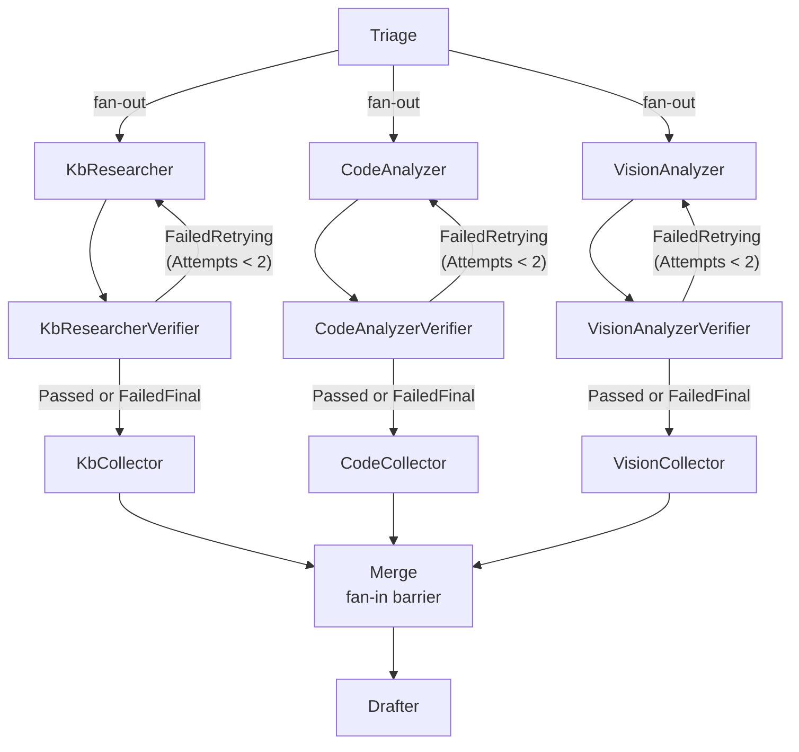
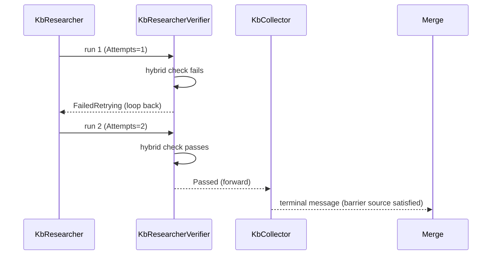

# Agent Verification Nodes Implementation Plan

> **For agentic workers:** REQUIRED SUB-SKILL: Use superpowers:subagent-driven-development (recommended) or superpowers:executing-plans to implement this plan task-by-task. Steps use checkbox (`- [ ]`) syntax for tracking.

**Goal:** Add a verifier node after each of the three fan-out specialist agents (KbResearcher, CodeAnalyzer, VisionAnalyzer) in the support pipeline, so a bad retrieval/analysis gets one retry with adjusted parameters before being accepted or explicitly flagged — replacing today's fake "any snippet found" confidence heuristic with a real, graded signal.

**Architecture:** Each specialist gets a paired verifier `IAgent` that runs a hybrid check (cheap rule-based first, LLM-judge only when ambiguous) and writes a `VerificationResult` onto `AgentContext`. In the graph, the verifier has two conditional outgoing edges — one loops back to the specialist for a single retry, the other forwards to a per-branch passthrough "collector" node. The three collectors (not the verifiers directly) are what feed the existing fan-in barrier into `Merge`, because a barrier's "wait for one message per source" only works correctly if that source's edge is unconditional — this exact topology was proven against the real Microsoft Agent Framework runtime before writing this plan (see Design Notes).

**Tech Stack:** .NET 9 / C#, Microsoft Agent Framework (`Microsoft.Agents.AI.Workflows` 1.15.0), xUnit + Moq (existing test stack), no new dependencies.

## Global Constraints

- No new NuGet packages — everything is built on `Microsoft.Agents.AI.Workflows` (already a dependency) and the existing `ILlmClient`.
- Every specialist agent (`KbResearcherAgent`, `CodeAnalyzerAgent`, `VisionAnalyzerAgent`) must become idempotent on retry: clear its own contribution to `AgentContext` before repopulating, never append across a retry.
- Max one retry per branch, enforced by an `Attempts` counter read directly in the graph's edge condition — no separate timeout/loop-guard mechanism.
- `DrafterAgent.BuildUserPrompt` must cap snippet count with `.Take(N)` (context-rot guard) — not a token-counting budget (that's explicitly out of scope, tracked as follow-up work).
- `DrafterAgent.ComputeConfidence` must be driven by real per-branch `VerificationResult.Status`, not snippet counts.
- Both HTTP entry points (`ChatController.Query` via `CoordinatorPipeline`, and `ChatController.QueryStream`'s manual sequential call chain) must get verification — `QueryStream` bypasses the graph today and needs its own small retry-once helper, not a duplicate graph.
- Follow existing repo conventions: one `IAgent` per file, xUnit + Moq tests under `backend/SupportForge.Api.Tests/Agents/`, `sealed class`, primary-constructor-style DI via `ILlmClient`.

## Design Notes (read before Task 6)

**Why collectors, not a direct verifier→Merge conditional edge:** `WorkflowBuilder.AddFanInBarrierEdge(sources, target)` waits until *every* source in `sources` has sent at least one message, however many supersteps that takes — this is exactly what we need for a branch that's mid-retry while the other two branches are already done. But `AddFanInBarrierEdge` has no condition parameter. A first attempt at this design used plain conditional `AddEdge<AgentContext>(verifier, merge, condition)` calls directly into `Merge` — spiking this against the real framework (three-executor console repro, `Microsoft.Agents.AI.Workflows` 1.15.0) showed `Merge` fires **once per plain edge independently**, with no synchronization: a branch that passes immediately triggers `Merge` before a sibling branch's retry has even resolved. Inserting a trivial per-branch identity "collector" `Executor` between each verifier and the barrier fixes this: the collector only ever receives a message via the verifier's "not retrying" conditional edge (the retry-bound message goes to the specialist instead, never touching the collector), so the collector is invoked exactly once per branch's full run — and `AddFanInBarrierEdge(collectors, merge)` then waits correctly across however many rounds each branch took. Re-running the spike with this topology produced exactly one `Merge.OnMessageDeliveryFinishedAsync` firing, with the correct final (post-retry) state. This is why Task 6 introduces a `PassthroughExecutor` alongside the existing `AgentExecutor`/`MergeExecutor` in `CoordinatorPipeline.cs`.



Sequence for one branch that fails once then passes on retry:



---

### Task 1: `VerificationResult` type + `AgentContext` fields

**Files:**
- Create: `backend/SupportForge.Agents/VerificationResult.cs`
- Modify: `backend/SupportForge.Agents/AgentContext.cs`
- Test: `backend/SupportForge.Api.Tests/Agents/VerificationResultTests.cs`

**Interfaces:**
- Produces: `VerificationStatus` enum (`NotRun`, `Passed`, `FailedRetrying`, `FailedFinal`), `VerificationResult` class with `Status`, `Attempts` (int), `Reason` (string?) settable properties. `AgentContext.KbVerification` / `CodeVerification` / `VisionVerification` (type `VerificationResult`, each defaulting to `new()`).

- [ ] **Step 1: Write the failing test**

```csharp
using SupportForge.Agents;
using Xunit;

namespace SupportForge.Api.Tests.Agents;

public class VerificationResultTests
{
    [Fact]
    public void AgentContext_StartsWithNotRunVerificationForAllThreeBranches()
    {
        var context = new AgentContext { ProjectId = "proj1", Query = "test" };

        Assert.Equal(VerificationStatus.NotRun, context.KbVerification.Status);
        Assert.Equal(VerificationStatus.NotRun, context.CodeVerification.Status);
        Assert.Equal(VerificationStatus.NotRun, context.VisionVerification.Status);
        Assert.Equal(0, context.KbVerification.Attempts);
    }
}
```

- [ ] **Step 2: Run test to verify it fails**

Run: `dotnet test backend/SupportForge.Backend.sln --filter VerificationResultTests`
Expected: FAIL to compile — `VerificationStatus`/`KbVerification` don't exist yet.

- [ ] **Step 3: Write minimal implementation**

`backend/SupportForge.Agents/VerificationResult.cs`:

```csharp
namespace SupportForge.Agents;

public enum VerificationStatus { NotRun, Passed, FailedRetrying, FailedFinal }

public sealed class VerificationResult
{
    public VerificationStatus Status { get; set; } = VerificationStatus.NotRun;
    public int Attempts { get; set; }
    public string? Reason { get; set; }
}
```

Modify `backend/SupportForge.Agents/AgentContext.cs` — add after `TotalTokensUsed`:

```csharp
    public VerificationResult KbVerification { get; } = new();
    public VerificationResult CodeVerification { get; } = new();
    public VerificationResult VisionVerification { get; } = new();
```

- [ ] **Step 4: Run test to verify it passes**

Run: `dotnet test backend/SupportForge.Backend.sln --filter VerificationResultTests`
Expected: PASS

- [ ] **Step 5: Commit**

```bash
git add backend/SupportForge.Agents/VerificationResult.cs backend/SupportForge.Agents/AgentContext.cs backend/SupportForge.Api.Tests/Agents/VerificationResultTests.cs
git commit -m "feat: add VerificationResult/VerificationStatus and AgentContext fields"
```

---

### Task 2: `KbResearcherAgent` retry-aware + idempotent, plus `KbResearcherVerifier`

**Files:**
- Modify: `backend/SupportForge.Agents/KbResearcherAgent.cs`
- Create: `backend/SupportForge.Agents/KbResearcherVerifier.cs`
- Modify: `backend/SupportForge.Api.Tests/Agents/KbResearcherAgentTests.cs`
- Test: `backend/SupportForge.Api.Tests/Agents/KbResearcherVerifierTests.cs`

**Interfaces:**
- Consumes: `KbSearchTool.SearchAsync(string projectId, string query, int topK = 5, CancellationToken ct = default)` (existing, unchanged), `AgentContext.KbVerification` (from Task 1), `ILlmClient.CompleteAsync` (existing).
- Produces: `KbResearcherVerifier : IAgent` with `Name => "KbResearcherVerifier"`. Sets `context.KbVerification.Status`/`Reason` and increments `context.TotalTokensUsed` when it uses the LLM-judge path.

- [ ] **Step 1: Write the failing tests**

Add to `KbResearcherAgentTests.cs` (new `[Fact]`, alongside the existing one):

```csharp
    [Fact]
    public async Task RunAsync_OnRetry_ClearsPreviousSnippetsAndWidensTopK()
    {
        var llm = new Mock<ILlmClient>();
        llm.Setup(l => l.EmbedAsync(It.IsAny<string>(), default)).ReturnsAsync(new float[] { 0.1f });

        var vectorStore = new Mock<IVectorStoreService>();
        vectorStore.Setup(v => v.QueryAsync("proj1-kb", It.IsAny<float[]>(), 10, null, default))
            .ReturnsAsync(new List<VectorQueryResult> { new("doc-2", "retry result", 0.2f, new Dictionary<string, string> { ["source"] = "kb/retry.md" }) });

        var tool = new KbSearchTool(llm.Object, vectorStore.Object);
        var agent = new KbResearcherAgent(tool);
        var context = new AgentContext { ProjectId = "proj1", Query = "q" };
        context.KbSnippets.Add("stale snippet from a previous attempt");
        context.KbVerification.Attempts = 1; // simulates: this is a retry

        var result = await agent.RunAsync(context);

        Assert.Single(result.KbSnippets);
        Assert.Equal("retry result", result.KbSnippets[0]);
        Assert.Equal(2, result.KbVerification.Attempts);
    }
```

Create `backend/SupportForge.Api.Tests/Agents/KbResearcherVerifierTests.cs`:

```csharp
using Moq;
using SupportForge.Agents;
using Xunit;

namespace SupportForge.Api.Tests.Agents;

public class KbResearcherVerifierTests
{
    [Fact]
    public async Task RunAsync_NoSnippets_FailsAndRetriesWhenUnderAttemptLimit()
    {
        var llm = new Mock<ILlmClient>();
        var verifier = new KbResearcherVerifier(llm.Object);
        var context = new AgentContext { ProjectId = "p", Query = "q" };
        context.KbVerification.Attempts = 1;

        var result = await verifier.RunAsync(context);

        Assert.Equal(VerificationStatus.FailedRetrying, result.KbVerification.Status);
        llm.Verify(l => l.CompleteAsync(It.IsAny<string>(), It.IsAny<string>(), It.IsAny<CancellationToken>()), Times.Never);
    }

    [Fact]
    public async Task RunAsync_NoSnippets_FailsFinalWhenAttemptLimitReached()
    {
        var llm = new Mock<ILlmClient>();
        var verifier = new KbResearcherVerifier(llm.Object);
        var context = new AgentContext { ProjectId = "p", Query = "q" };
        context.KbVerification.Attempts = 2;

        var result = await verifier.RunAsync(context);

        Assert.Equal(VerificationStatus.FailedFinal, result.KbVerification.Status);
    }

    [Fact]
    public async Task RunAsync_MultipleSnippets_PassesWithoutCallingLlm()
    {
        var llm = new Mock<ILlmClient>();
        var verifier = new KbResearcherVerifier(llm.Object);
        var context = new AgentContext { ProjectId = "p", Query = "q" };
        context.KbSnippets.Add("snippet 1");
        context.KbSnippets.Add("snippet 2");

        var result = await verifier.RunAsync(context);

        Assert.Equal(VerificationStatus.Passed, result.KbVerification.Status);
        llm.Verify(l => l.CompleteAsync(It.IsAny<string>(), It.IsAny<string>(), It.IsAny<CancellationToken>()), Times.Never);
    }

    [Fact]
    public async Task RunAsync_SingleSnippet_EscalatesToLlmJudge()
    {
        var llm = new Mock<ILlmClient>();
        llm.Setup(l => l.CompleteAsync(It.IsAny<string>(), It.IsAny<string>(), It.IsAny<CancellationToken>())).ReturnsAsync("no");
        var verifier = new KbResearcherVerifier(llm.Object);
        var context = new AgentContext { ProjectId = "p", Query = "q" };
        context.KbSnippets.Add("one weak snippet");
        context.KbVerification.Attempts = 2; // at limit, so a judged "no" should be FailedFinal not FailedRetrying

        var result = await verifier.RunAsync(context);

        Assert.Equal(VerificationStatus.FailedFinal, result.KbVerification.Status);
        llm.Verify(l => l.CompleteAsync(It.IsAny<string>(), It.IsAny<string>(), It.IsAny<CancellationToken>()), Times.Once);
    }
}
```

- [ ] **Step 2: Run tests to verify they fail**

Run: `dotnet test backend/SupportForge.Backend.sln --filter "KbResearcherAgentTests|KbResearcherVerifierTests"`
Expected: FAIL — `KbResearcherVerifier` doesn't exist; retry test fails because `KbResearcherAgent` doesn't clear/widen yet.

- [ ] **Step 3: Write minimal implementation**

Replace `backend/SupportForge.Agents/KbResearcherAgent.cs`:

```csharp
using SupportForge.Agents.Tools;

namespace SupportForge.Agents;

public sealed class KbResearcherAgent : IAgent
{
    private readonly KbSearchTool _tool;
    public string Name => "KbResearcher";

    public KbResearcherAgent(KbSearchTool tool) => _tool = tool;

    public async Task<AgentContext> RunAsync(AgentContext context, CancellationToken ct = default)
    {
        var topK = context.KbVerification.Attempts > 0 ? 10 : 5;
        var results = await _tool.SearchAsync(context.ProjectId, context.Query, topK, ct: ct);

        context.KbSnippets.Clear();
        foreach (var (text, source) in results)
        {
            context.KbSnippets.Add(text);
            context.Sources.Add(($"KB: {Path.GetFileName(source)}", source));
        }
        context.KbVerification.Attempts++;
        return context;
    }
}
```

Create `backend/SupportForge.Agents/KbResearcherVerifier.cs`:

```csharp
namespace SupportForge.Agents;

public sealed class KbResearcherVerifier : IAgent
{
    private const string JudgeSystemPrompt = """
        You judge whether a single retrieved knowledge-base snippet is actually relevant to a
        customer's support question. Respond with only "yes" or "no".
        """;

    private readonly ILlmClient _llm;
    public string Name => "KbResearcherVerifier";

    public KbResearcherVerifier(ILlmClient llm) => _llm = llm;

    public async Task<AgentContext> RunAsync(AgentContext context, CancellationToken ct = default)
    {
        var v = context.KbVerification;

        if (context.KbSnippets.Count == 0)
        {
            Fail(v, "No KB snippets were retrieved.");
        }
        else if (context.KbSnippets.Count == 1)
        {
            var relevant = await JudgeAsync(context, ct);
            if (relevant) v.Status = VerificationStatus.Passed;
            else Fail(v, "LLM judge found the single retrieved snippet not relevant to the query.");
        }
        else
        {
            v.Status = VerificationStatus.Passed;
        }

        return context;
    }

    private static void Fail(VerificationResult v, string reason)
    {
        v.Status = v.Attempts < 2 ? VerificationStatus.FailedRetrying : VerificationStatus.FailedFinal;
        v.Reason = reason;
    }

    private async Task<bool> JudgeAsync(AgentContext context, CancellationToken ct)
    {
        var userPrompt = $"""
            Customer question: {context.Query}
            Retrieved snippet: {context.KbSnippets[0]}
            """;
        var verdict = await _llm.CompleteAsync(JudgeSystemPrompt, userPrompt, ct);
        context.TotalTokensUsed += _llm.LastTotalTokens;
        return verdict.Trim().Equals("yes", StringComparison.OrdinalIgnoreCase);
    }
}
```

- [ ] **Step 4: Run tests to verify they pass**

Run: `dotnet test backend/SupportForge.Backend.sln --filter "KbResearcherAgentTests|KbResearcherVerifierTests"`
Expected: PASS

- [ ] **Step 5: Commit**

```bash
git add backend/SupportForge.Agents/KbResearcherAgent.cs backend/SupportForge.Agents/KbResearcherVerifier.cs backend/SupportForge.Api.Tests/Agents/KbResearcherAgentTests.cs backend/SupportForge.Api.Tests/Agents/KbResearcherVerifierTests.cs
git commit -m "feat: make KbResearcherAgent retry-aware and add KbResearcherVerifier"
```

---

### Task 3: `CodeAnalyzerAgent` retry-aware + idempotent, plus `CodeAnalyzerVerifier`

**Files:**
- Modify: `backend/SupportForge.Agents/CodeAnalyzerAgent.cs`
- Create: `backend/SupportForge.Agents/CodeAnalyzerVerifier.cs`
- Modify: `backend/SupportForge.Api.Tests/Agents/CodeAnalyzerAgentTests.cs`
- Test: `backend/SupportForge.Api.Tests/Agents/CodeAnalyzerVerifierTests.cs`

**Interfaces:**
- Consumes: `CodeSearchTool.SearchAsync` (existing, unchanged), `AgentContext.CodeVerification`, `AgentContext.Intent`.
- Produces: `CodeAnalyzerVerifier : IAgent`, `Name => "CodeAnalyzerVerifier"`. Must be a no-op (`Status` stays `NotRun`) when `Intent` isn't `code_issue`/`code_question`, mirroring `CodeAnalyzerAgent`'s own early return — a `NotRun` branch is neither `Passed` nor `FailedRetrying`, so it flows straight to its collector without ever looping back.

- [ ] **Step 1: Write the failing tests**

Add to `CodeAnalyzerAgentTests.cs`:

```csharp
    [Fact]
    public async Task RunAsync_OnRetry_ClearsPreviousSnippetsAndWidensTopK()
    {
        var llm = new Mock<ILlmClient>();
        llm.Setup(l => l.EmbedAsync(It.IsAny<string>(), default)).ReturnsAsync(new float[] { 0.1f });

        var vectorStore = new Mock<IVectorStoreService>();
        vectorStore.Setup(v => v.QueryAsync("proj1-code", It.IsAny<float[]>(), 10, null, default))
            .ReturnsAsync(new List<VectorQueryResult> { new("doc-2", "retry result", 0.2f, new Dictionary<string, string> { ["file"] = "Retry.cs" }) });

        var tool = new CodeSearchTool(llm.Object, vectorStore.Object);
        var agent = new CodeAnalyzerAgent(tool);
        var context = new AgentContext { ProjectId = "proj1", Query = "q", Intent = "code_issue" };
        context.CodeSnippets.Add("stale snippet");
        context.CodeVerification.Attempts = 1;

        var result = await agent.RunAsync(context);

        Assert.Single(result.CodeSnippets);
        Assert.Equal("retry result", result.CodeSnippets[0]);
        Assert.Equal(2, result.CodeVerification.Attempts);
    }
```

Create `backend/SupportForge.Api.Tests/Agents/CodeAnalyzerVerifierTests.cs`:

```csharp
using Moq;
using SupportForge.Agents;
using Xunit;

namespace SupportForge.Api.Tests.Agents;

public class CodeAnalyzerVerifierTests
{
    [Fact]
    public async Task RunAsync_IntentNotCodeRelated_StaysNotRun()
    {
        var llm = new Mock<ILlmClient>();
        var verifier = new CodeAnalyzerVerifier(llm.Object);
        var context = new AgentContext { ProjectId = "p", Query = "q", Intent = "kb_question" };

        var result = await verifier.RunAsync(context);

        Assert.Equal(VerificationStatus.NotRun, result.CodeVerification.Status);
    }

    [Fact]
    public async Task RunAsync_CodeIssueWithNoSnippets_FailsAndRetriesWhenUnderAttemptLimit()
    {
        var llm = new Mock<ILlmClient>();
        var verifier = new CodeAnalyzerVerifier(llm.Object);
        var context = new AgentContext { ProjectId = "p", Query = "q", Intent = "code_issue" };
        context.CodeVerification.Attempts = 1;

        var result = await verifier.RunAsync(context);

        Assert.Equal(VerificationStatus.FailedRetrying, result.CodeVerification.Status);
    }

    [Fact]
    public async Task RunAsync_MultipleSnippets_PassesWithoutCallingLlm()
    {
        var llm = new Mock<ILlmClient>();
        var verifier = new CodeAnalyzerVerifier(llm.Object);
        var context = new AgentContext { ProjectId = "p", Query = "q", Intent = "code_question" };
        context.CodeSnippets.Add("snippet 1");
        context.CodeSnippets.Add("snippet 2");

        var result = await verifier.RunAsync(context);

        Assert.Equal(VerificationStatus.Passed, result.CodeVerification.Status);
        llm.Verify(l => l.CompleteAsync(It.IsAny<string>(), It.IsAny<string>(), It.IsAny<CancellationToken>()), Times.Never);
    }
}
```

- [ ] **Step 2: Run tests to verify they fail**

Run: `dotnet test backend/SupportForge.Backend.sln --filter "CodeAnalyzerAgentTests|CodeAnalyzerVerifierTests"`
Expected: FAIL — `CodeAnalyzerVerifier` doesn't exist yet; retry test fails.

- [ ] **Step 3: Write minimal implementation**

Replace `backend/SupportForge.Agents/CodeAnalyzerAgent.cs`:

```csharp
using SupportForge.Agents.Tools;

namespace SupportForge.Agents;

public sealed class CodeAnalyzerAgent : IAgent
{
    private readonly CodeSearchTool _tool;
    public string Name => "CodeAnalyzer";

    public CodeAnalyzerAgent(CodeSearchTool tool) => _tool = tool;

    public async Task<AgentContext> RunAsync(AgentContext context, CancellationToken ct = default)
    {
        if (context.Intent is not ("code_issue" or "code_question")) return context;

        var topK = context.CodeVerification.Attempts > 0 ? 10 : 5;
        var results = await _tool.SearchAsync(context.ProjectId, context.Query, topK, ct: ct);

        context.CodeSnippets.Clear();
        foreach (var (text, file) in results)
        {
            context.CodeSnippets.Add(text);
            context.Sources.Add(($"Code: {file}", file));
        }
        context.CodeVerification.Attempts++;
        return context;
    }
}
```

Create `backend/SupportForge.Agents/CodeAnalyzerVerifier.cs`:

```csharp
namespace SupportForge.Agents;

public sealed class CodeAnalyzerVerifier : IAgent
{
    private const string JudgeSystemPrompt = """
        You judge whether a single retrieved source-code snippet is actually relevant to a
        customer's code-related support question. Respond with only "yes" or "no".
        """;

    private readonly ILlmClient _llm;
    public string Name => "CodeAnalyzerVerifier";

    public CodeAnalyzerVerifier(ILlmClient llm) => _llm = llm;

    public async Task<AgentContext> RunAsync(AgentContext context, CancellationToken ct = default)
    {
        if (context.Intent is not ("code_issue" or "code_question")) return context;

        var v = context.CodeVerification;

        if (context.CodeSnippets.Count == 0)
        {
            Fail(v, "No code snippets were retrieved for a code-related query.");
        }
        else if (context.CodeSnippets.Count == 1)
        {
            var relevant = await JudgeAsync(context, ct);
            if (relevant) v.Status = VerificationStatus.Passed;
            else Fail(v, "LLM judge found the single retrieved code snippet not relevant to the query.");
        }
        else
        {
            v.Status = VerificationStatus.Passed;
        }

        return context;
    }

    private static void Fail(VerificationResult v, string reason)
    {
        v.Status = v.Attempts < 2 ? VerificationStatus.FailedRetrying : VerificationStatus.FailedFinal;
        v.Reason = reason;
    }

    private async Task<bool> JudgeAsync(AgentContext context, CancellationToken ct)
    {
        var userPrompt = $"""
            Customer question: {context.Query}
            Retrieved code snippet: {context.CodeSnippets[0]}
            """;
        var verdict = await _llm.CompleteAsync(JudgeSystemPrompt, userPrompt, ct);
        context.TotalTokensUsed += _llm.LastTotalTokens;
        return verdict.Trim().Equals("yes", StringComparison.OrdinalIgnoreCase);
    }
}
```

- [ ] **Step 4: Run tests to verify they pass**

Run: `dotnet test backend/SupportForge.Backend.sln --filter "CodeAnalyzerAgentTests|CodeAnalyzerVerifierTests"`
Expected: PASS

- [ ] **Step 5: Commit**

```bash
git add backend/SupportForge.Agents/CodeAnalyzerAgent.cs backend/SupportForge.Agents/CodeAnalyzerVerifier.cs backend/SupportForge.Api.Tests/Agents/CodeAnalyzerAgentTests.cs backend/SupportForge.Api.Tests/Agents/CodeAnalyzerVerifierTests.cs
git commit -m "feat: make CodeAnalyzerAgent retry-aware and add CodeAnalyzerVerifier"
```

---

### Task 4: `VisionAnalysisTool`/`VisionAnalyzerAgent` retry-aware, plus `VisionAnalyzerVerifier`

**Files:**
- Modify: `backend/SupportForge.Agents/Tools/VisionAnalysisTool.cs`
- Modify: `backend/SupportForge.Agents/VisionAnalyzerAgent.cs`
- Create: `backend/SupportForge.Agents/VisionAnalyzerVerifier.cs`
- Modify: `backend/SupportForge.Api.Tests/Agents/VisionAnalyzerAgentTests.cs`
- Test: `backend/SupportForge.Api.Tests/Agents/VisionAnalyzerVerifierTests.cs`

**Interfaces:**
- Consumes: `ILlmClient.AnalyzeImageAsync` (existing, unchanged), `AgentContext.VisionVerification`, `AgentContext.ScreenshotBase64`.
- Produces: `VisionAnalysisTool.AnalyzeAsync(string base64Image, bool detailed = false, CancellationToken ct = default)` (new `detailed` param before `ct`). `VisionAnalyzerVerifier : IAgent`, `Name => "VisionAnalyzerVerifier"` — no-op (`NotRun`) when no screenshot was provided, mirroring `VisionAnalyzerAgent`'s early return.

- [ ] **Step 1: Write the failing tests**

Add to `VisionAnalyzerAgentTests.cs`:

```csharp
    [Fact]
    public async Task RunAsync_OnRetry_RequestsDetailedAnalysis()
    {
        var llm = new Mock<ILlmClient>();
        llm.Setup(l => l.AnalyzeImageAsync(It.IsAny<string>(), It.Is<string>(p => p.Contains("in detail")), It.IsAny<CancellationToken>()))
            .ReturnsAsync("detailed findings");

        var tool = new VisionAnalysisTool(llm.Object);
        var agent = new VisionAnalyzerAgent(tool);
        var context = new AgentContext { ProjectId = "p", Query = "q", ScreenshotBase64 = "base64data" };
        context.VisionVerification.Attempts = 1;

        var result = await agent.RunAsync(context);

        Assert.Equal("detailed findings", result.VisionFindings);
        Assert.Equal(2, result.VisionVerification.Attempts);
    }
```

Create `backend/SupportForge.Api.Tests/Agents/VisionAnalyzerVerifierTests.cs`:

```csharp
using Moq;
using SupportForge.Agents;
using Xunit;

namespace SupportForge.Api.Tests.Agents;

public class VisionAnalyzerVerifierTests
{
    [Fact]
    public async Task RunAsync_NoScreenshot_StaysNotRun()
    {
        var llm = new Mock<ILlmClient>();
        var verifier = new VisionAnalyzerVerifier(llm.Object);
        var context = new AgentContext { ProjectId = "p", Query = "q" };

        var result = await verifier.RunAsync(context);

        Assert.Equal(VerificationStatus.NotRun, result.VisionVerification.Status);
    }

    [Fact]
    public async Task RunAsync_EmptyFindings_FailsAndRetriesWhenUnderAttemptLimit()
    {
        var llm = new Mock<ILlmClient>();
        var verifier = new VisionAnalyzerVerifier(llm.Object);
        var context = new AgentContext { ProjectId = "p", Query = "q", ScreenshotBase64 = "data", VisionFindings = "" };
        context.VisionVerification.Attempts = 1;

        var result = await verifier.RunAsync(context);

        Assert.Equal(VerificationStatus.FailedRetrying, result.VisionVerification.Status);
    }

    [Fact]
    public async Task RunAsync_SubstantialFindings_PassesWithoutCallingLlm()
    {
        var llm = new Mock<ILlmClient>();
        var verifier = new VisionAnalyzerVerifier(llm.Object);
        var context = new AgentContext
        {
            ProjectId = "p", Query = "q", ScreenshotBase64 = "data",
            VisionFindings = "The screenshot shows a 500 Internal Server Error dialog with stack trace visible.",
        };

        var result = await verifier.RunAsync(context);

        Assert.Equal(VerificationStatus.Passed, result.VisionVerification.Status);
        llm.Verify(l => l.CompleteAsync(It.IsAny<string>(), It.IsAny<string>(), It.IsAny<CancellationToken>()), Times.Never);
    }
}
```

- [ ] **Step 2: Run tests to verify they fail**

Run: `dotnet test backend/SupportForge.Backend.sln --filter "VisionAnalyzerAgentTests|VisionAnalyzerVerifierTests"`
Expected: FAIL

- [ ] **Step 3: Write minimal implementation**

Replace `backend/SupportForge.Agents/Tools/VisionAnalysisTool.cs`:

```csharp
namespace SupportForge.Agents.Tools;

public sealed class VisionAnalysisTool
{
    private readonly ILlmClient _llm;

    public VisionAnalysisTool(ILlmClient llm) => _llm = llm;

    public int LastTotalTokens { get; private set; }

    public async Task<string> AnalyzeAsync(string base64Image, bool detailed = false, CancellationToken ct = default)
    {
        var prompt = detailed
            ? "Describe in detail any error messages, stack traces, log output, or UI state visible in this screenshot relevant to a support ticket. Include exact text where legible."
            : "Describe any error messages, stack traces, or UI state visible in this screenshot relevant to a support ticket.";
        var result = await _llm.AnalyzeImageAsync(base64Image, prompt, ct);
        LastTotalTokens = _llm.LastTotalTokens;
        return result;
    }
}
```

Replace `backend/SupportForge.Agents/VisionAnalyzerAgent.cs`:

```csharp
using SupportForge.Agents.Tools;

namespace SupportForge.Agents;

public sealed class VisionAnalyzerAgent : IAgent
{
    private readonly VisionAnalysisTool _tool;
    public string Name => "VisionAnalyzer";

    public VisionAnalyzerAgent(VisionAnalysisTool tool) => _tool = tool;

    public async Task<AgentContext> RunAsync(AgentContext context, CancellationToken ct = default)
    {
        if (string.IsNullOrEmpty(context.ScreenshotBase64)) return context;

        context.VisionFindings = await _tool.AnalyzeAsync(context.ScreenshotBase64, context.VisionVerification.Attempts > 0, ct);
        context.TotalTokensUsed += _tool.LastTotalTokens;
        context.VisionVerification.Attempts++;
        return context;
    }
}
```

Create `backend/SupportForge.Agents/VisionAnalyzerVerifier.cs`:

```csharp
namespace SupportForge.Agents;

public sealed class VisionAnalyzerVerifier : IAgent
{
    private const string JudgeSystemPrompt = """
        You judge whether a vision-analysis description meaningfully describes an error, stack trace,
        or relevant UI state, as opposed to a vague non-answer. Respond with only "yes" or "no".
        """;

    private readonly ILlmClient _llm;
    public string Name => "VisionAnalyzerVerifier";

    public VisionAnalyzerVerifier(ILlmClient llm) => _llm = llm;

    public async Task<AgentContext> RunAsync(AgentContext context, CancellationToken ct = default)
    {
        if (string.IsNullOrEmpty(context.ScreenshotBase64)) return context;

        var v = context.VisionVerification;
        var findings = context.VisionFindings;

        if (string.IsNullOrWhiteSpace(findings))
        {
            Fail(v, "Vision analysis returned no findings for a provided screenshot.");
        }
        else if (findings.Length < 20)
        {
            var relevant = await JudgeAsync(context, ct);
            if (relevant) v.Status = VerificationStatus.Passed;
            else Fail(v, "LLM judge found the vision findings to be a non-answer.");
        }
        else
        {
            v.Status = VerificationStatus.Passed;
        }

        return context;
    }

    private static void Fail(VerificationResult v, string reason)
    {
        v.Status = v.Attempts < 2 ? VerificationStatus.FailedRetrying : VerificationStatus.FailedFinal;
        v.Reason = reason;
    }

    private async Task<bool> JudgeAsync(AgentContext context, CancellationToken ct)
    {
        var userPrompt = $"""
            Customer question: {context.Query}
            Vision analysis findings: {context.VisionFindings}
            """;
        var verdict = await _llm.CompleteAsync(JudgeSystemPrompt, userPrompt, ct);
        context.TotalTokensUsed += _llm.LastTotalTokens;
        return verdict.Trim().Equals("yes", StringComparison.OrdinalIgnoreCase);
    }
}
```

- [ ] **Step 4: Run tests to verify they pass**

Run: `dotnet test backend/SupportForge.Backend.sln --filter "VisionAnalyzerAgentTests|VisionAnalyzerVerifierTests"`
Expected: PASS

- [ ] **Step 5: Commit**

```bash
git add backend/SupportForge.Agents/Tools/VisionAnalysisTool.cs backend/SupportForge.Agents/VisionAnalyzerAgent.cs backend/SupportForge.Agents/VisionAnalyzerVerifier.cs backend/SupportForge.Api.Tests/Agents/VisionAnalyzerAgentTests.cs backend/SupportForge.Api.Tests/Agents/VisionAnalyzerVerifierTests.cs
git commit -m "feat: make VisionAnalyzerAgent retry-aware and add VisionAnalyzerVerifier"
```

---

### Task 5: `DrafterAgent` — snippet cap + real confidence formula

**Files:**
- Modify: `backend/SupportForge.Agents/DrafterAgent.cs`
- Create: `backend/SupportForge.Api.Tests/Agents/DrafterAgentTests.cs` (no existing test file for this agent)

**Interfaces:**
- Consumes: `AgentContext.KbVerification`/`CodeVerification`/`VisionVerification` (Task 1).
- Produces: `DrafterAgent.ComputeConfidence(AgentContext)` now returns a graded value: `0.9` when every applicable branch passed, scaling down as branches fail, `0.3` when no branch was applicable at all (e.g. plain `kb_question` with nothing to verify against). `BuildUserPrompt` caps snippets at 5 per source via `.Take(MaxSnippetsPerSource)`.

- [ ] **Step 1: Write the failing tests**

```csharp
using SupportForge.Agents;
using Xunit;

namespace SupportForge.Api.Tests.Agents;

public class DrafterAgentTests
{
    [Fact]
    public void ComputeConfidence_AllApplicableBranchesPassed_ReturnsHigh()
    {
        var context = new AgentContext { ProjectId = "p", Query = "q" };
        context.KbVerification.Status = VerificationStatus.Passed;
        context.CodeVerification.Status = VerificationStatus.NotRun; // not applicable to this query
        context.VisionVerification.Status = VerificationStatus.NotRun;

        var confidence = DrafterAgent.ComputeConfidence(context);

        Assert.True(confidence >= 0.7, $"expected High-bucket confidence, got {confidence}");
    }

    [Fact]
    public void ComputeConfidence_NoBranchesApplicable_ReturnsLow()
    {
        var context = new AgentContext { ProjectId = "p", Query = "q" };
        // all three stay NotRun

        var confidence = DrafterAgent.ComputeConfidence(context);

        Assert.True(confidence < 0.4, $"expected Low-bucket confidence, got {confidence}");
    }

    [Fact]
    public void ComputeConfidence_MixOfPassedAndFailedFinal_ReturnsMedium()
    {
        var context = new AgentContext { ProjectId = "p", Query = "q" };
        context.KbVerification.Status = VerificationStatus.Passed;
        context.CodeVerification.Status = VerificationStatus.FailedFinal;
        context.VisionVerification.Status = VerificationStatus.NotRun;

        var confidence = DrafterAgent.ComputeConfidence(context);

        Assert.InRange(confidence, 0.4, 0.69);
    }

    [Fact]
    public void ComputeConfidence_AllApplicableBranchesFailedFinal_ReturnsLow()
    {
        var context = new AgentContext { ProjectId = "p", Query = "q" };
        context.KbVerification.Status = VerificationStatus.FailedFinal;
        context.CodeVerification.Status = VerificationStatus.NotRun;
        context.VisionVerification.Status = VerificationStatus.NotRun;

        var confidence = DrafterAgent.ComputeConfidence(context);

        Assert.True(confidence < 0.4, $"expected Low-bucket confidence, got {confidence}");
    }

    [Fact]
    public void BuildUserPrompt_CapsSnippetsAtFivePerSource()
    {
        var context = new AgentContext { ProjectId = "p", Query = "q" };
        for (var i = 0; i < 10; i++) context.KbSnippets.Add($"kb-snippet-{i}");

        var prompt = DrafterAgent.BuildUserPrompt(context);

        for (var i = 0; i < 5; i++) Assert.Contains($"kb-snippet-{i}", prompt);
        for (var i = 5; i < 10; i++) Assert.DoesNotContain($"kb-snippet-{i}", prompt);
    }
}
```

- [ ] **Step 2: Run tests to verify they fail**

Run: `dotnet test backend/SupportForge.Backend.sln --filter DrafterAgentTests`
Expected: FAIL — current `ComputeConfidence` only returns 0.8/0.4, current `BuildUserPrompt` doesn't cap.

- [ ] **Step 3: Write minimal implementation**

Replace `backend/SupportForge.Agents/DrafterAgent.cs`:

```csharp
namespace SupportForge.Agents;

public sealed class DrafterAgent : IAgent
{
    private const int MaxSnippetsPerSource = 5;

    public const string SystemPrompt = """
        You are a support engineer drafting a reply to a customer.
        Use only the provided KB/code context. If context is empty, say you need more information.
        Respond in Markdown.
        """;

    private readonly ILlmClient _llm;
    public string Name => "Drafter";

    public DrafterAgent(ILlmClient llm) => _llm = llm;

    public static string BuildUserPrompt(AgentContext context) => $"""
        Customer question: {context.Query}
        Intent: {context.Intent}
        KB context: {string.Join("\n---\n", context.KbSnippets.Take(MaxSnippetsPerSource))}
        Code context: {string.Join("\n---\n", context.CodeSnippets.Take(MaxSnippetsPerSource))}
        Vision findings: {context.VisionFindings}
        """;

    public static double ComputeConfidence(AgentContext context)
    {
        var applicable = new[] { context.KbVerification, context.CodeVerification, context.VisionVerification }
            .Where(v => v.Status != VerificationStatus.NotRun)
            .ToList();

        if (applicable.Count == 0) return 0.3;

        var passed = applicable.Count(v => v.Status == VerificationStatus.Passed);
        return 0.2 + 0.7 * passed / applicable.Count;
    }

    public async Task<AgentContext> RunAsync(AgentContext context, CancellationToken ct = default)
    {
        context.Draft = await _llm.CompleteAsync(SystemPrompt, BuildUserPrompt(context), ct);
        context.Confidence = ComputeConfidence(context);
        context.TotalTokensUsed += _llm.LastTotalTokens;
        return context;
    }
}
```

- [ ] **Step 4: Run tests to verify they pass**

Run: `dotnet test backend/SupportForge.Backend.sln --filter DrafterAgentTests`
Expected: PASS

- [ ] **Step 5: Commit**

```bash
git add backend/SupportForge.Agents/DrafterAgent.cs backend/SupportForge.Api.Tests/Agents/DrafterAgentTests.cs
git commit -m "feat: replace naive confidence heuristic with verification-driven score, cap prompt snippets"
```

---

### Task 6: Rewire `CoordinatorPipeline` with verifier + collector + retry-loop topology

**Files:**
- Modify: `backend/SupportForge.Agents/CoordinatorPipeline.cs`
- Modify: `backend/SupportForge.Api.Tests/Agents/CoordinatorPipelineTests.cs`

**Interfaces:**
- Consumes: `KbResearcherVerifier`, `CodeAnalyzerVerifier`, `VisionAnalyzerVerifier` (Tasks 2–4), all implementing `IAgent`.
- Produces: `CoordinatorPipeline` constructor now takes 8 `IAgent` params: `(IAgent triage, IAgent kb, IAgent kbVerifier, IAgent code, IAgent codeVerifier, IAgent vision, IAgent visionVerifier, IAgent drafter)`. `RunAsync` signature unchanged.

This task depends on the topology proven in **Design Notes** above — read it before starting.

- [ ] **Step 1: Write the failing tests**

Replace `backend/SupportForge.Api.Tests/Agents/CoordinatorPipelineTests.cs`:

```csharp
using System.Collections.Concurrent;
using SupportForge.Agents;
using Xunit;

namespace SupportForge.Api.Tests.Agents;

public class CoordinatorPipelineTests
{
    [Fact]
    public async Task RunAsync_RunsTriageFirstAndDrafterLast_WithKbCodeVisionBetween()
    {
        var order = new ConcurrentQueue<string>();
        var triage = new RecordingAgent("Triage", order);
        var kb = new RecordingAgent("KbResearcher", order);
        var code = new RecordingAgent("CodeAnalyzer", order);
        var vision = new RecordingAgent("VisionAnalyzer", order);
        var drafter = new RecordingAgent("Drafter", order);
        var passVerifier = new PassingVerifier();

        var pipeline = new CoordinatorPipeline(triage, kb, passVerifier, code, passVerifier, vision, passVerifier, drafter);
        await pipeline.RunAsync(new AgentContext { ProjectId = "proj1", Query = "test" });

        var recorded = order.ToList();
        Assert.Equal(5, recorded.Count);
        Assert.Equal("Triage", recorded[0]);
        Assert.Equal("Drafter", recorded[^1]);
        Assert.Equal(
            new HashSet<string> { "KbResearcher", "CodeAnalyzer", "VisionAnalyzer" },
            recorded.Skip(1).Take(3).ToHashSet());
    }

    [Fact]
    public async Task RunAsync_MergesSourcesFromConcurrentBranches_WithoutLosingEntries()
    {
        var order = new ConcurrentQueue<string>();
        var triage = new RecordingAgent("Triage", order);
        var kb = new SourceAddingAgent("KbResearcher", "KB", 50);
        var code = new SourceAddingAgent("CodeAnalyzer", "Code", 50);
        var vision = new RecordingAgent("VisionAnalyzer", order);
        var drafter = new RecordingAgent("Drafter", order);
        var passVerifier = new PassingVerifier();

        var pipeline = new CoordinatorPipeline(triage, kb, passVerifier, code, passVerifier, vision, passVerifier, drafter);
        var result = await pipeline.RunAsync(new AgentContext { ProjectId = "proj1", Query = "test" });

        Assert.Equal(100, result.Sources.Count);
        Assert.Equal(50, result.Sources.Count(s => s.Label.StartsWith("KB")));
        Assert.Equal(50, result.Sources.Count(s => s.Label.StartsWith("Code")));
    }

    [Fact]
    public async Task RunAsync_VerifierRequestsRetry_SpecialistRunsAgainBeforeDrafter()
    {
        var kbRunCount = 0;
        var kb = new CountingKbAgent(() => kbRunCount++);
        var code = new RecordingAgent("CodeAnalyzer", new ConcurrentQueue<string>());
        var vision = new RecordingAgent("VisionAnalyzer", new ConcurrentQueue<string>());
        var triage = new RecordingAgent("Triage", new ConcurrentQueue<string>());
        var drafterRan = false;
        var drafter = new CountingAgent("Drafter", () => drafterRan = true);

        // KbVerifier fails exactly once (Attempts becomes 1), forcing one retry, then passes.
        var kbVerifier = new RetryOnceVerifier(v => v.KbVerification);
        var passVerifier = new PassingVerifier();

        var pipeline = new CoordinatorPipeline(triage, kb, kbVerifier, code, passVerifier, vision, passVerifier, drafter);
        var result = await pipeline.RunAsync(new AgentContext { ProjectId = "proj1", Query = "test" });

        Assert.Equal(2, kbRunCount); // ran once, failed verification, ran again
        Assert.Equal(VerificationStatus.Passed, result.KbVerification.Status);
        Assert.True(drafterRan);
    }

    private sealed class RecordingAgent : IAgent
    {
        private readonly ConcurrentQueue<string> _order;
        public string Name { get; }
        public RecordingAgent(string name, ConcurrentQueue<string> order) { Name = name; _order = order; }
        public Task<AgentContext> RunAsync(AgentContext context, CancellationToken ct = default)
        {
            _order.Enqueue(Name);
            return Task.FromResult(context);
        }
    }

    private sealed class CountingAgent : IAgent
    {
        private readonly Action _onRun;
        public string Name { get; }
        public CountingAgent(string name, Action onRun) { Name = name; _onRun = onRun; }
        public Task<AgentContext> RunAsync(AgentContext context, CancellationToken ct = default)
        {
            _onRun();
            return Task.FromResult(context);
        }
    }

    private sealed class CountingKbAgent : IAgent
    {
        private readonly Action _onRun;
        public string Name => "KbResearcher";
        public CountingKbAgent(Action onRun) => _onRun = onRun;
        public Task<AgentContext> RunAsync(AgentContext context, CancellationToken ct = default)
        {
            _onRun();
            context.KbVerification.Attempts++;
            return Task.FromResult(context);
        }
    }

    private sealed class SourceAddingAgent : IAgent
    {
        private readonly string _labelPrefix;
        private readonly int _count;
        public string Name { get; }
        public SourceAddingAgent(string name, string labelPrefix, int count)
        {
            Name = name;
            _labelPrefix = labelPrefix;
            _count = count;
        }

        public async Task<AgentContext> RunAsync(AgentContext context, CancellationToken ct = default)
        {
            for (var i = 0; i < _count; i++)
            {
                await Task.Yield();
                context.Sources.Add(($"{_labelPrefix} {i}", $"url-{_labelPrefix}-{i}"));
            }
            return context;
        }
    }

    // A verifier stub that always marks its branch Passed — used for branches not under test.
    private sealed class PassingVerifier : IAgent
    {
        public string Name => "PassingVerifier";
        public Task<AgentContext> RunAsync(AgentContext context, CancellationToken ct = default)
        {
            context.KbVerification.Status = context.KbVerification.Status == VerificationStatus.NotRun ? VerificationStatus.Passed : context.KbVerification.Status;
            context.CodeVerification.Status = context.CodeVerification.Status == VerificationStatus.NotRun ? VerificationStatus.Passed : context.CodeVerification.Status;
            context.VisionVerification.Status = context.VisionVerification.Status == VerificationStatus.NotRun ? VerificationStatus.Passed : context.VisionVerification.Status;
            return Task.FromResult(context);
        }
    }

    // Fails the targeted branch's first attempt (Attempts becomes 1 -> FailedRetrying), passes on retry (Attempts becomes 2).
    private sealed class RetryOnceVerifier : IAgent
    {
        private readonly Func<AgentContext, VerificationResult> _select;
        public RetryOnceVerifier(Func<AgentContext, VerificationResult> select) => _select = select;
        public string Name => "RetryOnceVerifier";
        public Task<AgentContext> RunAsync(AgentContext context, CancellationToken ct = default)
        {
            var v = _select(context);
            v.Status = v.Attempts >= 2 ? VerificationStatus.Passed : VerificationStatus.FailedRetrying;
            return Task.FromResult(context);
        }
    }
}
```

- [ ] **Step 2: Run tests to verify they fail**

Run: `dotnet test backend/SupportForge.Backend.sln --filter CoordinatorPipelineTests`
Expected: FAIL to compile — constructor still takes 5 args.

- [ ] **Step 3: Write minimal implementation**

Replace `backend/SupportForge.Agents/CoordinatorPipeline.cs`:

```csharp
using Microsoft.Agents.AI.Workflows;

namespace SupportForge.Agents;

/// <summary>Adapts an <see cref="IAgent"/> into a Microsoft Agent Framework workflow node.</summary>
internal sealed class AgentExecutor : Executor<AgentContext, AgentContext>
{
    private readonly IAgent _agent;
    private readonly bool _isTerminal;

    public AgentExecutor(IAgent agent, bool isTerminal = false) : base(agent.Name)
    {
        _agent = agent;
        _isTerminal = isTerminal;
    }

    public override async ValueTask<AgentContext> HandleAsync(
        AgentContext message, IWorkflowContext context, CancellationToken cancellationToken = default)
    {
        var result = await _agent.RunAsync(message, cancellationToken);
        if (_isTerminal)
            await context.YieldOutputAsync(result, cancellationToken);
        return result;
    }
}

/// <summary>
/// Identity node sitting between a verifier's "not retrying" conditional edge and the fan-in barrier
/// into Merge. A barrier's "wait for one message per source" only works when that source's edge into
/// the barrier is unconditional; a verifier's retry-vs-forward decision must stay conditional. This
/// collector is invoked exactly once per branch's full run (the retry-bound message never reaches it,
/// it goes back to the specialist instead), so it's what the barrier can safely wait on.
/// </summary>
internal sealed class PassthroughExecutor : Executor<AgentContext, AgentContext>
{
    public PassthroughExecutor(string id) : base(id) { }
    public override ValueTask<AgentContext> HandleAsync(
        AgentContext message, IWorkflowContext context, CancellationToken cancellationToken = default)
        => new(message);
}

/// <summary>
/// Fan-in target for the three branch collectors. For in-process execution, a fan-in barrier delivers
/// one <see cref="HandleAsync"/> call per source (not a single batched array);
/// <see cref="OnMessageDeliveryFinishedAsync"/> fires once all sources for the step have been
/// delivered, which is where the merged result is forwarded on. All three branches mutate the
/// same shared <see cref="AgentContext"/> reference, so "merging" is just forwarding it once.
/// </summary>
[SendsMessage(typeof(AgentContext))]
internal sealed class MergeExecutor : Executor<AgentContext>
{
    private AgentContext? _received;

    public MergeExecutor() : base("Merge") { }

    public override ValueTask HandleAsync(
        AgentContext message, IWorkflowContext context, CancellationToken cancellationToken = default)
    {
        _received = message;
        return default;
    }

    protected override ValueTask OnMessageDeliveryFinishedAsync(
        IWorkflowContext context, CancellationToken cancellationToken = default)
    {
        var result = _received ?? throw new InvalidOperationException("Merge fired with no delivered messages.");
        _received = null;
        return context.SendMessageAsync(result, cancellationToken: cancellationToken);
    }
}

/// <summary>
/// Runs the support-query pipeline as a Microsoft Agent Framework workflow:
/// <see href="https://github.com/microsoft/agent-framework"/>. Triage runs first; KbResearcher,
/// CodeAnalyzer, and VisionAnalyzer fan out in parallel. Each specialist is followed by its verifier,
/// which either loops back to the specialist for one retry (conditional edge on
/// VerificationStatus.FailedRetrying) or forwards to that branch's collector. The three collectors
/// feed a fan-in barrier into Merge, which only requires each collector to eventually deliver exactly
/// one message — regardless of how many retry rounds its branch took. Drafter runs last.
/// </summary>
public sealed class CoordinatorPipeline
{
    private readonly Workflow _workflow;

    public CoordinatorPipeline(
        IAgent triage,
        IAgent kb, IAgent kbVerifier,
        IAgent code, IAgent codeVerifier,
        IAgent vision, IAgent visionVerifier,
        IAgent drafter)
    {
        var triageExec = new AgentExecutor(triage);

        var kbExec = new AgentExecutor(kb);
        var kbVerifierExec = new AgentExecutor(kbVerifier);
        var kbCollectorExec = new PassthroughExecutor("KbCollector");

        var codeExec = new AgentExecutor(code);
        var codeVerifierExec = new AgentExecutor(codeVerifier);
        var codeCollectorExec = new PassthroughExecutor("CodeCollector");

        var visionExec = new AgentExecutor(vision);
        var visionVerifierExec = new AgentExecutor(visionVerifier);
        var visionCollectorExec = new PassthroughExecutor("VisionCollector");

        var mergeExec = new MergeExecutor();
        var drafterExec = new AgentExecutor(drafter, isTerminal: true);

        var parallelExecs = new ExecutorBinding[] { kbExec, codeExec, visionExec };
        var collectorExecs = new ExecutorBinding[] { kbCollectorExec, codeCollectorExec, visionCollectorExec };

        var builder = new WorkflowBuilder(triageExec);
        builder.AddFanOutEdge(triageExec, parallelExecs);

        builder.AddEdge(kbExec, kbVerifierExec);
        builder.AddEdge<AgentContext>(kbVerifierExec, kbExec, ctx => ctx.KbVerification.Status == VerificationStatus.FailedRetrying);
        builder.AddEdge<AgentContext>(kbVerifierExec, kbCollectorExec, ctx => ctx.KbVerification.Status != VerificationStatus.FailedRetrying);

        builder.AddEdge(codeExec, codeVerifierExec);
        builder.AddEdge<AgentContext>(codeVerifierExec, codeExec, ctx => ctx.CodeVerification.Status == VerificationStatus.FailedRetrying);
        builder.AddEdge<AgentContext>(codeVerifierExec, codeCollectorExec, ctx => ctx.CodeVerification.Status != VerificationStatus.FailedRetrying);

        builder.AddEdge(visionExec, visionVerifierExec);
        builder.AddEdge<AgentContext>(visionVerifierExec, visionExec, ctx => ctx.VisionVerification.Status == VerificationStatus.FailedRetrying);
        builder.AddEdge<AgentContext>(visionVerifierExec, visionCollectorExec, ctx => ctx.VisionVerification.Status != VerificationStatus.FailedRetrying);

        builder.AddFanInBarrierEdge(collectorExecs, mergeExec);
        builder.AddEdge(mergeExec, drafterExec);

        _workflow = builder.WithOutputFrom(drafterExec).Build();
    }

    public async Task<AgentContext> RunAsync(AgentContext context, CancellationToken ct = default)
    {
        await using StreamingRun run = await InProcessExecution.RunStreamingAsync(_workflow, context, cancellationToken: ct);
        await foreach (var evt in run.WatchStreamAsync(ct))
        {
            switch (evt)
            {
                case WorkflowOutputEvent { Data: AgentContext result }:
                    return result;
                case WorkflowErrorEvent { Exception: { } ex }:
                    throw new InvalidOperationException("Workflow failed.", ex);
                case ExecutorFailedEvent failed:
                    throw new InvalidOperationException($"Executor '{failed.ExecutorId}' failed: {failed.Data}");
            }
        }

        throw new InvalidOperationException("Workflow completed without producing output.");
    }
}
```

- [ ] **Step 4: Run tests to verify they pass**

Run: `dotnet test backend/SupportForge.Backend.sln --filter CoordinatorPipelineTests`
Expected: PASS

- [ ] **Step 5: Commit**

```bash
git add backend/SupportForge.Agents/CoordinatorPipeline.cs backend/SupportForge.Api.Tests/Agents/CoordinatorPipelineTests.cs
git commit -m "feat: wire verifier + collector + retry-loop topology into CoordinatorPipeline"
```

---

### Task 7: Wire verifiers through DI (`Program.cs`) and the `QueryStream` bypass path

**Files:**
- Modify: `backend/SupportForge.Api/Program.cs`
- Modify: `backend/SupportForge.Api/Controllers/ChatController.cs`
- Modify: `backend/SupportForge.Api.Tests/Controllers/ChatControllerTests.cs`

**Interfaces:**
- Consumes: `KbResearcherVerifier`, `CodeAnalyzerVerifier`, `VisionAnalyzerVerifier` (Tasks 2–4), `CoordinatorPipeline`'s new 8-arg constructor (Task 6).
- Produces: `ChatController` constructor gains three params (`KbResearcherVerifier kbVerifier, CodeAnalyzerVerifier codeVerifier, VisionAnalyzerVerifier visionVerifier`). `QueryStream` now runs each specialist through the same retry-once semantics as the graph, via a small private helper.

`ChatController.Query` needs no logic change — it already just calls `_pipeline.RunAsync`, and the pipeline now verifies internally. Only `QueryStream` (which bypasses `CoordinatorPipeline` for token-by-token streaming) needs new retry logic.

- [ ] **Step 1: Write the failing test**

Add to `ChatControllerTests.cs` — a new test proving `QueryStream`'s manual path retries a failing branch once before drafting. This requires adding `using Microsoft.AspNetCore.Http;` to the file's usings, and updating the existing `MakeController` helper plus both pre-existing `Query_*` tests' `new CoordinatorPipeline(...)` calls to pass a `PassthroughVerifier()` (defined below) for the three new verifier slots — those tests aren't testing verification, they just need the pipeline to still run end-to-end.

```csharp
    [Fact]
    public async Task QueryStream_KbVerificationFails_RetriesOnceBeforeDrafting()
    {
        var llmMock = new Mock<ILlmClient>();
        llmMock.Setup(l => l.CompleteAsync(It.IsAny<string>(), It.IsAny<string>(), It.IsAny<CancellationToken>())).ReturnsAsync("kb_question");
        llmMock.Setup(l => l.EmbedAsync(It.IsAny<string>(), default)).ReturnsAsync(new float[] { 0.1f });
        llmMock.SetupSequence(l => l.StreamCompleteAsync(It.IsAny<string>(), It.IsAny<string>(), It.IsAny<CancellationToken>()))
            .Returns(ToAsyncEnumerable(new[] { "answer" }));

        var openAiLlm = new TestOpenAiLlmClient(llmMock.Object);
        var vectorStore = new Mock<IVectorStoreService>();
        var callCount = 0;
        vectorStore.Setup(v => v.QueryAsync(It.IsAny<string>(), It.IsAny<float[]>(), It.IsAny<int>(), null, default))
            .ReturnsAsync(() =>
            {
                callCount++;
                return callCount == 1
                    ? new List<VectorQueryResult>() // first attempt: nothing found -> verifier fails
                    : new List<VectorQueryResult> { new("doc-1", "found on retry", 0.2f, new Dictionary<string, string> { ["source"] = "kb/x.md" }) };
            });

        var kbResearcher = new KbResearcherAgent(new KbSearchTool(openAiLlm, vectorStore.Object));
        var kbVerifier = new KbResearcherVerifier(openAiLlm);

        var conversations = new Mock<IConversationRepository>();
        conversations.Setup(c => c.UpsertAsync(It.IsAny<Conversation>(), It.IsAny<CancellationToken>())).Returns(Task.CompletedTask);
        var messages = new Mock<IChatMessageRepository>();
        messages.Setup(m => m.AddAsync(It.IsAny<ChatMessage>(), It.IsAny<CancellationToken>())).Returns(Task.CompletedTask);
        var tokenUsage = new Mock<ITokenUsageRepository>();

        var pipeline = new CoordinatorPipeline(
            new TriageAgent(openAiLlm), new NoOpAgent("KbResearcher"), new PassthroughVerifier(),
            new NoOpAgent("CodeAnalyzer"), new PassthroughVerifier(),
            new NoOpAgent("VisionAnalyzer"), new PassthroughVerifier(),
            new DrafterAgent(openAiLlm));

        var controller = new ChatController(
            pipeline, new TriageAgent(openAiLlm), kbResearcher,
            new CodeAnalyzerAgent(new CodeSearchTool(openAiLlm, vectorStore.Object)), kbVerifier,
            new CodeAnalyzerVerifier(openAiLlm),
            new VisionAnalyzerAgent(new VisionAnalysisTool(openAiLlm)), new VisionAnalyzerVerifier(openAiLlm),
            openAiLlm, tokenUsage.Object, conversations.Object, messages.Object);

        var httpContext = new DefaultHttpContext { Response = { Body = new MemoryStream() } };
        controller.ControllerContext = new ControllerContext { HttpContext = httpContext };

        await controller.QueryStream(new ChatQueryRequest { ProjectId = "proj1", Query = "how do I reset my password" }, default);

        Assert.Equal(2, callCount); // first search found nothing, retry found something
    }

    private static async IAsyncEnumerable<string> ToAsyncEnumerable(IEnumerable<string> items)
    {
        foreach (var item in items) { yield return item; await Task.Yield(); }
    }

    private sealed class PassthroughVerifier : IAgent
    {
        public string Name => "PassthroughVerifier";
        public Task<AgentContext> RunAsync(AgentContext context, CancellationToken ct = default) => Task.FromResult(context);
    }
```

- [ ] **Step 2: Run test to verify it fails**

Run: `dotnet test backend/SupportForge.Backend.sln --filter ChatControllerTests`
Expected: FAIL to compile — `ChatController` constructor doesn't accept verifier args yet.

- [ ] **Step 3: Write minimal implementation**

Modify `backend/SupportForge.Api/Controllers/ChatController.cs` — update the constructor and fields:

```csharp
    private readonly CoordinatorPipeline _pipeline;
    private readonly TriageAgent _triage;
    private readonly KbResearcherAgent _kbResearcher;
    private readonly CodeAnalyzerAgent _codeAnalyzer;
    private readonly KbResearcherVerifier _kbVerifier;
    private readonly CodeAnalyzerVerifier _codeVerifier;
    private readonly VisionAnalyzerAgent _visionAnalyzer;
    private readonly VisionAnalyzerVerifier _visionVerifier;
    private readonly ILlmClient _llm;
    private readonly ITokenUsageRepository _tokenUsage;
    private readonly IConversationRepository _conversations;
    private readonly IChatMessageRepository _messages;

    public ChatController(
        CoordinatorPipeline pipeline,
        TriageAgent triage,
        KbResearcherAgent kbResearcher,
        CodeAnalyzerAgent codeAnalyzer,
        KbResearcherVerifier kbVerifier,
        CodeAnalyzerVerifier codeVerifier,
        VisionAnalyzerAgent visionAnalyzer,
        VisionAnalyzerVerifier visionVerifier,
        ILlmClient llm,
        ITokenUsageRepository tokenUsage,
        IConversationRepository conversations,
        IChatMessageRepository messages)
    {
        _pipeline = pipeline;
        _triage = triage;
        _kbResearcher = kbResearcher;
        _codeAnalyzer = codeAnalyzer;
        _kbVerifier = kbVerifier;
        _codeVerifier = codeVerifier;
        _visionAnalyzer = visionAnalyzer;
        _visionVerifier = visionVerifier;
        _llm = llm;
        _tokenUsage = tokenUsage;
        _conversations = conversations;
        _messages = messages;
    }
```

Add a private helper and use it in `QueryStream` (replace the four sequential `context = await ...RunAsync(...)` lines for kb/code/vision):

```csharp
    // Mirrors CoordinatorPipeline's retry-once-then-flag semantics for this manual (non-graph)
    // streaming path: run the specialist, verify, and retry exactly once if verification asks for it.
    private static async Task<AgentContext> RunWithVerificationAsync(
        IAgent specialist, IAgent verifier, AgentContext context, Func<AgentContext, VerificationResult> getResult, CancellationToken ct)
    {
        context = await specialist.RunAsync(context, ct);
        context = await verifier.RunAsync(context, ct);
        if (getResult(context).Status == VerificationStatus.FailedRetrying)
        {
            context = await specialist.RunAsync(context, ct);
            context = await verifier.RunAsync(context, ct);
        }
        return context;
    }
```

In `QueryStream`, replace:

```csharp
        context = await _triage.RunAsync(context, ct);
        context = await _kbResearcher.RunAsync(context, ct);
        context = await _codeAnalyzer.RunAsync(context, ct);
        context = await _visionAnalyzer.RunAsync(context, ct);
```

with:

```csharp
        context = await _triage.RunAsync(context, ct);
        context = await RunWithVerificationAsync(_kbResearcher, _kbVerifier, context, c => c.KbVerification, ct);
        context = await RunWithVerificationAsync(_codeAnalyzer, _codeVerifier, context, c => c.CodeVerification, ct);
        context = await RunWithVerificationAsync(_visionAnalyzer, _visionVerifier, context, c => c.VisionVerification, ct);
```

Modify `backend/SupportForge.Api/Program.cs` — register the three verifiers and update the `CoordinatorPipeline` factory:

```csharp
builder.Services.AddScoped<TriageAgent>();
builder.Services.AddScoped<KbResearcherAgent>();
builder.Services.AddScoped<CodeAnalyzerAgent>();
builder.Services.AddScoped<VisionAnalyzerAgent>();
builder.Services.AddScoped<KbResearcherVerifier>();
builder.Services.AddScoped<CodeAnalyzerVerifier>();
builder.Services.AddScoped<VisionAnalyzerVerifier>();
builder.Services.AddScoped<DrafterAgent>();
builder.Services.AddScoped<KbSearchTool>();
builder.Services.AddScoped<CodeSearchTool>();
builder.Services.AddScoped<VisionAnalysisTool>();
builder.Services.AddScoped<CoordinatorPipeline>(sp => new CoordinatorPipeline(
    sp.GetRequiredService<TriageAgent>(),
    sp.GetRequiredService<KbResearcherAgent>(),
    sp.GetRequiredService<KbResearcherVerifier>(),
    sp.GetRequiredService<CodeAnalyzerAgent>(),
    sp.GetRequiredService<CodeAnalyzerVerifier>(),
    sp.GetRequiredService<VisionAnalyzerAgent>(),
    sp.GetRequiredService<VisionAnalyzerVerifier>(),
    sp.GetRequiredService<DrafterAgent>()));
```

Update `ChatControllerTests.cs`'s `MakeController` helper and every `new ChatController(...)` / `new CoordinatorPipeline(...)` call (including the two pre-existing `Query_*` tests) to pass the new verifier arguments, using `new PassthroughVerifier()` for the `CoordinatorPipeline`'s three verifier slots in those pre-existing tests, and real `new KbResearcherVerifier(llm)` / `new CodeAnalyzerVerifier(llm)` / `new VisionAnalyzerVerifier(llm)` instances for `MakeController`'s (and the new test's) `ChatController` constructor args.

- [ ] **Step 4: Run tests to verify they pass**

Run: `dotnet test backend/SupportForge.Backend.sln --filter ChatControllerTests`
Expected: PASS

- [ ] **Step 5: Commit**

```bash
git add backend/SupportForge.Api/Program.cs backend/SupportForge.Api/Controllers/ChatController.cs backend/SupportForge.Api.Tests/Controllers/ChatControllerTests.cs
git commit -m "feat: wire verifiers through DI and give QueryStream retry-once parity with the graph"
```

---

### Task 8: Full solution build + test pass

**Files:** none (verification-only task)

- [ ] **Step 1: Build the whole solution**

Run: `dotnet build backend/SupportForge.Backend.sln`
Expected: 0 errors (warnings from pre-existing code are fine).

- [ ] **Step 2: Run the full test suite**

Run: `dotnet test backend/SupportForge.Backend.sln`
Expected: All tests pass, including `SupportForge.Api.Tests/Integration/EndToEndQueryTests.cs` (unaffected in behavior — verify it still passes since it exercises the real `CoordinatorPipeline`/DI wiring end-to-end).

- [ ] **Step 3: Manual smoke check (optional but recommended)**

Run the API locally (`dotnet run --project backend/SupportForge.Api`) and send a `POST /api/chat/query` for a project with an empty/near-empty KB — confirm the response's `Confidence` is now a graded low value (not the old "0.4 always shows Medium" artifact) and that a retry doesn't visibly duplicate KB citations in `Sources`.

- [ ] **Step 4: Commit (if any fixups were needed)**

```bash
git add -A
git commit -m "chore: fix up build/test issues found in full solution verification"
```

(Skip this commit if Steps 1–2 pass clean with no changes.)

## Known Follow-Up Work (explicitly out of scope for this plan)

- **Token budget enforcement / hard limits** — `ITokenUsageRepository` already records usage per project but nothing reads/sums it to enforce a cap, and `KbSearchTool`/`CodeSearchTool`'s embedding calls never populate `LastTotalTokens` at all (`OpenAiLlmClient.EmbedAsync` never reads the response's usage). Separate spec.
- **Prompt caching** — reordering `BuildUserPrompt` so a stable prefix precedes the variable query, to let OpenAI's automatic prefix caching engage; provider-dependent (unclear if NVIDIA NIM supports it). Separate spec.
- **`Sources` duplication across a retry** — unlike `KbSnippets`/`CodeSnippets` (now cleared on retry), `Sources` is a `ConcurrentBag` with no removal API, so a retried branch's stale citation from its first (failed) attempt can still appear in the final citation list alongside the retry's citation. Cosmetic only — `Sources` never feeds back into an LLM prompt, so it has no context-rot or token-cost impact. Not worth the blast radius of changing `Sources`' underlying type for this plan.

## Verification

1. `dotnet build backend/SupportForge.Backend.sln` — clean build.
2. `dotnet test backend/SupportForge.Backend.sln` — full suite green, including every new test file listed above.
3. Manual smoke test per Task 8 Step 3.
4. Confirm `docs/agentic-pipeline.md` — already noted as stale relative to the fan-out/fan-in topology before this plan — should be updated separately; not part of this plan's scope (documentation-only follow-up).
